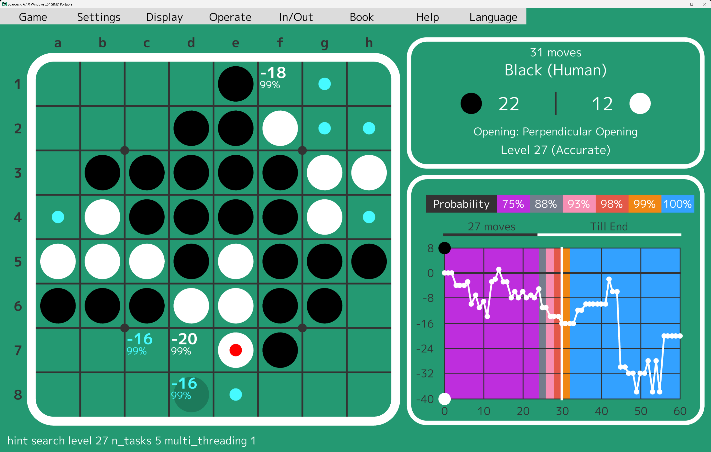
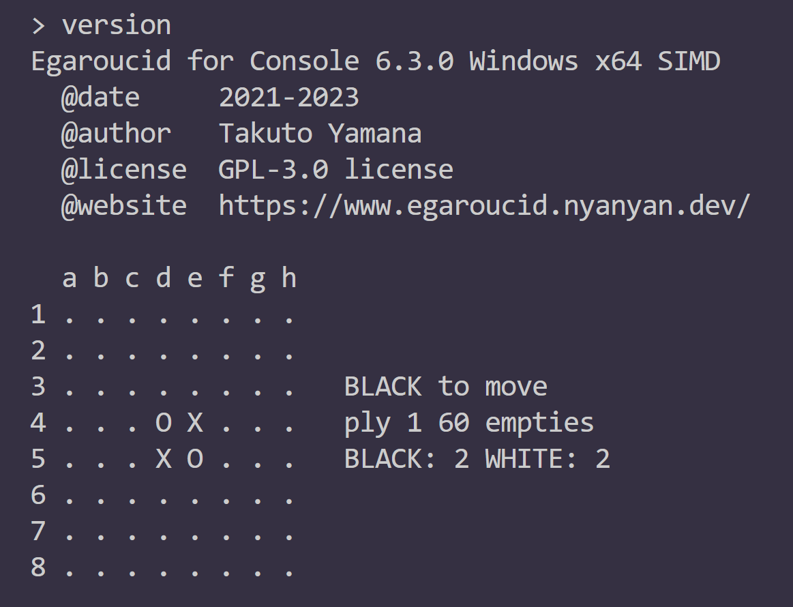

# Egaroucid

One of the strongest Othello AI Application in the world

See also https://www.egaroucid.nyanyan.dev/en/ for detail


Light version of this Othello AI got 1st place in the world ([CodinGame Othello](https://www.codingame.com/multiplayer/bot-programming/othello-1/leaderboard))


## Lineup

Totally free application

* **[Egaroucid](https://www.egaroucid.nyanyan.dev/en/) - GUI application**
  
  * Desktop application for Windows
  * Japanese / English
  * GUI with [Siv3D](https://github.com/Siv3D)
  
* **[Egaroucid for Console](https://www.egaroucid.nyanyan.dev/en/console) - Console application**
  
  * Windows / MacOS / Linux
  * Edax-like format / Go Text Protocol(GTP)
  * English
  
* **[Egaroucid for Web](https://www.egaroucid.nyanyan.dev/en/web/) - Web application**
  
  * Play on your browser
  * Japanese / English
  
  






## Install

### Egaroucid

Download [here](https://www.egaroucid.nyanyan.dev/en/download/), then execute the installer.

#### Reference

I think you can use it without any reference.

Any Help? Need translation? Please contact me [here](https://docs.google.com/forms/d/e/1FAIpQLSd6ML1T1fc707luPEefBXuImMnlM9cQP8j-YHKiSyFoS-8rmQ/viewform)!


### Egaroucid for Console

You can just download binary or build with ```g++``` or ```cmake``` command. Please see https://www.egaroucid.nyanyan.dev/en/console/

#### Reference

Please execute

```
$ Egaroucid_for_console.exe -help
```

##### Use with Go Text Protocol (GTP)

Please execute

```
$ Egaroucid_for_console.exe -gtp
```

I checked it works with GoGui and Quarry.


### Egaroucid for Web

Please build on your own or download resources (```ai.js``` and ```ai.wasm```) [here](https://github.com/Nyanyan/Egaroucid/tree/main/docs/en/web).

Required:

* ```em++``` command
  * worked with version 3.1.20

```
$ git clone git@github.com:Nyanyan/Egaroucid.git
$ cd Egaroucid/src
$ em++ Egaroucid_web.cpp -s WASM=1 -o ai.js -s "EXPORTED_FUNCTIONS=['_init_ai', '_ai_js', '_calc_value', '_stop', '_resume', '_malloc', '_free']" -O3 -s TOTAL_MEMORY=629145600 -s ALLOW_MEMORY_GROWTH=1
```

Easily, you can just execute a command below instead of the last ```em++``` command.

```
$ python Egaroucid_web_compile.py
```

Then ```ai.js``` and ```ai.wasm``` will be created.

#### Reference

* ```int _init_ai()```
  * initialize Egaroucid for Web.
  * always returns 0

* ```int _ai_js(int arr_board[64], int level, int ai_player)```
  * calculate the best move. 
  * ```arr_board```: array representing a board
    * ```0``` for black disc
    * ```1``` for white disc
    * ```-1``` for empty square
  * ```level```: Egaroucid's level
    * ```0``` to ```15```
  * ```ai_player```: Who will put a disc?
    * ```0``` for black
    * ```1``` for white
  * returns ```coord * 1000 + value```
    * ```coord```: ```0``` for h8, ```1``` for g8, ..., ```63``` for a1
    * ```value```: ```-64``` to ```64```, estimated Egaroucid's score
* ```void _calc_value(int arr_board[64], int res[74], int level, int ai_player)```
  * calculate score of each legal moves
  * ```arr_board```: array representing a board
    * ```0``` for black disc
    * ```1``` for white disc
    * ```-1``` for empty square
  * ```res```: array to store result
    * ```res[10 + coord] == value for the coord```
  * ```level```: Egaroucid's level
    * ```0``` to ```15```
  * ```ai_player```: Who will put a disc?
    * ```0``` for black
    * ```1``` for white
* ```void _stop()```
  * stop all calculation
* ```void _resume()```
  * let all calculation


## Looking for Your Voice

**Please contact me [here](https://docs.google.com/forms/d/e/1FAIpQLSd6ML1T1fc707luPEefBXuImMnlM9cQP8j-YHKiSyFoS-8rmQ/viewform)!**

* Want to use Egaroucid in your language?
* Want some new commands?
* Have a nice idea to improve?
* Want to be a tester for new version?
* Like this software?

I would like to hear your opinion.


## License

GPL 3.0 License

**If you want to use Egaroucid in your project, I can customize and build Egaroucid for you to avoid GPL-infection to your project. Please feel free to contact me [here](https://docs.google.com/forms/d/e/1FAIpQLSd6ML1T1fc707luPEefBXuImMnlM9cQP8j-YHKiSyFoS-8rmQ/viewform).**


## Creator

[Takuto Yamana (a.k.a Nyanyan)](https://nyanyan.dev/en/)


## Notes

オセロ・Othelloは登録商標です。 TM&© Othello,Co. and MegaHouse
