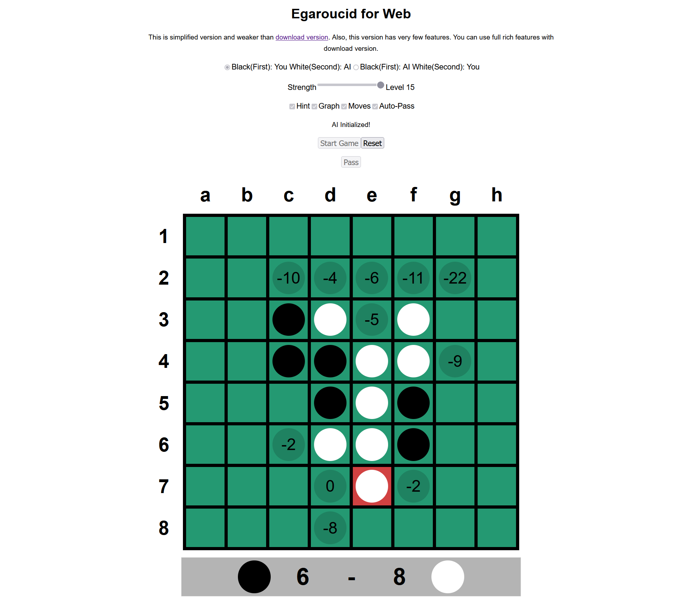

# Egaroucid

One of the strongest Othello AI Application in the world

See also https://www.egaroucid.nyanyan.dev/en/ for detail

## Lineup

Totally free application

* **[Egaroucid](https://www.egaroucid.nyanyan.dev/en/) - GUI application**
  
  * Desktop application for Windows / macOS
  * Japanese / English / Chinese
  * GUI with [Siv3D](https://github.com/Siv3D)
  
* **[Egaroucid for Console](https://www.egaroucid.nyanyan.dev/en/console) - Console application**
  
  * Windows / MacOS / Linux
  * Edax-like format / Go Text Protocol(GTP)
  * English
  
* **[Egaroucid for Web](https://www.egaroucid.nyanyan.dev/en/web/) - Web application**
  
  * Play on your browser
  * Japanese / English
  
  

## Get Egaroucid Now!

- Egaroucid
  - Windows: Download & Install it from [Website](https://www.egaroucid.nyanyan.dev/en/download/) or [GitHub Releases](https://github.com/Nyanyan/Egaroucid/releases)
  - MacOS / Linux: Please build by yourself!
- Egaroucid for Console
  - Windows: Download & Unzip it from [Website](https://www.egaroucid.nyanyan.dev/en/console/) or [GitHub Releases](https://github.com/Nyanyan/Egaroucid/releases)
  - MacOS / Linux: Please build by yourself using g++ or clang! [Build Instruction](https://www.egaroucid.nyanyan.dev/en/console/#Linux%20/%20MacOS)
- Egaroucid for Web
  - Visit [Website](https://www.egaroucid.nyanyan.dev/en/web/) and play now!

## Looking for Your Voice

**Please contact me [here](https://docs.google.com/forms/d/e/1FAIpQLSd6ML1T1fc707luPEefBXuImMnlM9cQP8j-YHKiSyFoS-8rmQ/viewform)!**

* Want to use Egaroucid in your language?
* Want some new commands?
* Have a nice idea to improve?
* Want to be a tester for new version?
* Like this software?

I would like to hear your opinion.

## License

GPL 3.0 License

**If you want to use Egaroucid in your project, I can customize and build Egaroucid for you to avoid GPL-infection to your project. Please feel free to contact me [here](https://docs.google.com/forms/d/e/1FAIpQLSd6ML1T1fc707luPEefBXuImMnlM9cQP8j-YHKiSyFoS-8rmQ/viewform).**

## Creator

[Takuto Yamana (a.k.a Nyanyan)](https://nyanyan.dev/en/)

## Notes

オセロ・Othelloは登録商標です。 TM&© Othello,Co. and MegaHouse
