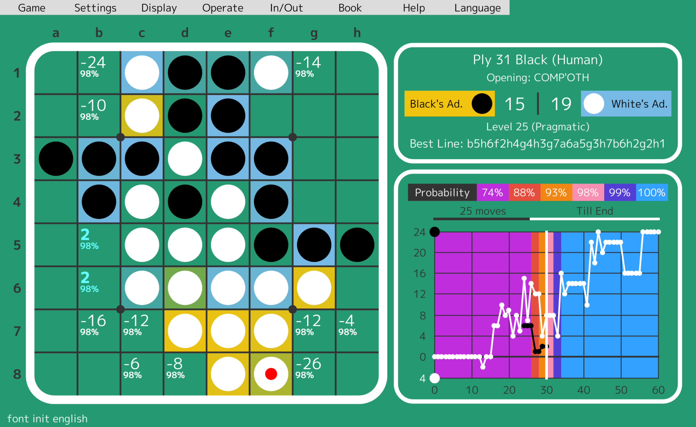
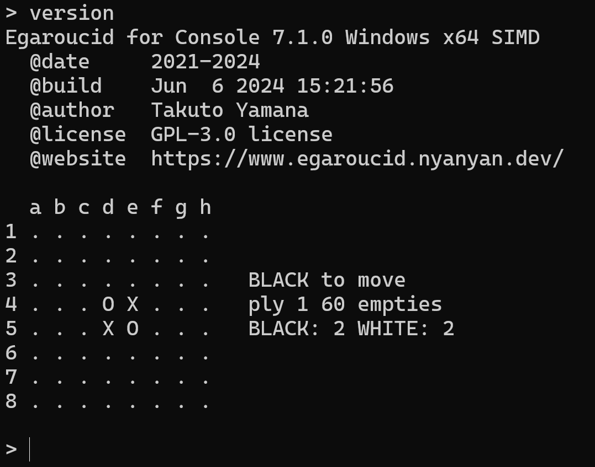
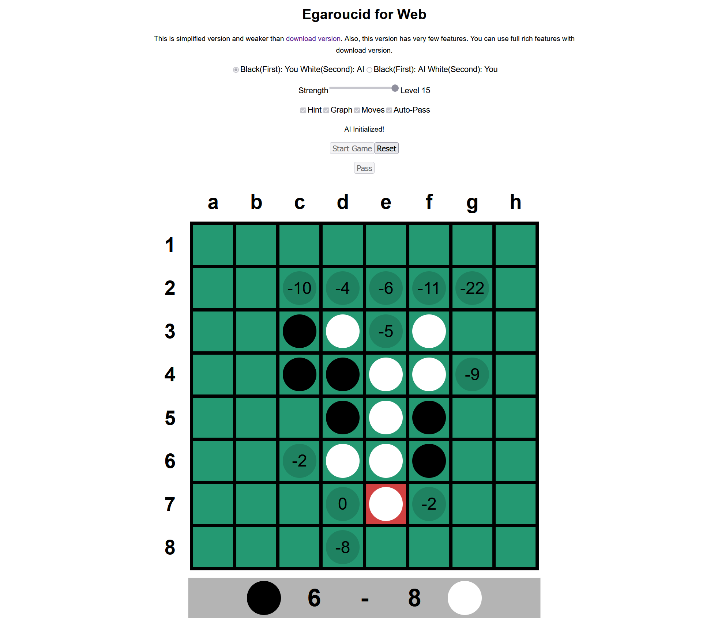

# Egaroucid

One of the strongest Othello AI Application in the world

See also https://www.egaroucid.nyanyan.dev/en/ for detail

## Lineup

Totally free application

* **[Egaroucid](https://www.egaroucid.nyanyan.dev/en/) - GUI application**
  
  * Desktop application for Windows / macOS
  * Japanese / English / Chinese
  * GUI with [Siv3D](https://github.com/Siv3D)
  
* **[Egaroucid for Console](https://www.egaroucid.nyanyan.dev/en/console) - Console application**
  
  * Windows / MacOS / Linux
  * Edax-like format / Go Text Protocol(GTP)
  * English
  
* **[Egaroucid for Web](https://www.egaroucid.nyanyan.dev/en/web/) - Web application**
  
  * Play on your browser
  * Japanese / English
  
  

## Get Egaroucid Now!

- Egaroucid
  - Windows: Download & Install it from [Website](https://www.egaroucid.nyanyan.dev/en/download/) or [GitHub Releases](https://github.com/Nyanyan/Egaroucid/releases)
  - MacOS / Linux: Please build by yourself!
- Egaroucid for Console
  - Windows: Download & Unzip it from [Website](https://www.egaroucid.nyanyan.dev/en/console/) or [GitHub Releases](https://github.com/Nyanyan/Egaroucid/releases)
  - MacOS / Linux: Please build by yourself using g++ or clang! [Build Instruction](https://www.egaroucid.nyanyan.dev/en/console/#Linux%20/%20MacOS)
- Egaroucid for Web
  - Visit [Website](https://www.egaroucid.nyanyan.dev/en/web/) and play now!

## Looking for Your Voice

**Please contact me [here](https://docs.google.com/forms/d/e/1FAIpQLSd6ML1T1fc707luPEefBXuImMnlM9cQP8j-YHKiSyFoS-8rmQ/viewform)!**

* Want to use Egaroucid in your language?
* Want some new commands?
* Have a nice idea to improve?
* Want to be a tester for new version?
* Like this software?

I would like to hear your opinion.

## License

GNU General Public License v3.0 or later

**If you want to use Egaroucid in your project, I can customize and build Egaroucid for you to avoid GPL-infection to your project. Please feel free to contact me [here](https://docs.google.com/forms/d/e/1FAIpQLSd6ML1T1fc707luPEefBXuImMnlM9cQP8j-YHKiSyFoS-8rmQ/viewform).**

## Publications

Publications related to Egaroucid

### Peer-Reviewed Papers

- <u>Takuto Yamana</u>, and Junichi Hoshino: [Compressing the Evaluation Function With Small-Scale Deep Learning on Othello](https://doi.org/10.1109/TG.2025.3624825), IEEE Transactions on Games (2025)
- <u>Takuto Yamana</u>, and Junichi Hoshino: [Developing and Evaluating a Strong Othello AI with Small-scale Deep Learning as a Compression](https://doi.org/10.20729/00239899), IPSJ Journal, Vol. 65, No. 10, pp. 1545-1553 {**[Specially Selected Paper](https://www.ipsj.or.jp/award/ssp_award.html)**}
  - Japanese Title: 小規模な深層学習による圧縮を利用した強力なオセロAIの開発と評価

### Other Papers

- <u>Takuto Yamana</u>, and Junichi Hoshino: Development and Evaluation of an Othello Explanation System using Othello AI and LLM, Proceedings of Game Programming Workshop, Vol. 2025, pp.104-111 (2025) {**[Game Programming Workshop Best Poster Award](https://www.gi-ipsj.org/gpw/award.html)**}
  - Japanese Title: オセロAIとLLMを使用したオセロ解説システムの開発と評価
- <u>山名琢翔</u>：[GPGPUによるαβ法を用いた高速なオセロ探索手法](https://ipsj.ixsq.nii.ac.jp/records/232914), IPSJ SIG Technical Reports (GI), Vol. 2024-GI-51, No. 26, pp. 1-9 (2024) {**[Young Encouragement Award](https://www.ipsj.or.jp/award/gi-award1.html)**}
- <u>Takuto Yamana</u>: [Mastering Othello with Deep Learning as a Compression](https://ipsj.ixsq.nii.ac.jp/records/218735), IPSJ SIG Technical Reports (GI), Vol. 2022-GI-48, No. 5, pp. 1-5 (2022) {**[Excellent Research Award](https://www.ipsj.or.jp/award/gi-award2.html)**, and **[IPSJ Yamashita SIG Research Award](https://www.ipsj.or.jp/award/yamashita2023.html)**}
  - Japanese Title: 深層学習による圧縮を利用した強力なオセロAIの制作

### Books & Chapters

- <u>Takuto Yamana</u>：[Is Othello Solved? Let's Make it Clear!](https://note.com/ipsj/n/n86f6dbfbfc7a), IPSJ Magazine, Vol. 65, No. 3, pp. 134-136 (2024)  {**Special Commentary**}
  - Japanese Title: 「オセロが解けた」を白黒ハッキリさせようじゃないか

## Creator

[Takuto Yamana (a.k.a Nyanyan)](https://nyanyan.dev/en/)

## Notes

オセロ・Othelloは登録商標です。 TM&© Othello,Co. and MegaHouse
