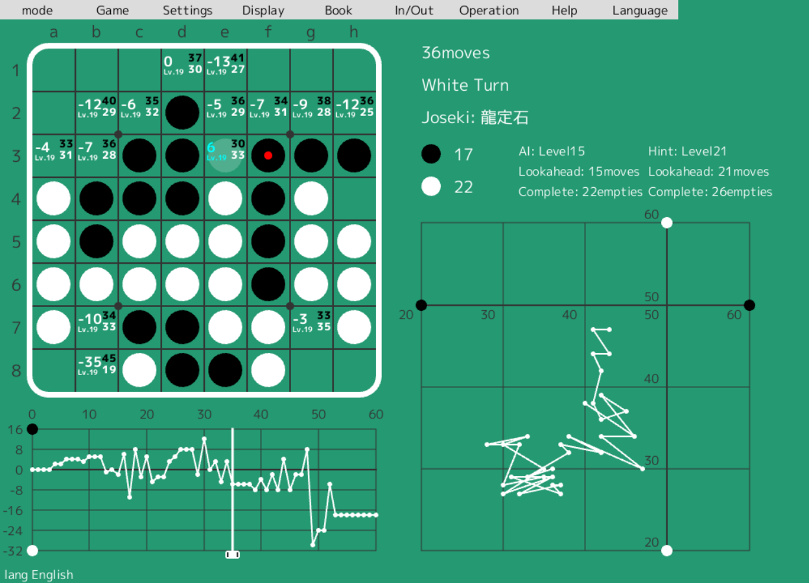
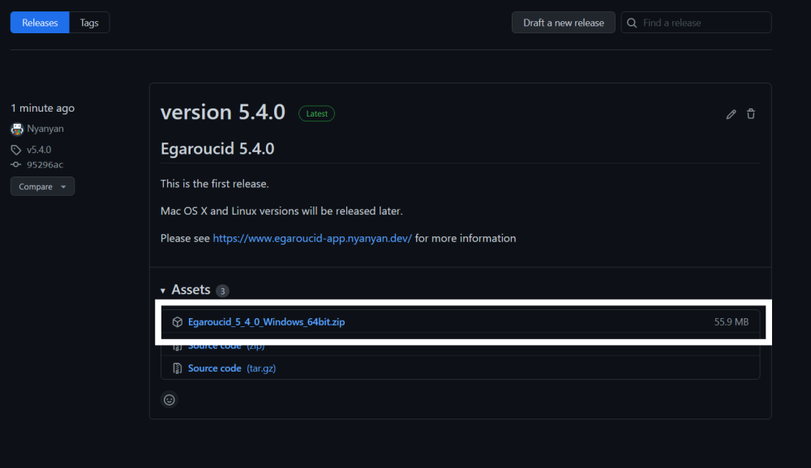

# Othello research support AI app Egaroucid

<a href="https://twitter.com/share?ref_src=twsrc%5Etfw" class="twitter-share-button" data-text="Othello research support AI app Egaroucid" data-url="https://www.egaroucid-app.nyanyan.dev/" data-hashtags="egaroucid" data-related="takuto_yamana,Nyanyan_Cube" data-show-count="false">Tweet</a> <a href=./../ja/>日本語</a>

## What is Egaroucid?

Egaroucid is an Othello app with one of the strongest othello solver AI. 

The light version got the first place in the world ([CodinGame Othello](https://www.codingame.com/multiplayer/bot-programming/othello-1/leaderboard)) as of February, 2022.

 

## Functions

* Play against AI
* Analyze games
* Show various evaluation values
* Input & Output
* Create & modify book automatically or manually
* Add Egaroucid's or Edax's book
* Show Opening (in Japanese)

## Download

[Here](https://github.com/Nyanyan/Egaroucid/releases) you can download.

Please click to download. Then execute it and please install it with the wizard.

### For MacOS

Not available for MacOS.

## Play against the light version which got 1st in the world

[Here](https://www.egaroucid.nyanyan.dev/) in Japanese you can play against the light version which got the first place in the world.

## Benchmarks

[Here](./../benchmark/) you can see.

## Technologies

[Here](./../technology/) you can see technologies used in this AI.

## Acknowledgments

I would like to thank these people for great contributions.

### UI Design

Kaneko Eizo

### User Test

okojoMK

Takada Seigo

madaranuko

Nagano Yasushi

trineutron

Kuruton

## Creator

Takuto Yamana

## Links

* [GitHub Repository](https://github.com/Nyanyan/Egaroucid)
* [Creator's Twitter](https://twitter.com/takuto_yamana)
* [Creator's Web Page](https://nyanyan.github.io/)

