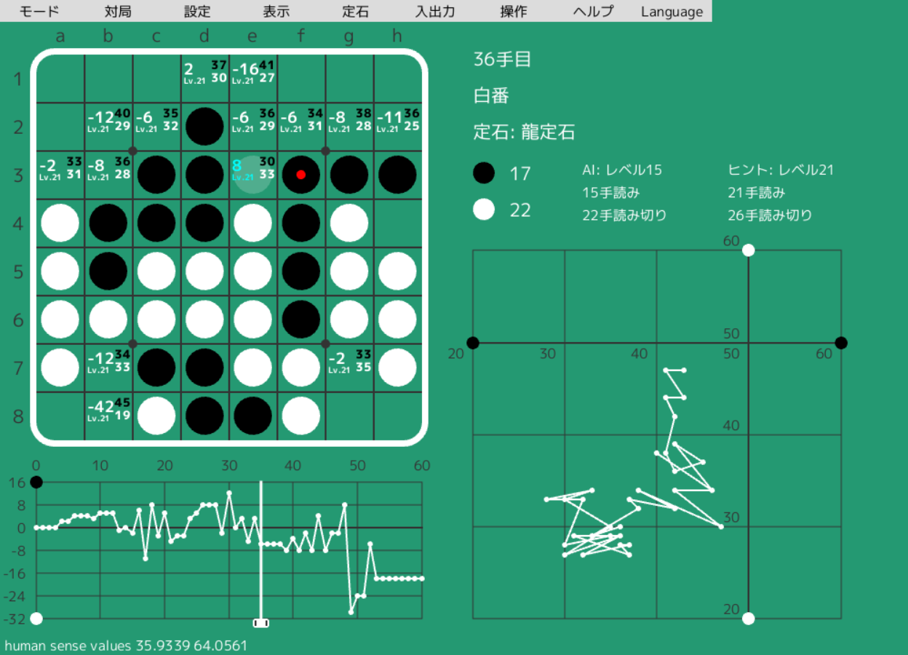

# オセロ研究支援AIアプリ Egaroucid5

<a href="https://twitter.com/share?ref_src=twsrc%5Etfw" class="twitter-share-button" data-text="最強レベルAI搭載オセロ研究支援ソフト" data-url="https://www.egaroucid-app.nyanyan.dev/" data-hashtags="egaroucid" data-related="takuto_yamana,Nyanyan_Cube" data-show-count="false">Tweet</a><script async src="https://platform.twitter.com/widgets.js" charset="utf-8"></script> <a href=./../en/>English</a>

## Egaroucidとは

Egaroucidは世界最強クラスのオセロAIを搭載したオセロ研究・対戦用アプリです。

搭載AIの軽量バージョンは[CodinGame Othello](https://www.codingame.com/multiplayer/bot-programming/othello-1/leaderboard)で世界1位になったものです(2022年2月現在)



 

## 主な機能

* 対局
* 対局分析
* 評価値、人間的評価値、うみがめ数の表示
* 各種入出力
* bookを自動/手動で作成/修正
* Egaroucid/Edax形式のbookの追加・統合
* 定石名の表示


## ダウンロード

[こちら](https://github.com/Nyanyan/Egaroucid5/releases/)から最新バージョンをzip形式でダウンロードできます。

以下の画像のように、自分のOSに合ったものをクリックしてダウンロードしてください(2022/02/20現在Windows64bitのみ対応です。他のOSについては少しお待ち下さい)。

zipファイルを任意の場所に解凍し、中の```Egaroucid5.exe```をダブルクリックするなどして実行してください。


## 使い方

[こちら](./../usage/)で使い方を解説しています。

なお、内容の同じ[markdown形式](./../usage/ja/index.md)および[PDF形式](./../usage/ja/index.pdf)がダウンロードできます。


## 世界1位バージョンで遊ぶ

[CodinGame Othello](https://www.codingame.com/multiplayer/bot-programming/othello-1/leaderboard)で世界1位になった軽量バージョンを[こちら](https://www.egaroucid.nyanyan.dev/)でブラウザを使って試遊できます。


## 各種ベンチマーク

[こちら](./../benchmark/)で各種ベンチマークの結果を公開しています。


## 技術資料

[こちら](./../technology/)でこのオセロAIに関する専門的な技術を公開しています。


## 謝辞

開発に多大なる貢献をしていただいた方々に感謝します(順不同、敬称略)

### UIデザイン

金子映像

### ユーザテスト

okojoMK

高田征吾

まだらぬこ

長野泰志

trineutron

クルトン


## 作者

山名琢翔/にゃにゃん


## 関連リンク

* [GitHubレポジトリ](https://github.com/Nyanyan/Egaroucid5)
* [作者Twitter(静かな方)](https://twitter.com/takuto_yamana)
* [作者Twitter(うるさい方)](https://twitter.com/Nyanyan_Cube)
* [作者webサイト](https://nyanyan.github.io/)