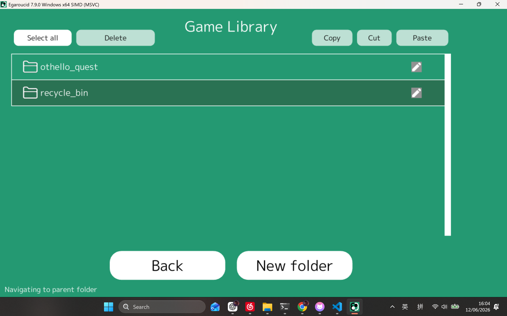
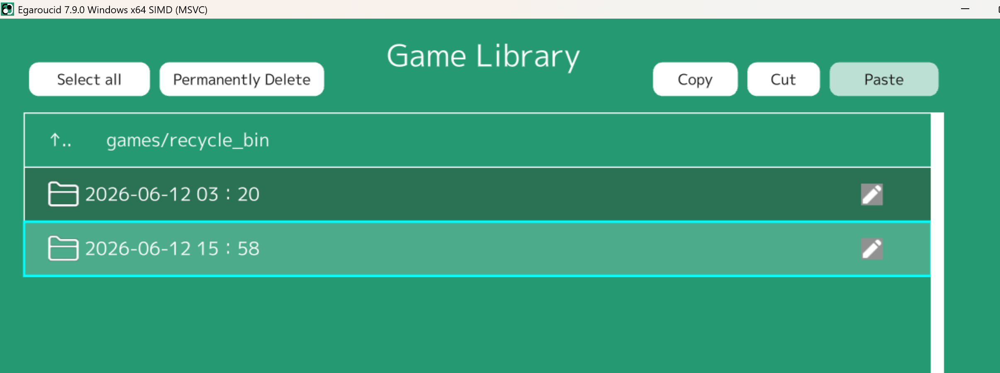

# Combined GUI Import, Game Library, and XOT Identification PR

## Summary

This PR combines three related GUI improvements for importing and managing games:

1. Othello Quest import: search, preview, import, and save Othello Quest games.
2. Game Library: browse, organize, move, delete, and save games in the `games/` library.
3. XOT identification: detect XOT game start positions and focus graph / analysis views on the real game segment.

I originally prepared these as split PRs, but the branches share GUI integration, settings, language resources, and save-flow handoff code. This combined PR keeps the review path in one place and documents each feature area below.

## File Map

### Othello Quest Import

- `src/gui/input_scene.hpp`
  - `Import_othello_quest` scene.
  - Username search form, game-mode selection, async list/detail fetch, result table, selection state, import flow, and Game Library save handoff.
- `src/gui/function/menu_definition.hpp`
  - Adds the Othello Quest input menu entry.
- `src/gui/function/shortcut_key.hpp`
  - Adds the shortcut command metadata for the menu entry.
- `src/gui/silent_load_scene.hpp` and `src/gui/close_scene.hpp`
  - Load and save the last Othello Quest username and selected mode.
- Language JSON files under `bin/resources/languages/` and `src/tools/release_script/format_files/0_common_files/languages/`
  - Adds Othello Quest labels and save-to-library text.

### Game Library

- `src/gui/input_scene.hpp`
  - `Game_library` scene.
  - Folder navigation, folder creation/rename, game import, reorder, copy/cut/paste, drag-and-drop moves, recycle bin, CSV load/save, and save-request handling.
- `src/gui/save_location_picker_scene.hpp`
  - Save destination picker for choosing a target `games/` subfolder.
- `src/gui/game_editor_scene.hpp`
  - Handoff for saving editor games to a selected library location.
- `src/gui/draw.hpp`
  - Shared explorer-list drawing and interaction helpers used by the library views.
- `src/gui/function/const/gui_common.hpp`
  - Shared state for Game Library save requests and settings.
- Release template files under `src/tools/release_script/format_files/GUI_*`
  - Adds empty `summary.csv` files for default Game Library folders.

### XOT Identification

- `src/engine/xot.hpp`
  - XOT board-key lookup helper.
- `src/engine/xot_keys.hpp`
  - Static XOT board-key table used by the lookup helper.
- `src/engine/engine_all.hpp`
  - Includes the XOT helper.
- `src/gui/function/util.hpp`
  - Updates graph-resource XOT state from loaded/imported histories.
- `src/gui/function/graph.hpp`
  - Filters graph data before the XOT start and draws the XOT start marker.
- `src/gui/main_scene.hpp`
  - Applies XOT-aware graph interaction, analysis task setup, and refreshes XOT state after edits.
- `src/gui/function/menu_definition.hpp`, `src/gui/silent_load_scene.hpp`, and `src/gui/close_scene.hpp`
  - Adds the XOT identification setting and persists it.

## Screenshots

### Othello Quest Import


### Game Library





### XOT Identification


## Data-Safety Fixes Included

During review, a few real data-safety issues were found and fixed:

- Game Library and save-location picker now skip malformed `summary.csv` rows with too few columns.
- Moving a game into a folder no longer overwrites an existing JSON file with the same filename.
- CSV rows are updated only after a file move/copy succeeds.
- Removing a game from `summary.csv` preserves all columns instead of truncating future metadata.
- Empty or malformed game JSON histories are rejected before accessing `.back()`.
- The Othello Quest save button is only shown on the result page and is disabled until there is a saveable selected game.

## Note on `xot_keys.hpp`

`src/engine/xot_keys.hpp` is a static board-key table for XOT opening detection. It contains 10,784 sorted board keys and is used by binary search in `xot.hpp`.

Validation from the review package:

- Declared key count: 10,784.
- Parsed key count: 10,784.
- Sorted key order: yes.
- Duplicate keys: 0.

The large line count in this file is data, not hand-written control flow.

## Validation

- Built successfully with Visual Studio BuildTools / MSBuild:

```powershell
& 'C:\Program Files (x86)\Microsoft Visual Studio\2022\BuildTools\MSBuild\Current\Bin\amd64\MSBuild.exe' Egaroucid.sln /m /p:Configuration=Release /p:Platform=x64 /verbosity:minimal
```

- Output binary: `bin/Egaroucid.exe`.
- Runtime and release language JSON files were checked for synchronization.
- Release templates contain 12 empty `summary.csv` files for Game Library defaults.
- Manual UI checks are shown in the screenshots above.

## Suggested PR Title

Add Othello Quest import, Game Library, and XOT identification
