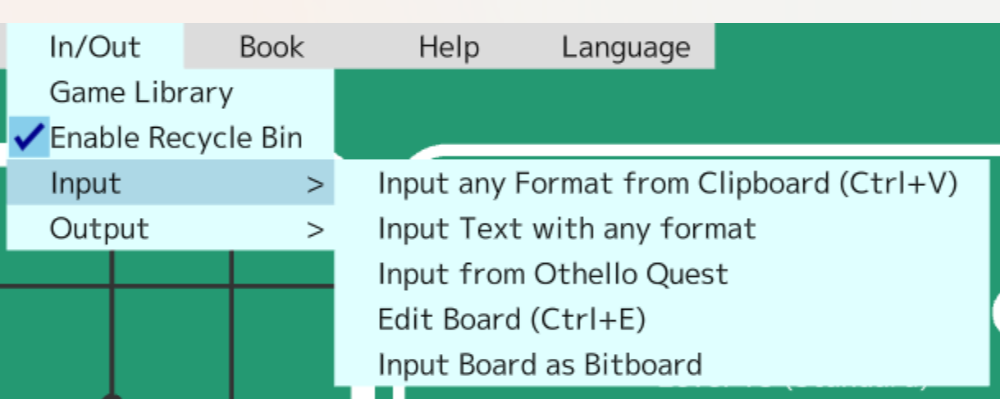
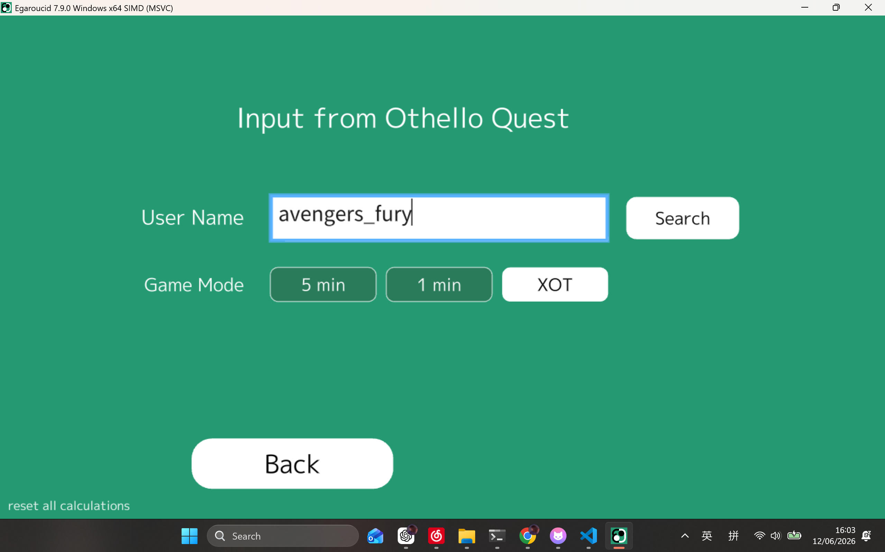
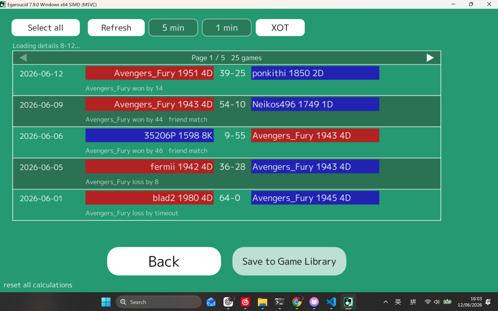
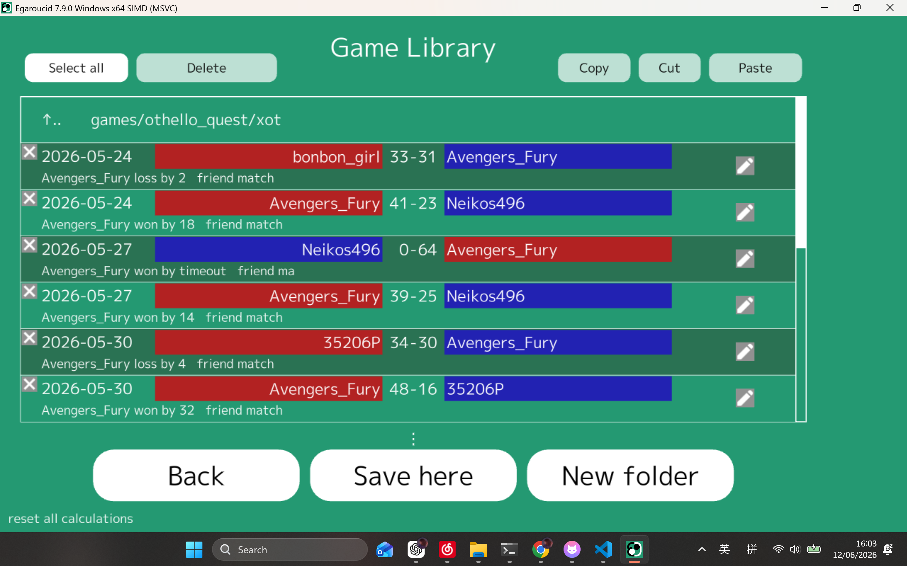

# Othello Quest Input PR Draft

## Summary

Add an Othello Quest import flow that searches a player's public games, previews results, imports games, and saves selected games into Game Library.

## What Changed

- Added an In/Out menu entry for Othello Quest input.
- Added a search screen with username input and mode selection:
  - 5 min
  - 1 min
  - XOT
- Fetches paginated Othello Quest game lists.
- Loads game details asynchronously and displays game metadata.
- Supports selecting games from search results.
- Saves selected ready games through Game Library instead of writing directly to a fixed folder.
- Keeps the "Save to Game Library" button hidden on the search page and disabled until there is a selected saveable game.
- Persists the last searched username and selected mode.

## Why

Users can currently paste individual game text manually, but Othello Quest games are easier to import from the public game list. This PR adds a focused UI for searching, previewing, and saving those games with their dates, players, scores, and result summary.

## Screenshots

## Validation

- Release x64 GUI build passed with MSBuild.
- Manually verified the Othello Quest menu entry, search form, results list, and Game Library save handoff with the screenshots above.
- Review fix verified that empty save attempts are blocked on the initial search page.

## Suggested PR Title

Add Othello Quest game import flow
