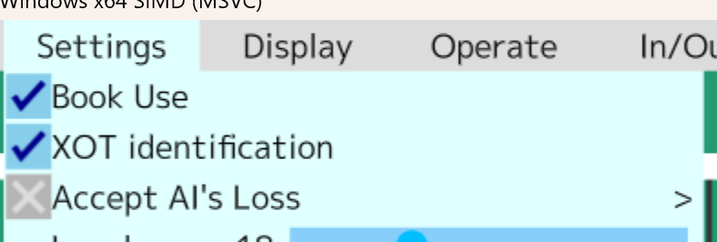
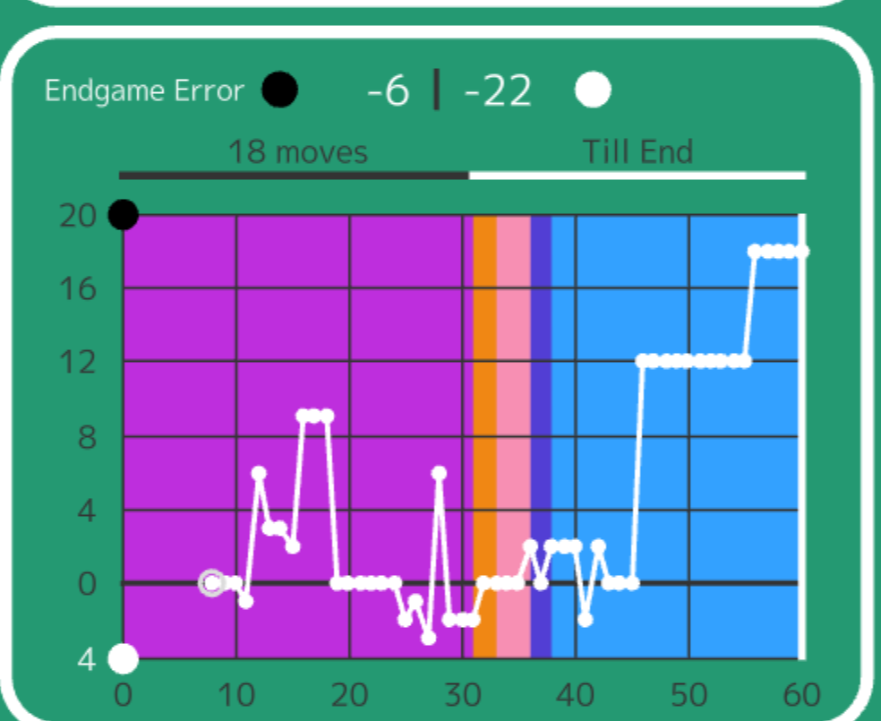
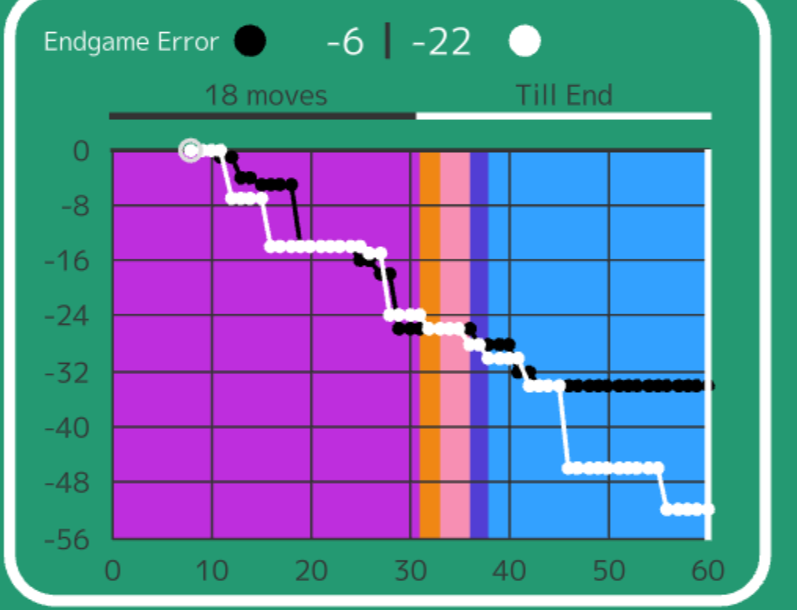

# XOT Identification PR Draft

## Summary

Add XOT opening identification and use it to keep analysis and graph views focused on the actual XOT game segment.

## What Changed

- Added XOT board-key lookup data and detection helper.
- Added a user setting for XOT identification.
- Marks the XOT start point in graph views.
- Filters graph interaction and analysis setup before the XOT start position when XOT identification is enabled.
- Refreshes XOT identification after manual moves, undo, branch saving, imports, and game loading.

## Why

Imported XOT games include a pre-game opening selection segment. Without identifying the XOT start position, analysis and graph views can include irrelevant positions before the actual game starts.

## Screenshots

## Validation

- Release x64 GUI build passed with MSBuild.
- XOT key table validation from review package:
  - 10784 declared keys.
  - 10784 parsed keys.
  - Sorted key order.
  - No duplicate keys.
- Manually verified the XOT identification setting and graph marker screenshots above.

## Suggested PR Title

Add XOT opening identification for graph and analysis views
