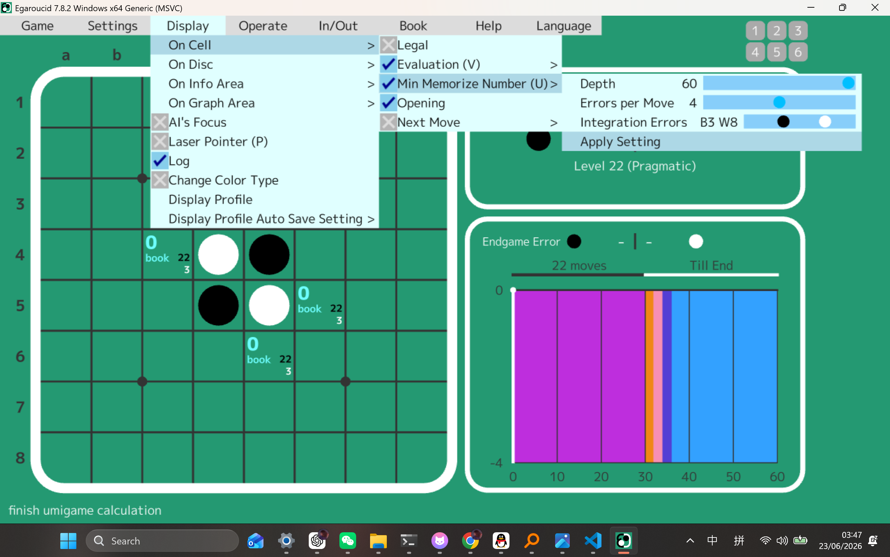
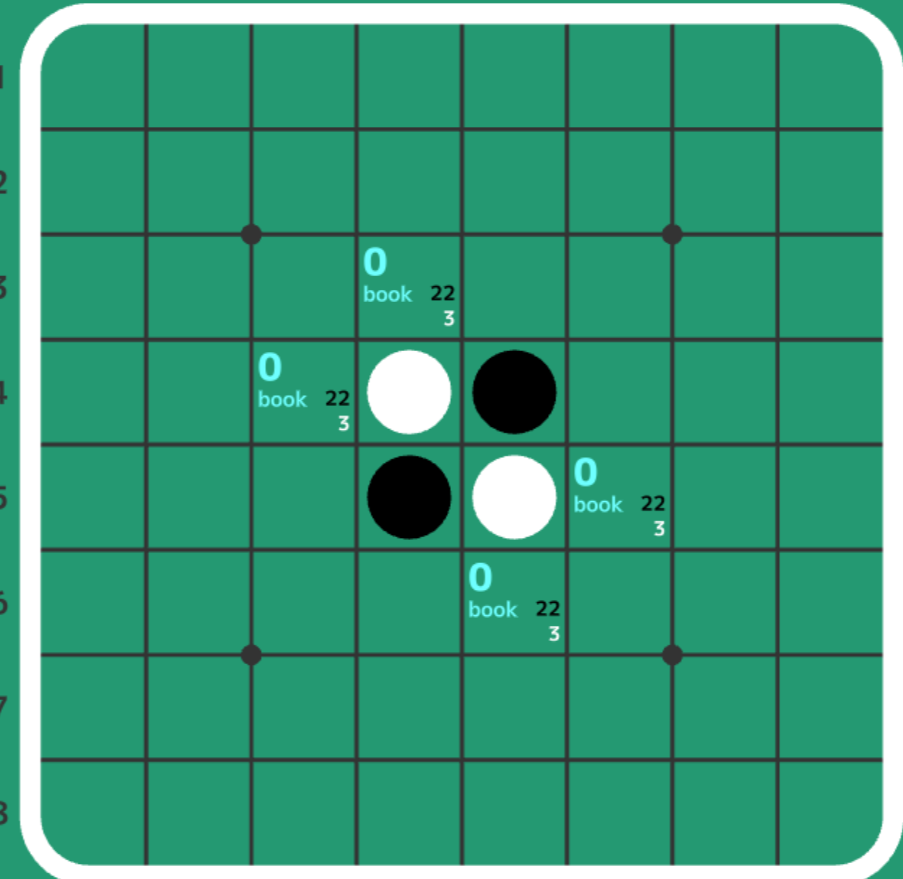

# Umigame Condition Settings

## Summary

This PR adds configurable display conditions for Umigame numbers.

The feature request came from mainland Chinese user MangWu, who wanted the next
Egaroucid version to allow wider and more practical conditions when calculating
and displaying `海龟数` / Umigame numbers.

MangWu's original request:

> 希望下一个版本的EG能对“海龟数”的限制进行调整：例如估值为0的某个棋步，海龟数随机值放宽至±2，在计算海龟数时，将所有己方为0或-2的后续分支全部计算在内；将对方0或+2的分支计算在内。

In this PR, that request is implemented as two display-side condition controls:

- `Errors per Move`: local per-node child loss.
- `Integration Errors`: black/white maximum child loss, shown as `B{black} W{white}`.

The internal score interval for `Integration Errors` is `[-B, +W]`. For example,
`B3 W8` accepts black-score child values from `-3` through `+8`.

## Scope

This PR only changes Umigame number display conditions.

It does not change book learning behavior, book revision handling, version
numbers, or the underlying lower-limit style design discussed elsewhere. The
existing Umigame result model remains non-negative `B{black} W{white}` counts.

## User-Facing Changes

- Adds `Errors per Move` under `Display > On Cell > Min Memorize Number`.
- Adds `Integration Errors` under the same menu, with independent black and
  white knobs.
- Adds `Apply Setting`; changing the sliders alone does not recalculate Umigame
  numbers until the setting is applied.
- Displays the `Integration Errors` slider value as `B{black} W{white}`.
- Draws the white player-loss knob as a pure white ball.
- Draws a single orange knob when the black and white knobs overlap, making it
  clear that both knobs are at the same value.

## Implementation Notes

- `Book::get_all_moves_within_child_loss()` gathers book moves within the local
  child-loss condition.
- `Umigame_condition` carries `max_move_loss`, `black_max_loss`, and
  `white_max_loss`.
- Umigame cache entries are protected by condition context. A change to
  `depth`, `max_move_loss`, `black_max_loss`, or `white_max_loss` clears the
  cache and increments the generation.
- Async Umigame UI jobs use request IDs. Old results and undefined interrupted
  results are ignored, so stale jobs cannot mark the current UI as complete.
- No `lower_limit`, `No range intersection`, `book_revision`, or
  `umigame_condition.hpp` design is introduced in this PR.

## Screenshots

### Condition Menu

### Displayed Umigame Values

## Relation To Issue #612

This PR is conceptually related to issue #612 because both discuss how Umigame
conditions should be interpreted. This PR is intentionally narrower: it only
changes display conditions for Umigame numbers and does not modify book
learning.

## OpenSiv3D IME Build Fix

This branch also includes an OpenSiv3D IME build fix. It is independent from the
Umigame condition feature and can be split out by maintainers if preferred.

## Validation

- `git diff --check`
- Parsed language JSON files under:
  - `bin/resources/languages/`
  - `src/tools/release_script/format_files/0_common_files/languages/`
- `python src/tools/release_script/build_console.py -c Generic`
- `python src/tools/release_script/build_gui.py -c Generic`

The Generic console and GUI builds passed locally with:

`MSBUILD_PATH=C:\Program Files (x86)\Microsoft Visual Studio\2022\BuildTools\MSBuild\Current\Bin\MSBuild.exe`

Manual UI checks covered:

- `Integration Errors = B10 W10` shows one orange overlap knob.
- `B10 W9` / `B9 W10` separates the black and pure-white knobs.
- Slider changes do not recalculate until `Apply Setting` is clicked.
- Applied condition changes clear displayed Umigame values and recalculate.

## Version

No version number is changed in this PR.
