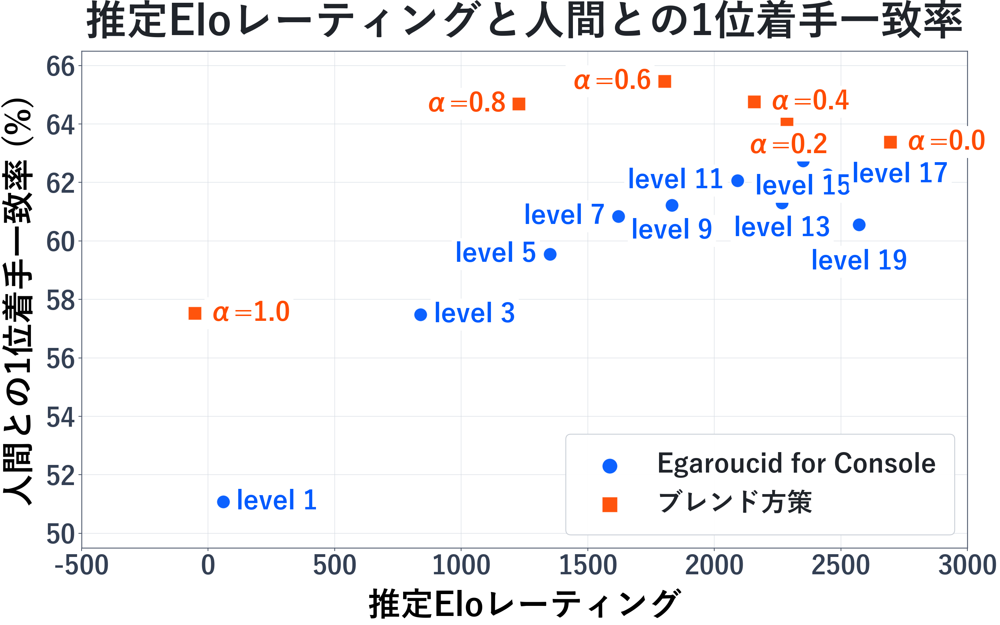

# 推定Eloと人間との着手一致率

関連issue: #613

作成日: 2026-07-20



## 図の定義

- 横軸は、総当たり戦から推定したEloレーティングである。
- 縦軸は、WTHORテストデータ100,000局面における人間との1位着手一致率である。
- RGB `(0, 90, 255)`の青い丸はEgaroucid for Console単体、RGB `(255, 75, 0)`の赤い四角はブレンド方策を表す。
- レーティングと1位着手一致率は点推定値だけを表示し、信頼区間は表示しない。
- 図全体、プロット領域、各点のラベル背景はRGB `(255, 255, 255)`の白である。PNG保存時も背景を透過しない。
- タイトル、軸名、目盛り、凡例、各点のラベルは太字で表示する。点ラベルと目盛り・凡例は30ポイント、軸名は38ポイント、タイトルは48ポイントである。
- 各点のラベルは原則として点から15ポイントの位置へ配置した。モデルが密集する箇所では重なりを避けるため、最大28ポイントまで離している。初期配置ではラベル同士が重ならないことを描画座標で確認した。保存済み位置を使用しない自動配置では近傍から探索を開始し、重ならない位置を見つけられない場合は、重なった図を保存せずエラーとして終了する。

強さと人間との着手一致率の両方が提示されている16モデルだけを作図対象とした。ランダム打ちは人間との着手一致率がなく、Egaroucid for Console level 21は総当たり戦の推定Eloが提示されていないため、図に含めていない。

## 入力データ

作図に使用した値は[`rating_vs_human_top1_data.csv`](rating_vs_human_top1_data.csv)に保存した。元の表との対応は次のとおりである。

- Egaroucid for Console: level 1、3、5、7、9、11、13、15、17、19
- ブレンド方策: α=0.0、0.2、0.4、0.6、0.8、1.0

## 再生成

```powershell
python src/tools/policy_network_human_like_ai/50_rating_vs_human_match/plot_rating_vs_human_match.py
```

このコマンドは[`label_positions.json`](label_positions.json)のラベル位置を読み込み、同じフォルダにPNG画像を出力する。

## ラベル位置の調整

次のコマンドでラベル位置調整画面を開く。

```powershell
python src/tools/policy_network_human_like_ai/50_rating_vs_human_match/plot_rating_vs_human_match.py `
  --adjust-labels
```

- ラベルをマウスの左ボタンでドラッグすると、そのラベルだけを移動できる。
- `S`キーを押すと、現在位置を`label_positions.json`へ保存し、同じ位置でPNG画像も更新する。
- `R`キーを押すと、調整画面を開いた時点の位置へ戻す。
- `--reset-labels`を併用すると、保存済み位置を無視し、自動配置を開始位置として調整できる。`S`キーを押すまでは保存済みファイルを変更しない。

位置は各点からラベルまでの横方向・縦方向のオフセットをポイント単位で保存する。文字揃えも保存するため、通常の再生成では調整画面で確定した見た目を再現する。
