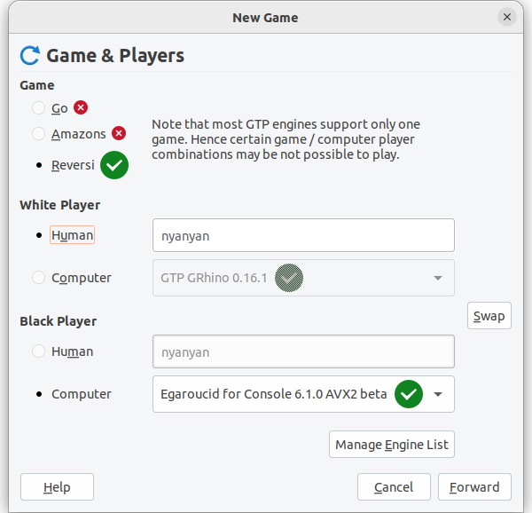

# Egaroucid for Console

Operations differ depending on your OS. This software is for Windows, Linux and MacOS.


## Windows

Please download the zip file and unzip it, then you can use it. For the best performance, you can also build it on your own. Please see documents for Linux to build it.

### Download

Please download a zip file that is suitable to your environment, and unzip wherever you want. Then execute <code>Egaroucid_for_console.exe</code> to run.


Egaroucid is optimized to SIMD version, which requires AVX2  instructions, but old CPUs (created in 2013 or older) might not be able  to run it. If so, please install Generic version.


CONSOLE_DOWNLOAD_TABLE_HERE


Please visit [GitHub Releases](https://github.com/Nyanyan/Egaroucid/releases) to see older versions and release notes.


## Linux / MacOS

Please build on your own. You can use cmake or g++.

Please download source code here, then unzip it.


CONSOLE_SOURCE_TABLE_HERE


### Build with cmake

Change directory.


<code>$ cd Egaroucid</code>


Then use <code>cmake</code> command to build.


<code>$ cmake -S . -B build [options]</code>


You can add additional options in <code>[options]</code>. Available options are:


<div class="table_wrapper"><table>
    <tr>
        <th>You want to</th>
        <th>Add this option</th>
    </tr>
    <tr>
        <td>Build without AVX2</td>
        <td>-DHAS_NO_AVX2=ON</td>
    </tr>
    <tr>
        <td>Use ARM processors</td>
        <td>-DHAS_ARM_PROCESSOR=ON</td>
    </tr>
    <tr>
        <td>Use 32-bit environment</td>
        <td>-DHAS_32_BIT_OS=ON</td>
    </tr>
    </table></div>


Then,


<code>$ cmake --build build</code>


That's all. You can see <code>Egaroucid_for_Console.out</code> in <code>Egaroucid/bin</code> directory. You can run with commands below.


<code>$ ./bin/Egaroucid_for_Console.out</code>


### Build with g++

Requirements are:

<ul>
    <li><code>g++</code> command
        <ul>
            <li>I tested with version 12.2.0 on Windows</li>
            <li>I tested with version 11.3.0 on Ubuntu</li>
        </ul>
    </li>
    <li>C++17</li>
</ul>
Change directory.


<code>$ cd Egaroucid/src</code>


Then compile it with <code>g++</code> command. You can change the output name.


<code>$ g++ -O2 ./src/Egaroucid_console.cpp -o ./bin/Egaroucid_for_Console.out -mtune=native -march=native -mfpmath=both -pthread -std=c++17 [options]</code>


You can add additional options in <code>[options]</code>. Available options are:

<div class="table_wrapper"><table>
    <tr>
        <th>You want to</th>
        <th>Add this option</th>
    </tr>
    <tr>
        <td>Build without AVX2</td>
        <td>-DHAS_NO_AVX2</td>
    </tr>
    <tr>
        <td>Use ARM processors</td>
        <td>-DHAS_ARM_PROCESSOR</td>
    </tr>
    <tr>
        <td>Use 32-bit environment</td>
        <td>-DHAS_32_BIT_OS</td>
    </tr>
    </table></div>


Then execute the output file.


<code>$ ./bin/Egaroucid_for_console.out</code>


## Usage

<code>$ Egaroucid_for_Console.exe -help</code>


or


<code>$ ./Egaroucid_for_Console.out -help</code>


to see how to use.


## Directory Structure

Egaroucid for Console uses some external files. If you've got a trouble, please check it.

<ul>
    <li>Egaroucid_for_Console.exe</li>
    <li>resources
        <ul>
            <li>hash (Files for hash)
                <ul>
                    <li>hash25.eghs</li>
                    <li>hash26.eghs</li>
                    <li>hash27.eghs</li>
                </ul>
            </li>
            <li>book.egbk3 (book file)</li>
            <li>eval.egev2 (evaluation file)</li>
            <li>eval_move_ordering_end.egev (evaluation file for endgame)</li>
        </ul>
    </li>
</ul>


## About Changing Book Format

Book format is changed in Egaroucid for Console 6.3.0. The new book's filename extension is ```.egbk2``` and it uses ```resources/book.egbk2``` as default book, but you can also use old book, which extension is ```.egbk```. If you want to use another book or old book, you can execute like this: ```Egaroucid_for_Console.exe -book [Book File]```.


## Documents for Go Text Protocol (GTP) users

GTP is a communication protocol made for game of Go, but you can play Othello with GTP on some applications. Some GTP commands are available on Egaroucid for Console, so these applications can communicate with Egaroucid for Console.


If you want to use GTP commands, please type this.


<code>$ Egaroucid_for_Console.exe -gtp</code>


I tested it works with GoGui on Windows and Quarry on Ubuntu.


### GoGui

I used [GoGui 1.5.1](https://github.com/Remi-Coulom/gogui/releases/tag/v1.5.1) on Windows.

GoGui with Egaroucid is something like this.

<div class="centering_box">
    
</div>
First, you have to register Egaroucid. Please add <code>-gtp</code> to the command, and set working directory as the directory on the executable.

<div class="centering_box">
    
    
</div>
Then you can execute Egaroucid.

<div class="centering_box">
    
</div>
On GoGui, board orientation is horizontally flipped, so you can see the ordinal board with flip the board horizontally again.

<div class="centering_box">
    
</div>


### Quarry

Egaroucid on Quarry is something like this.

<div class="centering_box">
    
</div>
First, you have to add Egaroucid. Open <code>Manage Engine List</code> via <code>New Game</code> or <code>Preferences</code>. Please add <code>-gtp</code> to the command.


Then start game to run Egaroucid.

<div class="centering_box">
    
    
</div>


