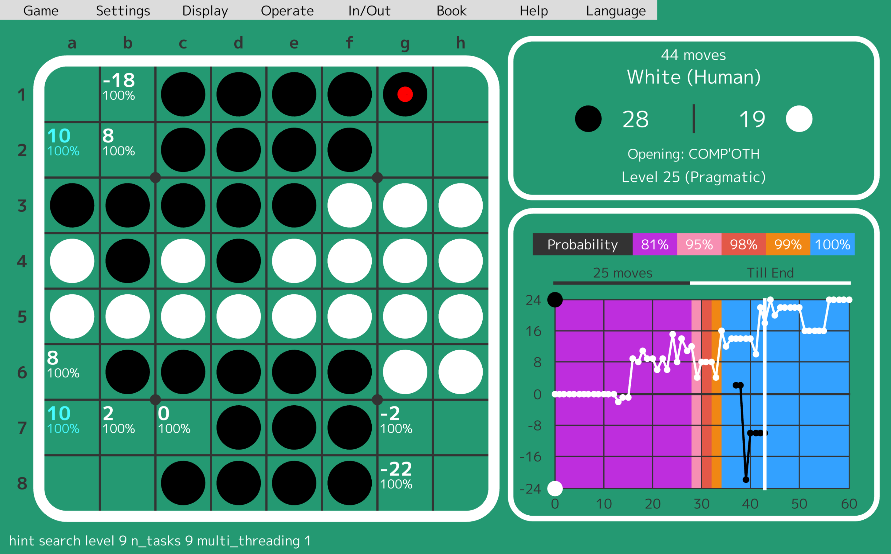
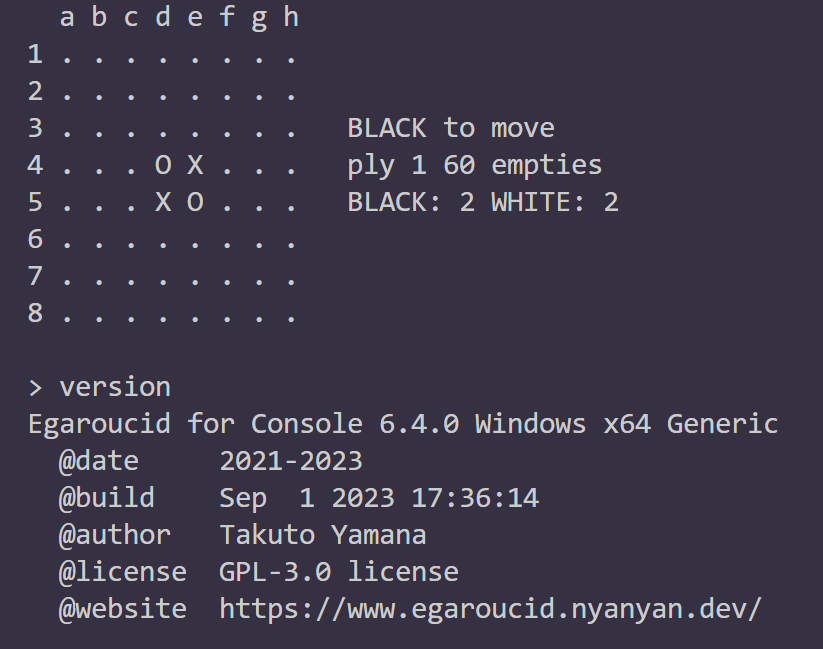
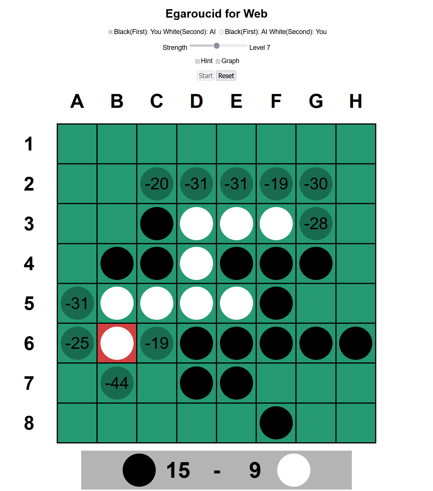

# Egaroucid

Othello Application with one of the strongest AI in the world

Egaroucid is an Othello app with one of the strongest othello solver AI. The light version got the first place in the world ([CodinGame Othello](https://www.codingame.com/multiplayer/bot-programming/othello-1)) as of March, 2023.

## Lineup

Completely free software. Egaroucid and Egaroucid for Console use the same (strong) engine, but Egaroucid for Web uses a simple (weaker) engine.

<table>
    <tr>
        <th>Name</th>
        <th>OS</th>
        <th>Details</th>
    </tr>
    <tr>
        <td>Egaroucid</td>
        <td>Windows</td>
        <td>[Download](./download/)</td>
    </tr>
    <tr>
        <td>Egaroucid for Console</td>
        <td>Windows/Linux</td>
        <td>[Download](./console/)</td>
    </tr>
    <tr>
        <td>Egaroucid for Web</td>
        <td>Any Web Browser</td>
        <td>[Play Now](./web/)</td>
    </tr>
</table>

	
    
    

## Features

<ul>
    <li>Accurate and fast evaluation function</li>
    <li>Fast search</li>
    <li>Play against AI
        <ul>
            <li>on Egaroucid's GUI</li>
            <li>on other GUI with Go Text Protocol (GTP) (Egaroucid for Console)
				<ul>
                    <li>GoGui</li>
                    <li>Quarry</li>
                </ul>
            </li>
        </ul>
    </li>
    <li>Analyze a game</li>
    <li>See evaluation values</li>
    <li>Input and Output in several formats</li>
    <li>Create / Modify book automatically / manually</li>
    <li>Add Egaroucid's / Edax's book</li>
    <li>Show opening name</li>
</ul>

## How to Install Egaroucid

### Egaroucid

Please visit [download page](./download/) and download installer, then install Egaroucid.

### Egaroucid for Console

Please read [how to install Egaroucid for Console](./console/) and download or build it.

### Egaroucid for Web

You don't need to do anything special. Please just visit [Egaroucid for Web page](./web/) and play now.

## Looking for your voice

Via this [Google form](https://docs.google.com/forms/d/e/1FAIpQLSd6ML1T1fc707luPEefBXuImMnlM9cQP8j-YHKiSyFoS-8rmQ/viewform), you can send me messages such as:

<ul>
    <li>I found a bug!</li>
    <li>I want to use Egaroucid in my language!</li>
    <li>I want some new functions!</li>
    <li>I have a good idea to improve!</li>
    <li>I want to participate in user tests!</li>
</ul>

I would like to hear your voice! Please contact me freely!

## Welcome your contribution on Egaroucid

Egaroucid is an open source software under GPL-3.0 license. All source codes are available on [GitHub here](https://github.com/Nyanyan/Egaroucid). I welcome your contributions such as pull requests!

## When you want to use Egaroucid in your own software

You can use Egaroucid freely under GPL-3.0 license. If you worry about GPL-infection, please ask me.

## Acknowledgements

I would like to thank these people for great contributions.

<ul>
    <li>UI Design
        <ul>
            <li>Kaneko Eizo</li>
        </ul>
    </li>
    <li>Technical Contribution
        <ul>
            <li>Toshihiko Okuhara</li>
        </ul>
    </li>
    <li>Technical Advice
        <ul>
            <li>Jon Marc Hornstein</li>
        </ul>
    </li>
    <li>Opening names Provision
        <ul>
            <li>Uenon</li>
            <li>Matthias Berg</li>
        </ul>
    </li>
    <li>Book Provision
        <ul>
            <li>Gunnar Andersson</li>
        </ul>
    </li>
    <li>User Test
        <ul>
            <li>Taiki Demoto</li>
            <li>Mathica</li>
            <li>Nettle</li>
            <li>okojoMK</li>
            <li>Takada Seigo</li>
            <li>madaranuko</li>
            <li>Nagano Yasushi</li>
            <li>trineutron</li>
            <li>Kuruton</li>
        </ul>
    </li>
</ul>

## Links

<ul>
    <li>[Egaroucid GitHub Repository](https://github.com/Nyanyan/Egaroucid)</li>
	<li>[The Weakest Othello AI](https://www.egaroucen.nyanyan.dev/)</li>
    <li>[My Website](https://nyanyan.dev/en/)</li>
    <li>[My Twitter](https://twitter.com/takuto_yamana)</li>
</ul>

## Creator

[Takuto Yamana](https://nyanyan.dev/en/)

