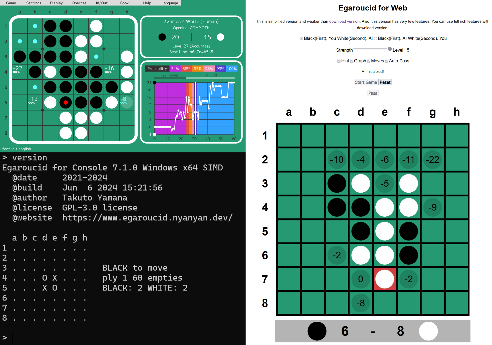

# Othello AI Egaroucid

**This page is a machine translation of the [Japanese version](https://www.egaroucid.nyanyan.dev/ja/). Please refer to the Japanese version for the official content.**

Othello Application with one of the strongest AI in the world

Egaroucid [ɪɡɑɻˈəʊsid] is an Othello app with one of the strongest othello solver AI. 

REPLACE_DOWNLOAD_BUTTON_HERE

## Lineup

Completely free software. Egaroucid and Egaroucid for Console use the same (strong) engine, but Egaroucid for Web uses a simple (weaker) engine.

<table>
    <tr>
        <th>Name</th>
        <th>Platforms</th>
    </tr>
    <tr>
        <td>[Egaroucid](./download/)</td>
        <td>Windows</td>
    </tr>
    <tr>
        <td>[Egaroucid for Console](./console/)</td>
        <td>Windows MacOS Linux</td>
    </tr>
    <tr>
        <td>[Egaroucid for Web](./web/)</td>
        <td>Any Web Browser</td>
    </tr>
    </table>

	

## Competitive Results

- Runner-up in Othello AI Tournament @[Generic Game Server](https://skatgame.net/mburo/ggs/) (2025/11/01)
- Othello AI Tournament Champion @[Generic Game Server](https://skatgame.net/mburo/ggs/) (2024/12/08)
- [CodinGame Othello](https://www.codingame.com/multiplayer/bot-programming/othello-1) World Champion (2021/11/22, 2023/09/08, 2025/02/01)

## Features

- Accurate and fast evaluation function
- Fast search
- Play against AI
    - on Egaroucid's GUI
    - on other GUI with Go Text Protocol (GTP) (Egaroucid for Console)
        - GoGui
        - Quarry
- Analyze a game
- See evaluation values
- Input and Output in several formats
- Create / Modify book automatically / manually
- Add Egaroucid's / Edax's book
- Show opening name
- Beautiful GUI powered by [Siv3D](https://siv3d.github.io/)

## How to Install Egaroucid

### Egaroucid

Please visit [download page](./download/) and download installer, then install Egaroucid.

### Egaroucid for Console

Please read [how to install Egaroucid for Console](./console/) and download or build it.

### Egaroucid for Web

You don't need to do anything special. Please just visit [Egaroucid for Web page](./web/) and play now.

## Official Documents

There are some official documents of Egaroucid written in Japanese. Please translate it by yourself.

- [How to Use Egaroucid](./usage/): Explains how to use the software one by one
- [Book Usage](./usage/book/): Explains how to use Egaroucid's book
- [Technology Explanation](./technology/explanation/): Technical explanation for Othello AI programmers

## Articles that introduce Egaroucid

- [The university student who created the world's strongest "Othello AI" - The starting point of creation was "a single picture book"](https://web.quizknock.com/othello-ai): Detailed introduction by QuizKnock Web media
- [Egaroucid: An Othello app review](https://www.worldothello.org/news/354/egaroucid-an-othello-app-review): Review of Egaroucid by World Othello Federation

## Other Documents

Other materials related to Egaroucid. Mostly for reading. (Available in Japanese only)

- [How I became World No. 1 in Othello AI and completely understood Othello AI](https://qiita.com/Nyanyan_Cube/items/195bdc47bb1d7c6f8b24): The story of how I reached No. 1 in a contest at the beginning of Othello AI development
- [How I won the Othello AI World Championship](https://qiita.com/Nyanyan_Cube/items/e104595c48e6ac67475b): The story of how I won an Othello AI tournament with few restrictions. After 3 years, I have almost reached the "true world's strongest" Othello AI I wrote about in my previous post.
- [Everyone, just build an Othello AI](https://qiita.com/Nyanyan_Cube/items/1839732d7bdf74caff21): Explains the benefits of building an Othello AI
- [Othello AI Textbook](https://note.com/nyanyan_cubetech/m/m54104c8d2f12): A magazine explaining Othello AI production from scratch. Completely free. Sample code is also available. These are somewhat old articles, so I hope to update them soon...
- [How the World No. 1 Othello AI creator made the weakest Othello AI (Story)](https://note.com/nyanyan_cubetech/n/n2674dd6f5973): The story of creating the weakest Othello AI, [Egaroucen](https://www.egaroucen.nyanyan.dev/) (the weakest in the world according to my own research)
- [How the World No. 1 Othello AI creator made the weakest Othello AI (Technical)](https://qiita.com/Nyanyan_Cube/items/43d8627539c73459635c): Technical explanation of the weakest Othello AI, [Egaroucen](https://www.egaroucen.nyanyan.dev/)
- [How I made my first app by turning the World No. 1 Othello AI into software with Siv3D](https://qiita.com/Nyanyan_Cube/items/bfb2bc3ba7a93c83f2d1): The story of releasing the Othello AI as a software that actually works on the screen

### Materials about Othello is Solved

On October 30, 2023, a paper titled [Othello is Solved](https://doi.org/10.48550/arXiv.2310.19387) was posted to arXiv. I am not the author of this paper, but since it is in my specialty, I read it and wrote a commentary on it. It is not directly related to Egaroucid, but my experience in developing Egaroucid was helpful in understanding the paper, so I will introduce it here. It is probably the most accurate and detailed explanation available in Japanese.

- [Othello is Solved (Hiroki Takizawa)](https://doi.org/10.48550/arXiv.2310.19387): Original paper (English).
- [Let's make it clear whether "Othello is Solved" or not](https://note.com/ipsj/n/n86f6dbfbfc7a): An article written as a special commentary in the journal of the Information Processing Society of Japan (IPSJ). I summarized the paper's commentary briefly.
- [Commentary on the Othello is Solved Paper (Personal View)](https://qiita.com/Nyanyan_Cube/items/a373da3157cdd117afcc): A long text of 17,000 characters, explaining the paper in detail.

## Looking for your voice

Via this [Google form](https://docs.google.com/forms/d/e/1FAIpQLSd6ML1T1fc707luPEefBXuImMnlM9cQP8j-YHKiSyFoS-8rmQ/viewform), you can send me messages such as:

- I found a bug!
- I want to use Egaroucid in my language!
- I want some new functions!
- I have a good idea to improve!
- I want to participate in user tests!

I would like to hear your voice! Please contact me freely!

## Welcome your contribution on Egaroucid

Egaroucid is an open source software under GPL-3.0 license. All source codes are available on [GitHub here](https://github.com/Nyanyan/Egaroucid). I welcome your contributions such as pull requests!

## When you want to use Egaroucid in your own software

You can use Egaroucid freely under GPL-3.0 license. If you worry about GPL-infection, please ask me.

If you use Egaroucid, I would be happy to receive a report (not mandatory).

## Citation

We welcome the use of Egaroucid in papers and other publications.

When citing Egaroucid, please use the following format as a reference, or adjust it to fit the citation format of your publication.

Yamana, Takuto.: Egaroucid, https://www.egaroucid.nyanyan.dev/

## Acknowledgements

I would like to thank these people for great contributions (in no particular order, titles omitted).

- UI Design
  - Kaneko Eizo
- Technical Contribution / [GitHub Contribution](https://github.com/Nyanyan/Egaroucid/graphs/contributors)
  - Toshihiko Okuhara
  - Hayato Sasakura
  - acepck
  - HiraokaTakuya
  - Ben Stokmans
  - seigot
- Translation
  - ZhangHengge (Simplified Chinese)
  - YuYutw123 (Traditional Chinese (Taiwan))
- Technical Advice
  - Jon Marc Hornstein
- Opening names Organize / Provision
  - Kyrin
  - Wanryu
  - Uenon
  - Matthias Berg
- Book Provision
  - Gunnar Andersson
- User Test
  - Ben Seeley
  - Wanryu
  - OGA NAO
  - Satoshi Kurahashi
  - Taiki Demoto
  - Mathica
  - Nettle
  - okojoMK
  - Takada Seigo
  - madaranuko
  - Nagano Yasushi
  - trineutron
  - Kuruton

## Links

- [Egaroucid GitHub Repository](https://github.com/Nyanyan/Egaroucid)
- [The Weakest Othello AI](https://www.egaroucen.nyanyan.dev/)
- [My Website](https://nyanyan.dev/en/)
- [My Twitter](https://twitter.com/takuto_yamana)

## Third-Party Links
Below is a list of Egaroucid-related links provided by third parties. The author of Egaroucid assumes no responsibility for the content of these links.

- [Distribution of books in Egaroucid format (Japanese)](https://hasera.net/othello/Egaroucid-book.html): High-precision books that can be used directly with Egaroucid are being made available to the public.

## Works by third parties using Egaroucid-related materials

These are works developed by third parties using Egaroucid or Egaroucid's training data, etc.

- [Reversi Web](https://reversi.yuki-lab.com/en/): Othello AI that can be played on the website. The Egaroucid for Web engine is used as the top-level AI that you can play against by registering an account.
- [Reversi Nexus](https://reversi.nexus/): Othello AI that can be played on websites, desktops, and mobiles. It seems they referred to Egaroucid's [training data](./technology/train-data/) and [technical explanation](./technology/explanation/).

## Other Othello AIs

Recent great Othello AIs:

- [Edax 4.6](https://github.com/abulmo/edax-reversi): Strong and famous. Egaroucid borrows many ideas from Edax.
- [Edax 4.5](https://github.com/okuhara/edax-reversi-AVX): Edax 4.4 optimized for AVX. Strong and very fast. Egaroucid borrows some ideas from Edax 4.5.
- [Master Reversi](http://t-ishii.la.coocan.jp/hp/mr/): Strong and very fast.
- [FOREST](https://lapagedolivier.fr/forest.htm): Uses alpha-beta pruning with neural-network-based evaluation function. The accuracy of its evaluation function is very good.
- [dekunobou](https://dekunobou.jj1guj.net/): An unique Othello AI which uses alpha-beta pruning with an evaluation function optimized by genetic algorithm. The developer is also famous for shogi AI.
- [WZebra](http://www.radagast.se/othello/download.html): Development stopped in around 2005. In old versions of Egaroucid, the default book was based on WZebra's book under a permission of its developer. Although the development has already stopped, I would like to introduce it with respect.
- [Logistello](https://skatgame.net/mburo/log.html): The first Othello AI to win against world champion Takeshi Murakami in 1997. The idea of this AI is used in Egaroucid even now. Although the development has already stopped, I would like to introduce it with respect.

## Creator

[Takuto Yamana](https://nyanyan.dev/en/)
