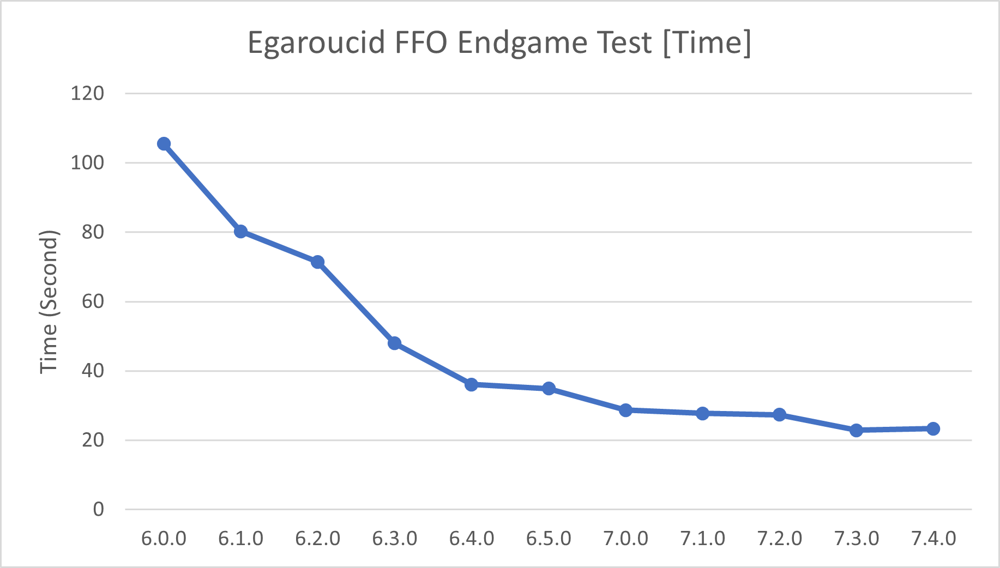
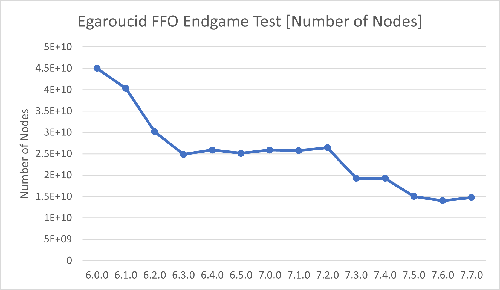
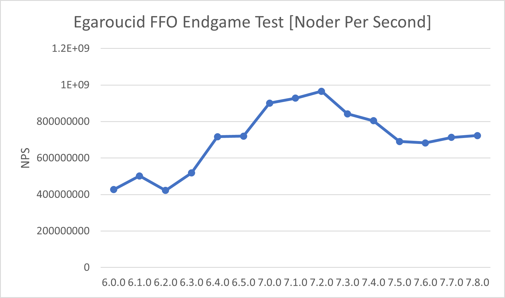

# Egaroucid Technology

## Benchmarks

I used 2 benchmarks for evaluating Egaroucid. The first one is [The FFO endgame test suite](http://www.radagast.se/othello/ffotest.html). This test is for the speed of endgame complete search. The second one is the matches against old versions of Egaroucid and [Edax 4.4](https://github.com/abulmo/edax-reversi/releases/tag/v4.4). To test the strength of its evaluation function, I used no book, and used [XOT](https://berg.earthlingz.de/xot/aboutxot.php?lang=en) for the starting positions.

### The FFO endgame test suite

The endgame search is evaluated by 3 features:

<ul>
    <li>Search time</li>
    <li>Number of nodes visited</li>
    <li>NPS (Nodes Per Second)</li>
</ul>

The most important feature for users is the search time. This feature is shown as the actual time (second) to solve [The FFO endgame test suite](http://www.radagast.se/othello/ffotest.html) #40 to #59. This value is good if it decreases.

To shorten the search time, we can do two things: decrease the number of nodes and increase the number of nodes visited in a unit time.

There are some graphs of results of The FFO endgame test suite on Core i9 13900K, SIMD version.

	
    
    

### Battles with XOT

It is the best way to evaluate the strength of Othello AI that we have battles with some engines. The result of battles by each version of Egaroucid and [Edax 4.4](https://github.com/abulmo/edax-reversi/releases/tag/v4.4) is below.

To avoid same lines, I used [XOT](https://berg.earthlingz.de/xot/aboutxot.php?lang=en) as the beginning board. Each battle is done in level 1 (lookahead depth is 1 for the midgame, 2 for the endgame).

<table>
<tr><th>Name</th><th>Winning Rate</th></tr>
<tr><td>7.1.0</td><td>0.5770</td></tr>
<tr><td>7.0.0</td><td>0.5537</td></tr>
<tr><td>6.5.X</td><td>0.5434</td></tr>
<tr><td>6.4.X</td><td>0.4904</td></tr>
<tr><td>6.3.X</td><td>0.4561</td></tr>
<tr><td>6.1.X</td><td>0.5020</td></tr>
<tr><td>6.0.X</td><td>0.4451</td></tr>
<tr><td>Edax</td><td>0.4321</td></tr>
</table>

The further log is available [here](./battle.txt).

Egaroucid 6.2.0 is omitted because it has the same evaluation function as 6.3.0.

### Details

There are detailed benchmarks for each version including older versions.

<table>
	<tr>
		<th>Version</th>
		<th>Date</th>
	</tr>
    <tr>
		<td><a href="./benchmarks/7_1_0/">7.1.0</a></td>
		<td>2024/06/06</td>
	</tr>
    <tr>
		<td><a href="./benchmarks/7_0_0/">7.0.0</a></td>
		<td>2024/04/17</td>
	</tr>
    <tr>
		<td><a href="./benchmarks/6_5_0/">6.5.0</a></td>
		<td>2023/10/25</td>
	</tr>
    <tr>
		<td><a href="./benchmarks/6_4_0/">6.4.0</a></td>
		<td>2023/09/01</td>
	</tr>
    <tr>
		<td><a href="./benchmarks/6_3_0/">6.3.0</a></td>
		<td>2023/07/09</td>
	</tr>
    <tr>
		<td><a href="./benchmarks/6_2_0/">6.2.0</a></td>
		<td>2023/03/15</td>
	</tr>
    <tr>
		<td><a href="./benchmarks/6_1_0/">6.1.0</a></td>
		<td>2022/12/23</td>
	</tr>
	<tr>
		<td><a href="./benchmarks/6_0_0/">6.0.0</a></td>
		<td>2022/10/10</td>
	</tr>
    	<tr>
		<td><a href="./benchmarks/5_10_0/">5.10.0</a></td>
		<td>2022/06/08</td>
	</tr>
    	<tr>
		<td><a href="./benchmarks/5_9_0/">5.9.0</a></td>
		<td>2022/06/07</td>
	</tr>
    	<tr>
		<td><a href="./benchmarks/5_8_0/">5.8.0</a></td>
		<td>2022/05/13</td>
	</tr>
    	<tr>
		<td><a href="./benchmarks/5_7_0/">5.7.0</a></td>
		<td>2022/03/26</td>
	</tr>
    	<tr>
		<td><a href="./benchmarks/5_5_0/">5.5.0/5.6.0</a></td>
		<td>2022/03/16</td>
	</tr>
    <tr>
		<td><a href="./benchmarks/5_4_1/">5.4.1</a></td>
		<td>2022/03/02</td>
	</tr>
</table>

## Technology Explanation

I wrote [Technology Explanation](https://www.egaroucid.nyanyan.dev/ja/technology/explanation/) only in Japanese. Please translate by yourself.

## Download Transcript

Huge dataset of games played by Egaroucid is available. Please see [Download Transcript](./transcript) page.
