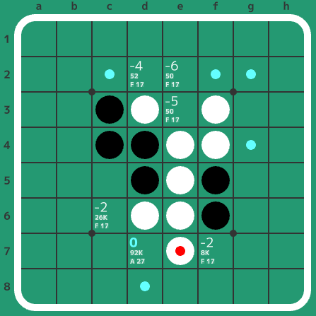
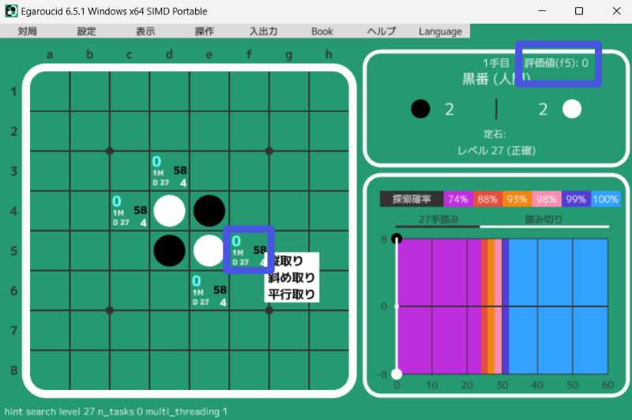

# Egaroucid Book Detailed Explanation

**This page is a machine translation of [the Japanese version](../../../ja/usage/book/). Please refer to [the Japanese version](../../../ja/usage/book/) for the official content.**

This page explains how to use the Book-related features in the Othello AI Egaroucid (author's usage). This is strictly the author's personal usage, but Egaroucid is designed to use the Book with the methods described here.

This page is only available in Japanese. The target audience is Othello players (human Othello players).

Last updated: 2024/08/13 Egaroucid 7.3.0

INSERT_TABLE_OF_CONTENTS_HERE

## What is a Book?

In Egaroucid, a Book is a "collection of evaluation values calculated with high precision in advance."

Othello AI can quickly read to the end in the endgame, but it cannot read to the end in the opening and midgame. In such cases, an evaluation function is used to predict the final result from the state of the board before the endgame, and that predicted result is used as the likely correct result. However, evaluation functions are naturally not perfect. It is often unable to detect bad moves that result in a loss of about 2 stones. Therefore, a method is adopted to pre-calculate the evaluation values of various board positions over a long period from the opening to the midgame.

From here, we will explain the basic knowledge of Egaroucid's Book. I think the design philosophy is similar to Edax's Book, so if you are familiar with Edax's Book, you may understand it by reading it lightly.

### Book Structure

This might be a detailed explanation from the beginning, but since I thought it would be good to show it first, I will explain the Book structure first.

In Egaroucid's Book, the following information is recorded for each board:

<div class="table_wrapper">
<table>
    <tr>
        <th>Name</th>
        <th>Content</th>
    </tr>
    <tr>
        <td>Board</td>
        <td>Arrangement of stones for the player whose turn it is, and arrangement of opponent's stones</td>
    </tr>
    <tr>
        <td>Evaluation Value</td>
        <td>Evaluation value from the perspective of the player whose turn it is (meaning "if the best move is made on this board, it will result in an X stone win")</td>
    </tr>
    <tr>
        <td>Level</td>
        <td>AI level used for evaluation value calculation (recorded to show foresight in moves, etc.)</td>
    </tr>
    <tr>
        <td>Line Count</td>
        <td>How many board positions from this position to the endgame are registered in the Book (related to Book accuracy)</td>
    </tr>
    <tr>
        <td>Leaf Evaluation Value</td>
        <td>The evaluation value of probably the best move among legal moves that lead to board positions not registered in the Book (used for Book learning)</td>
    </tr>
    <tr>
        <td>Leaf Move</td>
        <td>Probably the best move among legal moves that lead to board positions not registered in the Book</td>
    </tr>
    <tr>
        <td>Leaf Level</td>
        <td>AI level that calculated the Leaf Evaluation Value and Move</td>
    </tr>
</table>
</div>

The Book stores evaluation values and other information linked to board information. Among these pieces of information, the evaluation value is what users see most often. This is simply a value indicating how favorable a position is to one side, and it is the most important information. Various other pieces of information are stored to accurately and efficiently calculate this value (Book learning).

Information about leaves is used in Book learning, which will be described later.

### AI Moves Using the Book

When the AI makes a move in a certain position, if there is even one move registered in the Book that can be played from that position, it will make a move from among the moves registered in the Book. In other words, moves registered in the Book must always be good moves. If only moves other than the best move are registered in the Book, the moves will become erratic.

When the AI actually uses the Book, it tries each legal move, then searches the Book, and notes down the registered evaluation value (for the opponent) and the move. After expanding all legal moves, the move with the smallest evaluation value for the opponent (= the move with the largest evaluation value for itself) is used as the best move. If at least one of the legal moves leads to a position registered in the Book, the AI will only choose from positions registered in the Book. Also, if there are multiple moves with the same evaluation value, it will randomly choose a move among the best moves.

By the way, in Edax, these legal moves (among those registered in the Book) are included in the Book structure above under the name "link". However, I personally felt that link information was redundant and made the Book structure complicated, as it could be generated on the fly by searching the Book a few times, so it was not adopted in Egaroucid. A secondary effect of not adopting links is that the Book capacity is smaller than that of Edax.

### Book Accuracy

The evaluation values registered in the Book are pre-calculated by Egaroucid. Therefore, they can be considered reasonably accurate, but if asked if the values are strictly correct, I can only say I don't know. However, you can obtain information about how thoroughly the evaluation values have been calculated. For example, the following indicators come to mind:

<ul>
    <li>AI level used to calculate the evaluation value</li>
    <li>Number of positions registered in the Book among all positions beyond the current position</li>
</ul>

If the AI level is high, it reads moves deeper, so the values are reliable. Also, if many positions are registered in the Book beyond the current position, that fact also relates to the reliability of the evaluation value to some extent.

These two indicators are easy to understand, but Egaroucid, inspired by the functions of Uenon EDAX (as of 2025/12/25, the website seems to have been hijacked...), has introduced a mechanism to display Book accuracy in 6 stages. The accuracy of evaluation values is assessed in 6 stages from A to F. Details are as follows:

<div class="table_wrapper">
<table>
    <tr>
        <th>Accuracy</th>
        <th>State</th>
        <th>Judgment Criteria</th>
    </tr>
    <tr>
        <td>A</td>
        <td>Almost no error in value</td>
        <td>All leaf nodes of Book continuations with less than 2 stone loss are full searches</td>
    </tr>
    <tr>
        <td>B</td>
        <td>High Reliability</td>
        <td>Among Book continuations with less than 2 stone loss, at least one leaf node is a full search, and other leaf nodes are read to the endgame</td>
    </tr>
    <tr>
        <td>C</td>
        <td>Accurate</td>
        <td>All leaf nodes of Book continuations with less than 2 stone loss are read to the endgame</td>
    </tr>
    <tr>
        <td>D</td>
        <td>Reasonably Accurate</td>
        <td>At least one leaf node of Book continuations with less than 2 stone loss is a full search</td>
    </tr>
    <tr>
        <td>E</td>
        <td>Fairly Accurate</td>
        <td>At least one leaf node of Book continuations with less than 2 stone loss is read to the endgame</td>
    </tr>
    <tr>
        <td>F</td>
        <td>Value is Suspicious</td>
        <td>No leaf nodes of Book continuations with less than 2 stone loss are read to the endgame</td>
    </tr>
</table>
</div>

In Egaroucid 7.3.0 and later, accuracy A is further evaluated in detail from AA to AF. AA to AF are determined by the state of the Book leaf nodes when continuing to play moves with 2 stone loss or less.

The three Book accuracy information introduced here can be displayed on the screen. Please check "Display > Display on legal moves > Book Accuracy".

Displaying Book accuracy will be useful for Book learning, which will be described later.

<div class="centering_box">
    
</div>

### Standard Included Book Specifications

Egaroucid comes with a Book created by the author upon installation. The standard Book was created independently (until Egaroucid 6.5.2, it was based on [Zebra's](http://radagast.se/Othello/download.html) Book, with values recalculated and additional learning performed with permission from the Zebra author).

For Book specifications, please refer to Book > Book Information. The standard included Book is a Book learned manually, then appropriately summarized and published.

## Trying Book Learning

You can learn the Book yourself using the Egaroucid software. Egaroucid includes almost the same function as Edax's ```book deviate```.

Egaroucid's Book learning uses the concept of "leaf" introduced in the Book structure. A leaf is "the best move (or what seems to be the best move) among the legal moves for that position, excluding moves (positions) registered in the Book." When learning the Book, it looks at all the leaves of the positions that match the learning settings, and if they meet the learning setting range, the position after that move is newly registered in the Book.

Here, four types of Book learning-related settings appear: depth, error per move, cumulative error, and leaf error. Error per move indicates how many stone losses from the best move (or what seems to be the best move) to explore, cumulative error indicates up to how many total stone losses are allowed to explore when repeating stone losses, and leaf error indicates how many stone losses up to the value of the registered position to expand the leaf (a concept similar to error per move).

Here, I will explain how the author learns Egaroucid's Book. Several methods of Book learning are conceivable, so I will briefly explain them in three types.

### Setting the Starting Position

In Egaroucid, you can freely set the starting position for Book learning. Create the position you want to learn by playing manually or using various input functions. It's a good idea to display the Book accuracy, find moves with poor accuracy, and set that move as the starting position.

### Learning Using Multiple Levels

It is recommended to start by applying learning broadly and shallowly at low levels. Then, identify promising continuations, gradually increase the level, and narrow down the search range to create a high-precision Book quickly.

Here, it is important to effectively use the "read to the end" (rough search but reads to the endgame) timing and "full search" (perfectly reads to the endgame) timing of each level.

As an example, I will introduce some sample learning settings. Although some fine-tuning may be necessary depending on your PC's specifications, I hope this serves as a reference.

#### When creating a Book with depth 32

If you have a PC that can easily perform a 28-move full search, the following settings might be good. The author uses levels 19 and 27 for learning with a Core i9 13900K. With these settings, you can create a Book with an accuracy rating of A if done well. Level 21 performs "read to the end" from depth 30 onwards, so by combining it with level 27, you can create an accurate book.

<div class="table_wrapper">
<table>
    <tr>
        <th>Level</th>
        <th>Depth</th>
        <th>Error per move</th>
        <th>Cumulative error</th>
        <th>Leaf error</th>
        <th>Remarks</th>
    </tr>
    <tr>
        <td>19</td>
        <td>31</td>
        <td>4</td>
        <td>4</td>
        <td>4</td>
        <td>Read to the end only at depth 31</td>
    </tr>
    <tr>
        <td>19</td>
        <td>31</td>
        <td>4</td>
        <td>4</td>
        <td>0</td>
        <td>Read positions with suspicious values a bit more</td>
    </tr>
    <tr>
        <td>27</td>
        <td>32</td>
        <td>0</td>
        <td>0</td>
        <td>2</td>
        <td>Use full search at depth 32 to make the best continuation accurate</td>
    </tr>
</table>
</div>

If you want to speed up calculations a bit more, you can use settings like the following. This does not perform a 28-move full search, but uses a 98% "read to the end". With these settings, the Book accuracy rating will be C at most.

<div class="table_wrapper">
<table>
    <tr>
        <th>Level</th>
        <th>Depth</th>
        <th>Error per move</th>
        <th>Cumulative error</th>
        <th>Leaf error</th>
        <th>Remarks</th>
    </tr>
    <tr>
        <td>17</td>
        <td>31</td>
        <td>4</td>
        <td>4</td>
        <td>4</td>
        <td>Create a Book broadly and shallowly with midgame search up to depth 31 (inaccurate)</td>
    </tr>
    <tr>
        <td>21</td>
        <td>32</td>
        <td>1</td>
        <td>1</td>
        <td>2</td>
        <td>Read to the end up to depth 32 with level 21 (read to the end at 98% accuracy at depth 32)</td>
    </tr>
</table>
</div>

#### When creating a Book with depth 40

Please note that creating a Book with depth 40 from shallow positions like the first move can potentially lead to a very large file size.

The following settings perform a full search for the last 24 moves of the endgame.

<div class="table_wrapper">
<table>
    <tr>
        <th>Level</th>
        <th>Depth</th>
        <th>Error per move</th>
        <th>Cumulative error</th>
        <th>Leaf error</th>
        <th>Remarks</th>
    </tr>
    <tr>
        <td>8</td>
        <td>30</td>
        <td>3</td>
        <td>3</td>
        <td>3</td>
        <td>Create a Book broadly and shallowly with midgame search up to depth 35 (inaccurate)</td>
    </tr>
    <tr>
        <td>9</td>
        <td>36</td>
        <td>2</td>
        <td>2</td>
        <td>2</td>
        <td>Create a Book broadly and shallowly with midgame search up to depth 38 (inaccurate)</td>
    </tr>
    <tr>
        <td>21</td>
        <td>40</td>
        <td>1</td>
        <td>1</td>
        <td>1</td>
        <td>Use full search from depth 36 onwards to make evaluation values accurate</td>
    </tr>
</table>
</div>

### Using Book Correction

Simply learning the Book might result in situations where, after a +2 move, there are only -4 moves available. In such cases, it is better to change the former move to +4. This process of updating the evaluation value of the current position using the evaluation value of the position after a move is implemented under the name "Book Correction." This is similar to Edax's ```book fix```.

Although level information was included in the Book's structure, Book Correction modifies the value of the position before the move even if the level of the position after the move is lower than the level of the current position. Also, while Edax performs corrections including leaf information, Egaroucid's Book Correction ignores leaf information.

When Book Correction is performed, it changes the Book's evaluation values, so even if you run Book learning again with the same settings that previously finished perfectly, it will likely calculate some positions again. Basically, it is assumed that Book learning and Book Correction are repeated to improve the Book's accuracy and increase the number of registered positions.

Note that if you import Edax's Book and then use Book Correction as is, the evaluation values may become strange due to differences in specifications between Edax and Egaroucid. Please be careful. If you import Edax's Book, it is recommended to clear all Book learning settings and then perform learning at a low level for a while to mitigate this problem.

### Using Leaf Recalculation

The concept of a leaf appeared in the Book structure, and in Book learning, by looking at the value of this leaf, it determines whether to newly register that leaf (a position not yet registered in the Book) in the Book. In other words, if the leaf's evaluation value is random, learning will not proceed well. In such a situation, using the leaf recalculation function will automatically find and recalculate leaves among the leaves of the target positions in the learning settings that were calculated at a low level.

### Using Book Reduction

If you learn the Book using the methods described so far, the Book may become too large and difficult to manage. In such cases, it is a good idea to appropriately delete unnecessary moves using the Book reduction function.

First, set the starting position of the continuation you want to reduce the Book for. For example, if there are too many rabbit openings based on the number of continuations, set it to a rabbit opening position. In that state, set the Book settings (depth, error per move, tactical error) and press the Book reduction button, and only positions that meet the conditions will remain in the Book. This operation does not affect positions that cannot be reached from the starting position.

### Manually Changing/Deleting Book Evaluation Values

Egaroucid has a function to manually change and delete Book evaluation values. This can be used when evaluation values are somehow strange and Book learning is not going well, or when a human already knows the evaluation values for a position. Evaluation values manually entered by humans are treated as higher (more accurate) than all AI levels.

Check "Book > Book Operations > Edit with right-click", set an appropriate position, and right-click on a legal move. Then, "Evaluation Value (Move):" will appear in the upper right corner of the screen, where you can enter numbers using the number keys or numeric keypad. Then, right-click the same square again or press Enter to apply the value. Pressing Esc or right-clicking the same square again when no value is entered will exit Book editing mode.

<div class="centering_box">
    
</div>

## Book File Structure

Egaroucid's book is saved in a proprietary binary file format (little-endian). This section explains the structure, including formats used in the past. While this may not be useful information for general users, it might be helpful for modifying Egaroucid or manipulating the Book.

### egbk3 format

The extension is <code>.egbk3</code>.

This is the latest format.

<div class="table_wrapper">
<table>
    <tr>
        <th>Item</th>
        <th>Data Size (bytes)</th>
        <th>Content</th>
    </tr>
    <tr>
        <td>"EGAROUCID"</td>
        <td>9</td>
        <td>Fixed string "EGAROUCID"</td>
    </tr>
    <tr>
        <td>Book Version</td>
        <td>1</td>
        <td>Fixed to 3 for egbk3 format</td>
    </tr>
    <tr>
        <td>Number of Registered Positions</td>
        <td>4</td>
        <td>Number of positions registered in the book</td>
    </tr>
    <tr>
        <td>Position Information</td>
        <td>25 * Number of Registered Positions</td>
        <td>Data of registered positions (see below)</td>
    </tr>
    </table>
</div>

The following data is stored for each registered position:

<div class="table_wrapper">
<table>
    <tr>
        <th>Item</th>
        <th>Data Size (bytes)</th>
        <th>Content</th>
    </tr>
    <tr>
        <td>Player's Stone Arrangement</td>
        <td>8</td>
        <td>Uses 64 bits to store whether there is a player's stone in each of the 64 squares (MSB is a1)</td>
    </tr>
    <tr>
        <td>Opponent's Stone Arrangement</td>
        <td>8</td>
        <td>Uses 64 bits to store whether there is an opponent's stone in each of the 64 squares (MSB is a1)</td>
    </tr>
    <tr>
        <td>Evaluation Value</td>
        <td>1</td>
        <td>Evaluation value of that position</td>
    </tr>
    <tr>
        <td>Level</td>
        <td>1</td>
        <td>AI level that calculated the evaluation value of the position</td>
    </tr>
    <tr>
        <td>Line Count</td>
        <td>4</td>
        <td>A value indicating how many positions after that position are registered in the book</td>
    </tr>
    <tr>
        <td>Leaf Evaluation Value</td>
        <td>1</td>
        <td>Evaluation value of the best-looking move among unregistered moves in the book</td>
    </tr>
    <tr>
        <td>Leaf Move</td>
        <td>1</td>
        <td>Best-looking move among unregistered moves in the book</td>
    </tr>
    <tr>
        <td>Leaf Level</td>
        <td>1</td>
        <td>AI level used for leaf calculation</td>
    </tr>
    </table>
</div>

### egbk2 format

The extension is <code>.egbk2</code>. This was used until Egaroucid 6.5.0.

<div class="table_wrapper">
<table>
    <tr>
        <th>Item</th>
        <th>Data Size (bytes)</th>
        <th>Content</th>
    </tr>
    <tr>
        <td>"EGAROUCID"</td>
        <td>9</td>
        <td>Fixed string "EGAROUCID"</td>
    </tr>
    <tr>
        <td>Book Version</td>
        <td>1</td>
        <td>Fixed to 2 for egbk2 format</td>
    </tr>
    <tr>
        <td>Number of Registered Positions</td>
        <td>4</td>
        <td>Number of positions registered in the book</td>
    </tr>
    <tr>
        <td>Position Information</td>
        <td>(22 + 2 * Number of Links) * Number of Registered Positions</td>
        <td>Data of registered positions (see below)</td>
    </tr>
</table>
</div>

The following data is stored for each registered position:

<div class="table_wrapper">
<table>
    <tr>
        <th>Item</th>
        <th>Data Size (bytes)</th>
        <th>Content</th>
    </tr>
    <tr>
        <td>Player's Stone Arrangement</td>
        <td>8</td>
        <td>Uses 64 bits to store whether there is a player's stone in each of the 64 squares (MSB is a1)</td>
    </tr>
    <tr>
        <td>Opponent's Stone Arrangement</td>
        <td>8</td>
        <td>Uses 64 bits to store whether there is an opponent's stone in each of the 64 squares (MSB is a1)</td>
    </tr>
    <tr>
        <td>Evaluation Value</td>
        <td>1</td>
        <td>Evaluation value of that position</td>
    </tr>
    <tr>
        <td>Level</td>
        <td>1</td>
        <td>AI level that calculated the evaluation value of the position</td>
    </tr>
    <tr>
        <td>Number of Links</td>
        <td>4</td>
        <td>Number of legal moves for that position registered in the book</td>
    </tr>
    <tr>
        <td>Leaf Information</td>
        <td>2 * Number of Links</td>
        <td>Data of registered links</td>
    </tr>
</table>
</div>

The following data is stored for each link:

<div class="table_wrapper">
<table>
    <tr>
        <th>Item</th>
        <th>Data Size (bytes)</th>
        <th>Content</th>
    </tr>
    <tr>
        <td>Link Evaluation Value</td>
        <td>1</td>
        <td>Evaluation value of the legal move</td>
    </tr>
    <tr>
        <td>Link Move</td>
        <td>1</td>
        <td>Registered legal move</td>
    </tr>
</table>
</div>

### egbk format

The extension is <code>.egbk</code>. This was used until Egaroucid 6.2.0.

<div class="table_wrapper">
<table>
    <tr>
        <th>Item</th>
        <th>Data Size (bytes)</th>
        <th>Content</th>
    </tr>
    <tr>
        <td>Number of Registered Positions</td>
        <td>4</td>
        <td>Number of positions registered in the book</td>
    </tr>
    <tr>
        <td>Position Information</td>
        <td>17 * Number of Registered Positions</td>
        <td>Data of registered positions (see below)</td>
    </tr>
</table>
</div>

The following data is stored for each registered position:

<div class="table_wrapper">
<table>
    <tr>
        <th>Item</th>
        <th>Data Size (bytes)</th>
        <th>Content</th>
    </tr>
    <tr>
        <td>Player's Stone Arrangement</td>
        <td>8</td>
        <td>Uses 64 bits to store whether there is a player's stone in each of the 64 squares (MSB is a1)</td>
    </tr>
    <tr>
        <td>Opponent's Stone Arrangement</td>
        <td>8</td>
        <td>Uses 64 bits to store whether there is an opponent's stone in each of the 64 squares (MSB is a1)</td>
    </tr>
    <tr>
        <td>Evaluation Value</td>
        <td>1</td>
        <td>Evaluation value of that position plus 64</td>
    </tr>
</table>
</div>