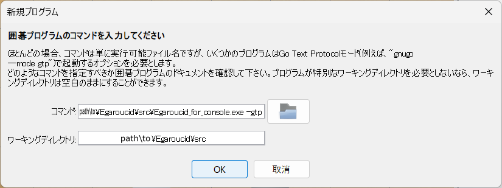
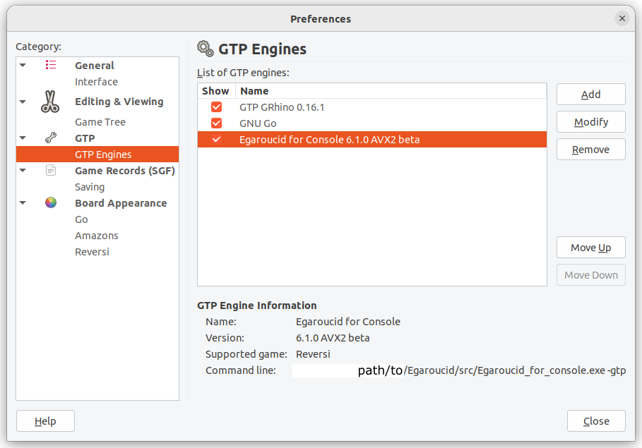

# Egaroucid for Console

OSによって操作が異なります。WindowsとLinux、MacOSに対応しています


## Windows

zipファイルをダウンロードして解凍するだけで使用可能です。なお、Linux版の手法を使って手元でコンパイルするとお使いのパソコンに最適化できるためパフォーマンスが上がる可能性があります。

### ダウンロード

以下から自分の環境に合ったものをダウンロードし、任意の場所に解凍してください。実行ファイル(<code>Egaroucid_for_console.exe</code>)をコンソールから実行すると起動します。


Egaroucidはx64のSIMDバージョン(AVX2を使用)に最適化して作っていますが、こちらは概ね2013年以降のCPUでないと動作しません。その場合にはSIMDを使用していないGenericバージョンを使用してください。また、AVX-512に対応したCPU (Intel Core iシリーズの第7から11世代など) をお使いの場合はAVX512版の方が高速に動くかもしれません。


CONSOLE_DOWNLOAD_TABLE_HERE


過去のバージョンや各バージョンのリリースノートは[GitHubのリリース](https://github.com/Nyanyan/Egaroucid/releases)からご覧ください。


## Linux / MacOS

cmakeでビルドするか、直接g++を使ってビルドすることができます。

下記リンクからコードをダウンロードし、任意の場所に解凍してください。


CONSOLE_SOURCE_TABLE_HERE


### cmakeでビルド

ディレクトリを移動します。


<code>$ cd Egaroucid</code>


<code>cmake</code>でビルドします。


<code>$ cmake -S . -B build [options]</code>


このとき、<code>[options]</code>には以下のオプションを入れられます。


<div class="table_wrapper"><table>
    <tr>
        <th>状況</th>
        <th>追加するオプション</th>
    </tr>
    <tr>
        <td>AVX2(相当)を使わない場合</td>
        <td>-DHAS_NO_AVX2=ON</td>
    </tr>
    <tr>
        <td>ARMプロセッサで動かす場合</td>
        <td>-DHAS_ARM_PROCESSOR=ON</td>
    </tr>
    <tr>
        <td>32bit環境で動かす場合</td>
        <td>-DHAS_32_BIT_OS=ON</td>
    </tr>
    <tr>
        <td>AVX-512が使えるCPUの場合</td>
        <td>-DHAS_AVX512=ON</td>
    </tr>
    </table></div>


<code>$ cmake --build build</code>


これでビルドができます。<code>Egaroucid/bin</code>フォルダの中に<code>Egaroucid_for_Console.out</code>ができましたので、以下のコマンドで実行できます。


<code>$ ./bin/Egaroucid_for_Console.out</code>


### g++でビルド

以下の条件を満たしてください。

<ul>
    <li><code>g++</code>コマンドが必要
        <ul>
            <li>Windowsではバージョン13.1.0で動作確認済</li>
            <li>Ubuntuではバージョン11.3.0で動作確認済</li>
        </ul>
    </li>
    <li>C++17の機能が必要</li>
</ul>
ディレクトリを移動します。


<code>$ cd Egaroucid</code>


<code>g++</code>コマンドにてコンパイルします。出力ファイルは任意の名前で構いません。


<code>$ g++ -O2 ./src/Egaroucid_console.cpp -o ./bin/Egaroucid_for_Console.out -mtune=native -march=native -mfpmath=both -pthread -std=c++17 [options]</code>


このとき、<code>[options]</code>には以下のオプションを入れられます。


<div class="table_wrapper"><table>
    <tr>
        <th>状況</th>
        <th>追加するオプション</th>
    </tr>
    <tr>
        <td>AVX2(相当)を使わない場合</td>
        <td>-DHAS_NO_AVX2</td>
    </tr>
    <tr>
        <td>ARMプロセッサで動かす場合</td>
        <td>-DHAS_ARM_PROCESSOR</td>
    </tr>
    <tr>
        <td>32bit環境で動かす場合</td>
        <td>-DHAS_32_BIT_OS</td>
    </tr>
    <tr>
        <td>AVX-512が使えるCPUの場合</td>
        <td>-DHAS_AVX512</td>
    </tr>
    </table></div>


実行します。


<code>$ ./bin/Egaroucid_for_console.out</code>


## 使い方

<code>$ Egaroucid_for_Console.exe -help</code>

を実行すると使えるオプションやコマンドが確認できます。


## フォルダ構成

Egaroucid for Consoleはいくつかの外部ファイルを必要とします。上記の方法でダウンロードやコンパイルした場合には特にエラーなく動きますが、もし動かなくなった場合にはフォルダ構成を確認してください。

<ul>
    <li>Egaroucid_for_Console.exe</li>
    <li>resources
        <ul>
            <li>hash (ハッシュファイル なくても動きます)
                <ul>
                    <li>hash25.eghs</li>
                    <li>hash26.eghs</li>
                    <li>hash27.eghs</li>
                </ul>
            </li>
            <li>book.egbk3 (bookファイル)</li>
            <li>eval.egev2 (評価ファイル)</li>
            <li>eval_move_ordering_end.egev (終盤探索向け評価ファイル)</li>
        </ul>
    </li>
</ul>


## book形式の変更について

Egaroucid for Consoleはバージョン7.0.0からbook形式を変更しました。新しいbookの拡張子は```.egbk3```で、標準では```resources/book.egbk3```というbookを読み込みますが、古い```.egbk```、```.egbk2```形式のbookも読み込むことができます。標準以外のbookや古いbookを使いたい場合は```Egaroucid_for_Console.exe -book [bookファイル名]```として起動してください。


## Go Text Protocol (GTP)対応

GTPは囲碁向けに作られた通信プロトコルですが、これを用いてオセロが使えるソフトウェアがいくつか存在します。Egaroucid for ConsoleはGTPに対応していますので、これらのソフトウェアから呼び出すことが可能です。


GTPコマンドを使う場合には


<code>$ Egaroucid_for_Console.exe -gtp</code>


を実行してください。


WindowsにてGoGuiを用いた動作確認を、UbuntuにてQuarryを用いた動作確認を行いました。


### GoGui

GoGuiはWindowsにて[バージョン1.5.1](https://github.com/Remi-Coulom/gogui/releases/tag/v1.5.1)を使って動作を確認しました。これ以外のバージョンのGoGuiでの動作保証はできていません。

GoGuiでの動作画面は以下のようになります。

<div class="centering_box">
    
</div>

まず、<code>プログラム>新規プログラム</code>からEgaroucidを登録します。その際、コマンドには<code>-gtp</code>を追加し、ワーキングディレクトリはEgaroucidの実行ファイルがある場所にしてください。

<div class="centering_box">
    
    
</div>

そして、<code>プログラム>プログラムを起動</code>から追加したEgaroucidを選択することでEgaroucidを起動できます。

<div class="centering_box">
    
</div>

GoGuiにおいては、盤面の行が上下反転しているので、<code>表示>Board Orientation>Flip Horizontally</code>を選択すると修正できます。

<div class="centering_box">
    
</div>


### Quarry

Quarryでの動作画面は以下のようになります。

<div class="centering_box">
    
</div>

<code>New Game</code>や<code>Preferences</code>から<code>Manage Engine List</code>を開き、Egaroucidを追加します。このとき、コマンドに<code>-gtp</code>を追加してください。


手番を選択してゲームを開始するとEgaroucidが起動します。

<div class="centering_box">
    
    
</div>


