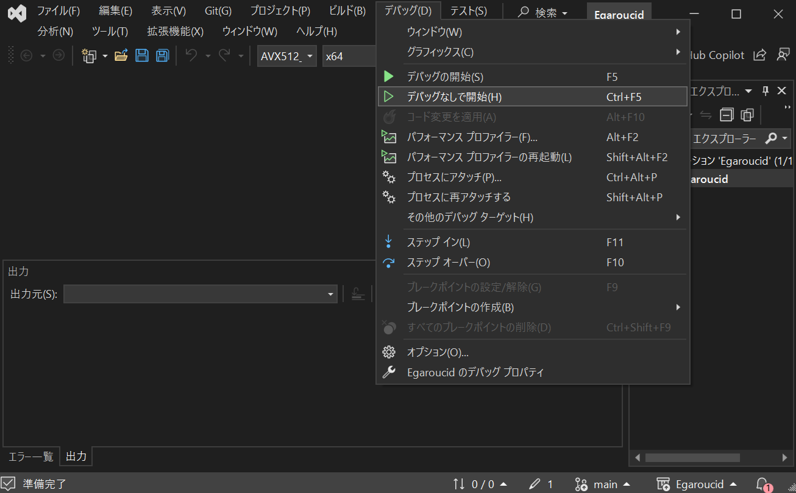
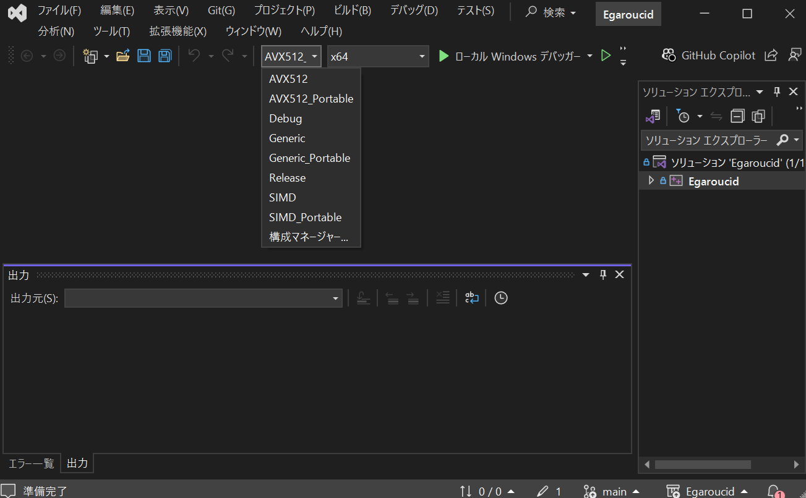

# Egaroucid ダウンロード

インストール版とポータブル版があります。インストール版はインストーラを実行すると自動的に最適な設定でインストールしてくれるものです。ポータブル版はzipファイルを解凍して使うものです。

EgaroucidはWindows向けに作っていますが、Macでもビルド可能です(有志による貢献です)


## インストール版

以下のボタンを押してインストーラをダウンロードしてください。ダウンロードが完了したらインストーラを実行し、手順に従うとインストールが完了します。

REPLACE_DOWNLOAD_BUTTON_HERE

インストーラを実行すると以下のように「WindowsによってPCが保護されました」と出ることがありますが、「詳細情報」を押すと「実行」ボタンが出ます。こちらを押すとインストーラを実行できます。なお、Egaroucidは悪意を持ったコードを含んでいませんが、この操作は自己責任で行ってください。

<div class="centering_box">
    
    
</div>


Egaroucidは64bitのWindowsかつIntel製かAMD製のCPU、またはx64互換機能のあるARM製CPUに対応しています。

Egaroucidは個々の環境向けに高速に動くようにいくつかのバージョン(SIMD / Generic / AVX512)を用意しています。インストール版では自動で最適なものをインストールしてくれます。

過去のバージョンや各バージョンのリリースノートは[GitHubのリリース](https://github.com/Nyanyan/Egaroucid/releases)からご覧ください。


## ポータブル版

<b>Egaroucidは64bitのWindowsかつIntel製かAMD製のCPU、x64互換機能のあるARM製CPUに対応しています。</b>

以下から自分の環境に合ったものをダウンロードし、zipを解凍してください。中のEgaroucid_[バージョン].exeを実行するとEgaroucidが起動します。


GUI_DOWNLOAD_TABLE_HERE


EgaroucidはSIMDバージョン(AVX2が必要)に最適化して作っていますが、こちらは概ね2013年以降のCPUでないと動作しません。その場合にはGenericバージョンを使用してください。また、AVX-512に対応したCPU (Intel Core iシリーズの第7から11世代の一部など) をお使いの場合はAVX512版の方が高速に動くかもしれません。

過去のバージョンや各バージョンのリリースノートは[GitHubのリリース](https://github.com/Nyanyan/Egaroucid/releases)からご覧ください。


## book形式の変更について

### egbk3形式への変更

Egaroucidはバージョン6.5.1からbook形式を変更し、拡張子が```.egbk3```のものを使うようになりました。以前のバージョンをお使いで新しく6.5.1をインストールした場合、初回起動時に古い```.egbk2```形式および```.egbk```形式のbookを自動で変換します。また、古い形式もbookの読み込みなど各種機能が使えます。ただし、保存形式は新しい```.egbk3```形式になります。

### egbk2形式への変更

Egaroucidはバージョン6.3.0からbook形式を変更しました。新しいbookの拡張子は```.egbk2```です。6.2.0以前のバージョンをお使いで新しく6.3.0をインストールした場合、初回起動時に古い```.egbk```形式のbookを自動で変換します。また、古い形式もbookの参照および統合機能が使えます。ただし、保存形式は新しい```.egbk2```形式になります。


## 自分でビルドする

Egaroucidは自分でビルドすることもできます。自分のPCで高速に動くように細かい最適化オプションを使ったり、改造して遊んだりできます。

### Windows

必要なもの

<ul>
    <li>[Visual Studio](https://visualstudio.microsoft.com/ja/vs/community/)</li>
    <li>[Siv3D](https://siv3d.github.io/ja-jp/)</li>
</ul>

Egaroucidのソースコードを以下からダウンロードします。

GUI_SOURCE_TABLE_HERE

Zipを解凍し、<code>Egaroucid.sln</code>をダブルクリックし、Visual StudioでEgaroucidプロジェクトを開きます。<code>デバッグ>デバッグなしで開始</code>ボタンを押して、ビルド・実行できます。ソリューション構成からエディション(SIMD版など)を選べます。

Egaroucidのソースコードは<code>src/engine</code>内のもの(AI部分)と<code>src/gui</code>内のもの(GUI描画に関わる部分)です。こちらをいじると改造できます。

<div class="centering_box">
    
    
</div>

### Mac

そのうち追記します

### Linux

そのうち追記します
