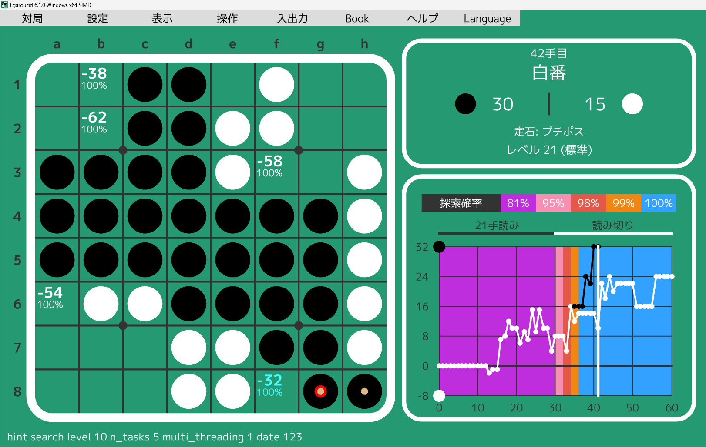
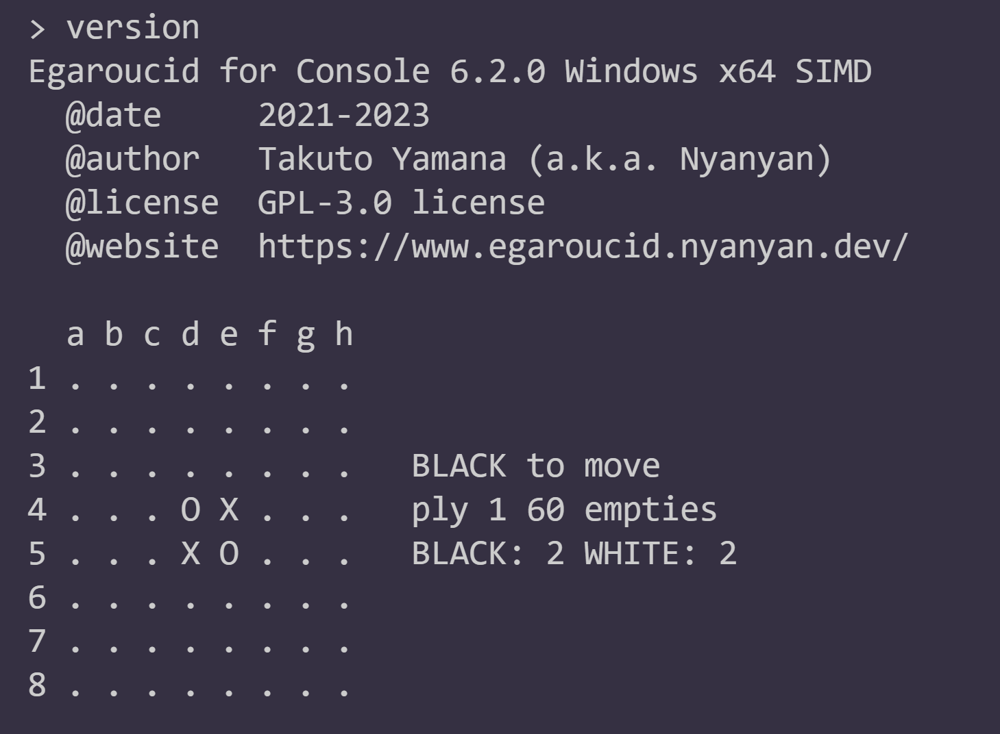

# オセロAI Egaroucid

世界最強レベルAI搭載 オセロ研究支援アプリ

Egaroucidは世界最強クラスのオセロAIを搭載した無料のオセロ研究・対戦用アプリです。搭載AIの軽量バージョンは[CodinGame Othello](https://www.codingame.com/multiplayer/bot-programming/othello-1)で世界1位になったものです(2023年6月現在)

## ラインナップ

全てフリーソフトとして公開しています。EgaroucidとEgaroucid for Consoleは同一の強い思考エンジンですが、Egaroucid for Webは簡易的な思考エンジンを搭載しています。

<table>
    <tr>
        <th>名称</th>
        <th>対応OS</th>
        <th>詳細</th>
    </tr>
    <tr>
        <td>Egaroucid</td>
        <td>Windows</td>
        <td>[ダウンロード](./download/)</td>
    </tr>
    <tr>
        <td>Egaroucid for Console</td>
        <td>Windows/MacOS/Linux</td>
        <td>[ダウンロード](./console/)</td>
    </tr>
    <tr>
        <td>Egaroucid for Web</td>
        <td>任意のWebブラウザ</td>
        <td>[今すぐ遊ぶ](./web/)</td>
    </tr>
</table>

	
    
    

## 特徴

<ul>
    <li>正確で高速な独自の評価関数</li>
    <li>高速な探索</li>
    <li>AIとの対局
        <ul>
            <li>独自GUIでの対局</li>
            <li>Go Text Protocol (GTP)対応GUIを用いた対局(Egaroucid for Console)
				<ul>
                    <li>GoGui</li>
                    <li>Quarry</li>
                </ul>
            </li>
        </ul>
    </li>
    <li>対局解析</li>
    <li>評価値・うみがめ数の表示</li>
    <li>各種入出力</li>
    <li>bookを自動/手動で作成/修正</li>
    <li>Egaroucid/Edax形式bookの追加・統合</li>
    <li>定石名の表示</li>
</ul>

## 導入する

### Egaroucid

[ダウンロードページ](./download/)より自分の環境に合ったものをダウンロードし、インストーラを実行してください。

### Egaroucid for Console

[コンソール版導入ページ](./console/)の解説に従ってダウンロードまたはビルドをしてください。

### Egaroucid for Web

ダウンロードやインストールの必要はありません。[Web版ページ](./web/)で今すぐ遊べます。

## バグ報告・新機能の提案などを募集しています

[こちらのGoogleフォーム](https://docs.google.com/forms/d/e/1FAIpQLSd6ML1T1fc707luPEefBXuImMnlM9cQP8j-YHKiSyFoS-8rmQ/viewform)より意見を受け付けています。

<ul>
    <li>不具合を発見した</li>
    <li>Egaroucidの翻訳をしたい</li>
    <li>こんな機能が欲しい</li>
    <li>こうしたらもっと良くなりそう</li>
    <li>ユーザテストに参加したい</li>
</ul>

など、様々な意見をお待ちしております。

## OSSへの貢献を歓迎します

EgaroucidはGPL-3.0ライセンスの下で作られたオープンソースソフトウェアです。[GitHub](https://github.com/Nyanyan/Egaroucid)にて全てのコードを公開しています。プルリクエストなどによる貢献を歓迎しています。

## Egaroucidを使用したアプリを作る場合

GPL-3.0ライセンスの下で自由に使っていただいて構いません。GPLの感染が気になる場合にはご相談ください。

利用した場合には(義務ではありませんが)利用報告をいただけると喜びます。

## 謝辞

開発に多大なる貢献をしていただいた方々に感謝します(順不同、敬称略)。

<ul>
    <li>UIデザイン
        <ul>
            <li>金子映像</li>
        </ul>
    </li>
    <li>技術提供
        <ul>
            <li>奥原俊彦</li>
        </ul>
    </li>
    <li>技術的アドバイス
        <ul>
            <li>Jon Marc Hornstein</li>
        </ul>
    </li>
    <li>定石名提供
        <ul>
            <li>うえのん</li>
            <li>Matthias Berg</li>
        </ul>
    </li>
    <li>Book提供
        <ul>
            <li>Gunnar Andersson</li>
        </ul>
    </li>
    <li>ユーザテスト
        <ul>
            <li>倉橋哲史</li>
            <li>出本大起</li>
            <li>まてぃか</li>
            <li>Nettle蕁麻</li>
            <li>okojoMK</li>
            <li>高田征吾</li>
            <li>まだらぬこ</li>
            <li>長野泰志</li>
            <li>trineutron</li>
            <li>クルトン</li>
        </ul>
    </li>
</ul>

## 関連リンク

<ul>
    <li>[Egaroucid GitHub レポジトリ](https://github.com/Nyanyan/Egaroucid)</li>
	<li>[自作最弱オセロAI](https://www.egaroucen.nyanyan.dev/)</li>
    <li>[作者Webサイト](https://nyanyan.dev/ja/)</li>
    <li>[作者Twitter](https://twitter.com/takuto_yamana)</li>
</ul>

## 他のオセロAI

近年のオセロAIを紹介します。

<ul>
    <li>[Edax 4.4](https://github.com/abulmo/edax-reversi) 強豪かつ有名なオセロAIです。EgaroucidはEdaxのアイデアを多く参考にしています。</li>
	<li>[Edax 4.5](https://github.com/okuhara/edax-reversi-AVX) Edax 4.4をAVXに最適化したものです。とても速く、Egaroucidでも一部の工夫を参考にしています。</li>
	<li>[Master Reversi](http://t-ishii.la.coocan.jp/hp/mr/) 強豪かつ高速なオセロAIです。</li>
	<li>[FOREST](https://ocasile.pagesperso-orange.fr/forest.htm) 深層学習を利用した評価関数でαβ法を行うオセロAIです。評価関数の精度が非常に良いです。</li>
    <li>[dekunobou](https://dekunobou.jj1guj.net/) 遺伝的アルゴリズムで評価関数を調整したユニークなオセロAIです。dekunobouの開発者は将棋AIの開発でも有名です。</li>
    <li>[WZebra](http://www.radagast.se/othello/download.html) 2005年頃まで開発されていたオセロAIです。Egaroucidでは作者の許可の下、WZebraのbookを元に値を修正して標準付属bookを作っています。すでに開発は止まっていますが敬意を表して紹介します。</li>
    <li>[Logistello](https://skatgame.net/mburo/log.html) 1997年に当時の世界チャンピオン村上健氏に勝利したオセロAIです。Logistelloで考案された技術はEgaroucidでも基礎的なところで使用しています。すでに開発は止まっていますが敬意を表して紹介します。</li>
</ul>

## 作者

[山名琢翔](https://nyanyan.dev/ja/)

