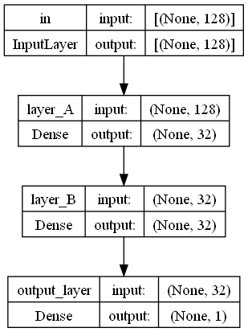
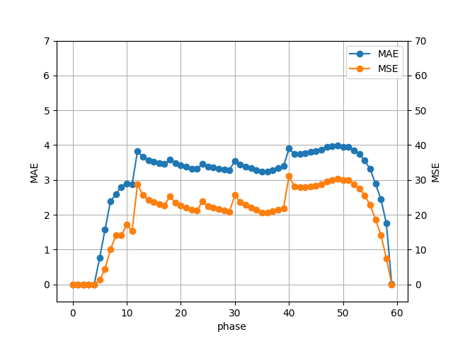

# Egaroucid 技術解説

**ここに書いた内容は初心者向きではありません。オセロAI初心者向け記事は[こちら](https://note.com/nyanyan_cubetech/m/m54104c8d2f12)に書きました。**

このページは日本語のみの雑多なオセロAI関連の技術文書です。のんびりと気が向いたときに書き足していきます。章立ての順番に意味はありません。読みたいところだけをぜひお読みください！

最終更新: 2024/04/07

INSERT_TABLE_OF_CONTENTS_HERE

## 探索アルゴリズムの選定(minimaxかMCTSか)

ゲームAIを作る上でのアルゴリズムは古くからminimax法が有名でした。1997年にチェスで人間を打ち負かしたDeep Blueも、同年にオセロで人間を打ち負かしたLogistelloも、このminimax法から派生するアルゴリズムでした。しかし、2000年に入るとMCTS(モンテカルロ木探索)が発展し、さらに2010年代にはMCTSをさらにアップデートしたPV-MCTS (Policy Value MCTS)が発展しました。2016年に囲碁で人間を打ち負かしたAlphaGoはPV-MCTSです。

この2つのアルゴリズムは根本から違うものです。例えば将棋AIではminimax系統とMCTS系統でそれぞれ良さがあるようですが、オセロにおいてはどちらを使うのが良いでしょうか。オセロにおいてminimax系統とMCTS系統のどちらが良いか、結論を簡単に出すことはできないと思います。ただ、Egaroucidではminimax系統のNegascout法を使っています。

ここでは、Egaroucidでminimax系統を採用した経緯を含め、オセロにおけるminimax系統とMCTS系統のどちらを採用するかという議論を書いてみます。

### 評価関数の精度

minimax系統のアルゴリズムでは、計算量の問題で終局まで読みきれない場合には終局前に評価関数を使って、それをそのまま終局まで読んだ確定値と同じように利用します。つまり、評価関数の精度が悪ければ必然的にAIは弱くなります。

MCTSはもともと囲碁のために発展したアルゴリズムでした。囲碁ではminimax系統のアルゴリズムが使いにくかったのです。その原因が囲碁の評価関数の作りにくさにあったといいます。将棋ではNNUEという評価関数が強いようで、NNUE+minimax系統の組み合わせとPV-MCTSが拮抗しているらしいです。

オセロにおいては、Logistelloに関する論文「Experiments with Multi-ProbCut and a New High-Quality Evaluation Function for Othello」でパターンを用いた評価関数が提案されてから、(それなりに)手軽に高精度の評価関数が作れるようになりました。ですので、評価関数の精度は、オセロにおいてはあまり問題になりません。この点で、オセロでminimax系統が向いていると言えます。

### 合法手数

MCTSは評価関数を必要としない以外にも利点があります。それは、合法手が多いゲームでもそれなりの性能が出せるところです。MCTSは囲碁のために考案されましたが、実際、囲碁は合法手が非常に多いこともあり、minimax系統のアルゴリズムには向かないそうです。

各局面の合法手数を$b$、探索する深さを$d$とすると、minimax法の計算量は$b^d$、そしてminimax法に効果的な枝刈りを施したαβ法は$\sqrt{b^d}$​です。合法手が多いゲームでは指数関数の底が大きくなるため、計算量が爆発しやすくなって困ります。囲碁などのゲームではこの問題が非常に大きく、そのためにminimax系統が向かないのです。しかし、オセロに関して言えば合法手は対局全体を通して10手前後と比較的少なめで、この点でもオセロはminimax系統に向いているでしょう。

### スコアを最大化するゲームである点

オセロは囲碁や将棋と違い、勝ち負けを争ううえで、終局時における相手との石の枚数の差(最終石差)を最大化するというタスクのあるゲームです。実際、人間によるオセロの大会では、一般に、勝敗が同じ人が複数人いた場合には石差の合計が大きい人(大勝をいっぱいした人)が上の順位になります。

経験的にMCTS系統ではスコアを最大化するゲームが苦手と言われます。そのため、オセロではこの点でminimax系統が良いと言えると思います。

ただ、2024年にMCTSでスコアを最大化するゲームを扱う手法が提案され、この手法が非常によくできているという印象を受けました。もしかしたら、スコア最大化の問題はMCTS側の工夫で解消できる問題かもしれません。その手法を提案している論文はこちら: [Self-Playを用いた深層強化学習におけるスコア分布予測型モデルの提案](http://id.nii.ac.jp/1001/00232803/)

### 完全読みの実装

オセロでは、終盤30手(オセロ自体が60手で必ず終局するため、終盤というよりはど真ん中ですが…)程度は終局まで個人向けパソコンでも数秒から10秒程度で完全読みできます。完全読みは名前の通り、終局まで厳密に読み切ってしまうため、ミスをする余地が(バグがなければ)ありません。そういうわけで、特にオセロではこの完全読み(または、明らかな悪手を省く工夫をした読み切り)をいかに早い段階で行うかが強さに直結します。

MCTS系統のアルゴリズムは完全読みのような厳密な探索には向かないため、完全読みはminimax系統で行います。そのため、中盤探索も含めて全てminimax系統でオセロAIを作ってしまえば、実装が簡潔になると思われます。

### 双方のアルゴリズムで実験してみた結果

[CodinGame Othello](https://www.codingame.com/multiplayer/bot-programming/othello-1)というオセロAIのコンテストに参加しているときに、minimaxとMCTSを両方試してみたのですが、どうも私の実装ではMCTSがあまり強くなりませんでした。あくまでも当時の私の実装力の範囲の話なので、本当にオセロにMCTSが向いていないのかを議論することはできませんが、その時にとりあえずminimaxを使おうという結論になりました。

ただ、このコンテストの上位にMCTS系統のような雰囲気の打ち方のAIがおり、本当にMCTSが弱いというよりは、私の実装力の問題である説が濃厚です。

### 個人的な面白さ

これは単純に私の趣味です。私は個人的に、人間が頑張ってチューニングしたコードが大好きですし、自分でもコードをよく吟味してチューニングしたいと思ってます。minimax系統のアルゴリズムはその点、微々たる高速化が全体のスピードに多大な影響を与えるという点で、個人的に好みでした。

将棋AI開発者とお話しをすると思うのですが、minimax系のオセロAIはMCTS系の将棋AIなどと比べて、些細な高速化が有効に働きやすいようです。些細な高速化が大好きな私としては、minimax系の方が面白そうに感じました。ただ、もちろん将棋AIはスピードがいらないかと言うとそんなわけはないはずで、将棋は将棋で細かな高速化を頑張っているはずです。

## 評価関数

ここではEgaroucid 6.X.Xのことを書いています。Egaroucid 7.X.Xのリリースに向けて、2024年3月現在、評価関数の大改修を行っています。大改修が終わったらここにその成果を書こうと思います。

既存の強豪オセロAIに広く使われているパターン評価は、[Logistelloで提案](https://skatgame.net/mburo/ps/improve.pdf)され、今日のEdaxまでほとんど形を変えずに受け継がれています。Egaroucidもこのパターン評価をベースにしていますが、少し特徴量を追加しました。

Egaroucidでは石自体をパターンとして評価する既存手法に追加の特徴量を加え、全ての得点の和を評価値としました。

評価関数は1手を1つのフェーズとして合計60フェーズ用意し、それぞれ大量の学習データ(全フェーズ合計で18億局面)を用意し、Adamで最適化しました。

### 石評価パターン

盤面のパターンとして使ったのは以下です。

    

### その他の特徴量

Egaroucidではさらに、それぞれの手番について以下の項目を計算し、特徴量に追加しました。

<ul>
    <li>石が空きマスに接している数</li>
    <li>石数</li>
</ul>

### 正確性と速さのトレードオフ

評価関数は一般に、複雑なモデルを使えば精度が高まり、強くなります。しかし、複雑なモデルは往々にして計算時間が多くかかります。そうすると時間あたりに先読みできる深さが浅くなり、時間あたりの強さでは逆に弱くなってしまうかもしれません。特にαβ法系統のアルゴリズムは、評価関数を実行する回数がどうしても多くなり、評価関数の速さは探索全体の速さに強く影響を与えます。

しかし、逆に評価関数が正確になると正確なmove orderingができ、αβ法などでは訪問ノード数を減らすことができ、結果的に高速になるという考え方もできます。ゲーム木は深さに対して指数的に大きくなるため、深い探索を行う場合には、評価関数が多少複雑である方が訪問ノード数を減らせて探索全体の高速化ができる可能性もあります。

これらの2つの観点は、結局はバランスの問題だと思います。EgaroucidではEdaxに比べて少し複雑な評価関数を用いており、そのためにEdaxよりも評価関数が遅いです。

評価関数を複雑にすると遅くなる、ということをより具体的に考えると、結局はメモリへのランダムアクセスがボトルネックになりがちです。これについては、ある程度は仕方のない問題です。使うパターンの数や大きさによってメモリ参照のスピードは変化しますので、限界まで高速化することを考える場合には選ぶパターンについてよく吟味する必要があると思います。とは言いつつ、現時点では色々と試してみた結果あまり効果がなかったのですが…

### NNUE評価関数

将棋AIで開発され、後にチェスAIにも輸入された、 [NNUE](https://github.com/ynasu87/nnue)という評価関数があります。NNUEは、簡単に言えばごく小さなニューラルネットワークを評価関数として用いるものです。将棋やチェスでは成功を収めているこの評価関数がオセロにおいて使えないか、少し実験してみました。結論を言うと、「完全にダメだと断定は全くできないが、高性能な評価関数を作るのは結構大変そう」というのが今のところの見解です。

ニューラルネットワークと聞くと遅そうなイメージがあり、遅いとαβ法のようなアルゴリズムには適さないような気がします。しかし、NNUEはニューラルネットワークの規模を非常に小さくし、入力層を着手ごとに差分計算したり、中間層をSIMDで高速化したりすることでCPU上で十分実用的なスピードにしています。実際、将棋では既存の3駒関係を使った評価関数に遜色ないスピードだそうです。

NNUEの良さは、非線形な評価関数であるところです。パターン評価や将棋の3駒関係は、どちらも線形な評価関数であるため、その表現力には仕組み上の限界があります。しかし、ニューラルネットワークであればこの限界がないというわけです。

この規模でオセロに対して十分に学習できるかを試してみました。実験として黒石の有無64マス、白石の有無64マスの合計128個の入力(つまり、ビットボードそのまま)に対して中間層として32ノードの全結合層を2つ、活性化関数をReLUとしたモデル(下図参照)を仮で作り、十分な学習データで学習してみました。

    

その結果、既存のパターン評価には評価性能が届きませんでした。具体的には、評価関数の学習データに対する平均絶対誤差(MAE)について、パターン評価は3.5石程度なのに対し、このテストモデルは5.4石程度でした。NNUEの良さは非線形性による評価性能の向上だったので、オセロにおいて、この実験ではNNUEの優位性を感じることはできませんでした。もしNNUEをオセロに使うのであれば、NNUEをオセロにおいて実用するには入力層の工夫か中間層のボリュームを増やすことが大切だと感じています。ただ、これらの解決法は推論スピードを損ねる可能性があるため、スピードとの兼ね合いを見ながら検討する必要があります。

ちなみに、上図くらいの大きさのモデルであれば、確かにかなり高速にCPUで推論できそうでした。ですので、NNUEはもう少し頑張ってみる価値があるような気がします。

## 評価関数の最適化

評価関数は、どんなモデルを使おうとも、何らかの形でそのモデルに含まれるパラメータを最適化(学習)する必要があります。

### 最急降下法

評価関数、特にパターン評価の最適化には、古くから最急降下法が使われてきました。これは[Logistelloで考案](https://skatgame.net/mburo/ps/improve.pdf)されたものです。

最急降下法による最適化については、オセロAI Thellの作者による[文書](https://sealsoft.jp/thell/learning.pdf)が詳しいです。

Egaroucidでは、ただの最急降下法では収束が遅いので、最急降下法の改良アルゴリズムであるAdamをCUDAで自前実装したものを使っています。

学習データに対する評価関数の損失をプロットしたものが以下の図です。横軸がフェーズ(何手目か)、縦軸が損失(青/左は絶対誤差の平均、橙/右は2乗誤差の平均)です。フェーズによって学習データの質を変えているので形がいびつなところがありますが、概ね絶対誤差が3.5石程度であるとわかります。

    

### 深層学習

評価関数の最適化を深層学習によって行うこともできます。これは探索中に推論を回すということではなく、少ないデータで効果的に学習を行うための工夫です。また、深層学習によって生まれたパラメータは、往々にして元の評価関数モデルよりもデータ量を小さくできるため、圧縮として活用することもできます。

元々Egaroucidは[CodinGame Othello](https://www.codingame.com/multiplayer/bot-programming/othello-1)というプログラミングコンテストに参加する目的で制作していました。そのため、このコンテスト特有の「10万文字以内でコードを記述しなければいけない」という制限を守りつつ強い評価関数を作るため、評価関数の圧縮として考案しました。

現在のEgaroucidでは、非常に大量の学習データ(18億局面以上！)を作ることに成功したため、深層学習ではなくAdamを使っています。

深層学習による学習は、以下の資料にまとめてあります。

<ul>
    <li>[オセロAIの教科書 7 【評価】 パターン評価など](https://note.com/nyanyan_cubetech/n/nb6067ce73ccd)</li>
    <li>[深層学習による圧縮を利用した強力なオセロAIの制作 (2024/06/25から無料ダウンロード可能)](http://id.nii.ac.jp/1001/00218627/)</li>
</ul>
### 学習データの作り方

学習データは、基本的にEgaroucid同士の自己対戦によって生成しました。

序盤をランダム打ちした状態からEgaroucidのレベル11などで自己対戦を行い、その対局結果(石差)を正解として、対局中の局面を学習データとしました。

ただ、この方法では序盤のデータはランダム打ちによるノイズが混じっています。そこで、序盤10手までは全ての展開を列挙し、列挙した300万程度の局面それぞれにEgaroucidのBook生成機能を使って評価値をつけ、それを正解としました。ちなみに、そのときに「序盤の展開の数を調べてみよう」と思って調べた結果を[オセロの序盤の展開数](./#ゲームの特性_オセロの序盤の展開数)に書きました。こちらもぜひご覧ください。

Egaroucidは「前回のバージョンを使って自己対戦させ、データを増やす」という手法が取れるため学習データには困らないのですが、最初にオセロAIを作る際には学習データを用意するのが大変だと思います。そこで、インターネット上で公開されている、学習に使える棋譜データおよびデータの変換方法を紹介します。これらがあれば、自前でデータを作らなくてもすぐに学習ができると思います。

<ul>
    <li>[Egaroucid自己対戦の棋譜](./../transcript/)</li>
    <li>[La base WTHOR (フランスオセロ連盟が配布している人間による対戦の棋譜)](https://www.ffothello.org/informatique/la-base-wthor/)</li>
    <li>[オセロの棋譜データベースWTHORの読み込み方](https://qiita.com/tanaka-a/items/e21d32d2931a24cfdc97)</li>
</ul>

## 枝刈り

Egaroucidでは、様々な方法で探索を省略(枝刈り)しています。特に込み入った枝刈りはEdaxに実装されているものを参考にしています。

### Negascout法

Egaroucidではminimax法系統の探索をしているので、Negascout法によって枝刈りを増やしています。Negascout法はαβ法に加え、最善(と思しき)手(Principal Variation = PV)を通常窓[α,β]で探索したら、残りの手を[α,α+1]でNull Window Search (NWS)します。これでfail highしたらPVを更新するために通常窓で探索し直して、fail lowしたらそのまま放置して良いです。

Negascoutについては、[note](https://note.com/nyanyan_cubetech/n/nf810b043fb78)に詳しく書きました。

### 置換表による枝刈り (Transposition Cutoff)

ゲーム木はほとんど木構造として見なせるのですが、たまに合流する手筋があります。この際に同じ局面を再度探索しては無駄です。そのため、置換表(特殊なハッシュテーブル)に探索結果をメモしておきます。各ノードで探索前に置換表を参照して、値が登録されていればただちにそれを返せば良いです。また、評価値の下限値と上限値を登録しておくと、探索窓を狭める効果も期待できます。

置換表に値が登録されていたとしても、現在行っている探索よりも浅い探索の結果であればそれを採用してはいけません。Egaroucidでは評価値の下限と上限に加えて探索の深さとMulti ProbCutの確率、さらに探索の新しさを記録することで、現在行っている探索の結果として置換表の値を採用するかどうかを決定しています。

なお、置換表の参照にはオーバーヘッドがあるので、それが無視できるほど根に近いノードでのみ置換表へのアクセスを行います。根に近いノードでのみ行うことで、置換表に登録するデータを必要最低限に減らすこともできます。

さらに、置換表に過去の探索での最善手も一緒に記録しておくことで、現在の探索での手の並び替え(Move Ordering)にも使えます。

### 置換表による拡張した枝刈り(Enhanced Transposition Cutoff)

あるノードを探索するとき、そのノードが置換表に登録されていなくても、そのノードの子ノードを展開して置換表を参照すると、探索窓を狭めたり、評価値を確定できる場合があります。これはEdaxにてEnhanced Transposition Cutoff (ETC)として実装されているアイデアです。

あるノードを[α,β]の探索窓で探索するとします。また、子ノードを展開して、各子ノードについて置換表に記載されている(子ノードの手番から見た)最小値Lと最大値Hを見ていきます。すると、$\beta<\max(-\{L\})$であれば$\beta$を$\max(-\{L\})$に更新できますし、同様にして$\alpha>\max(-\{H\})$であれば$\alpha$を$\max(-\{H\})$に更新できます。

これは子ノードを展開した後に置換表の参照を繰り返すため、オーバーヘッドがかなり大きいです。根に近いノードでのみ行います。

### 確定石による枝刈り (Stability Cutoff)

ある盤面について、黒の確定石がB個、白の確定石がW個あれば、最終局面はB対64-Bから64-W対Wのどれかになるので、例えば黒目線での評価値(最終石差)は2B-64から64-2Wの中に入ることがわかります。これを用いて探索窓を狭めることができる場合があります。これはEdaxにてStability Cutoffとして実装されているアイデアです。

この手法は探索しているノードが終局に十分近い場合、つまり確定石が存在する可能性が高い場合にしか使えません。また、確定石の計算にはオーバーヘッドがありますので、あまりにも終局に近すぎると、単純に探索した方が速くなることも多くあります。

なお、確定石の個数が少ないと狭められる探索窓の範囲は-64や+64に近くなります。そのため、確定石を求める前に確定石の個数が少ないと見込まれる場合は、狭める対象の探索窓が-64や64などに近い領域を含んでいる場合のみ行います。確定石が多いと見込まれれば、狭める対象の探索窓が0に近い場合も枝刈りを試みます。確定石の個数の期待値は局面が進むにつれて増えていく傾向があるので、この見込みには深さと探索窓の上限/下限を対応づけたものを使用します。

確定石自体の計算には、

<ul>
    <li>過去の探索での最善手(置換表に登録されている値)</li>
    <li>辺の確定石(事前計算しておき、辺の形を参照して決定する)</li>
    <li>8方向(縦横斜め)全てのラインが他の石で埋まっている石を確定石とする</li>
    <li>確定石に8近傍を囲まれた石を確定石とする(ループで処理する)</li>
</ul>

を行っています。もちろん、これだけでは完璧に全ての確定石を求めることはできません。しかし、オセロAIの枝刈りという文脈ではこれで十分ですし、あまり正確にして遅くなっても意味がありません。

### Multi-ProbCut

これは古くからある手法で、[Logistelloで採用](https://skatgame.net/mburo/ps/improve.pdf)されたものです。Logistello以降も現在まで様々なオセロAIで採用されています。この手法は特殊な枝刈りで、探索結果が真の値であるという保証がなくなります。

こちらについてはすでに論文や解説が多いため、ここでの解説は省略します。

## 手の並び替え(Move Ordering)

αβ法の流れを汲むゲーム木探索アルゴリズムでは、各ノードにおいて子ノードを有望な順(良さそうな手の順)に並べて、その順番に探索すると枝刈りが発生しやすくなります。この手の並べ替えをMove Orderingと言います。

ここでは、Egaroucidで使用しているMove Orderingを解説します。色々な特徴を使っていますが、Egaroucidでは常にすべての要素を使うのではなく、状況に応じて使用する特徴、および特徴ごとの重要度を変えています。

### 浅い探索(以前の探索)の結果

浅い探索の結果で良いと判断された手は、深い探索でも良い手だろう、という考えに基づき、浅い探索の結果をMove Orderingに取り入れています。また、以前の探索で得られた結果が置換表に入っていれば、それを参照するだけとする場合もあります。

ちなみに、αβ法では反復深化を行う場合がありますが、なんでそんな実装をするのかといえば、浅い探索結果を置換表に保持しておいて、Move Ordering時に前回の探索結果を適宜参照し、効率的に探索を行いたいという考え方もできます。もちろん、制限時間内いっぱいに探索したいという需要もありますが。

### 専用評価関数の値

Egaroucid 7.0.0では終盤の探索において、move ordering専用の軽量な評価関数を使っています。通常使う評価関数は終盤のmove orderingに使うには遅すぎるのですが、とは言え終盤のmove orderingも評価関数を使いたいと考え、一部のパターンのみを使った小さな評価関数を作りました。パターンを減らしたことでメモリ参照の回数が減り、非常に高速になっています。また、精度も学習データに対して絶対誤差が4.2石程度と、move orderingに使うには申し分ないと考えています。

### 着手後の相手の合法手数

自分の着手後、相手が打てる手が少ない手を優先します。これには2つの意味を考えられます。

まず、オセロというゲームが、相手の打てる場所(より正確には、人力オセロにおける手数(てかず)ですが、単に打てる場所と近似します)を減らしていくゲームであるということです。つまり、相手が打てるところを少なくするような手が、オセロというゲームにおいてそもそも強い手なことが多いのです。

また、合法手が少なければ、単純に展開すべき子ノードの数が少なく済むため、そういった貪欲法を続ければ探索に必要な訪問ノード数を減らせると期待できる面もあります。特にNull Window Search (NWS)においてfail highを狙う場合、fail highさえしてしまえば必ずしも最善手を探索する必要がないため、このMove Orderingが効果を発揮しやすいです。

余談ですが、この「相手の合法手数」という単純な指標が、オセロというゲームの本質としても、さらにゲーム木探索の都合としても、双方から見て非常に合理的なのは、非常に美しい話だと思います。

なお、この合法手数が少ない順に探索する手法を「速さ優先探索」という場合もあるようです。

### 着手後に自分の石に接している空きマスの数(潜在的着手可能数)

ある手を着手後、空きマスのうち、8近傍のいずれかで自分の石と接している空きマスが少ない手を優先します。これも相手の打てるところを減らしていくという話と大体同じ意味を持ちます。

オセロでは合法手は必ず空きマスに打つ手のみで、かつ、相手の石を挟んでひっくり返すというルールです。ですから、相手が着手する場所は、必ず空きマスであり、かつその空きマスに自分の石が1つ以上接しています。

自分の石に接している空きマスは、今すぐに相手の合法手になることはなくとも、将来的に相手の合法手になる可能性があります。そのため、こういった空きマスの数は少ない方が良いと判断します。この考え方を「潜在的着手可能数」と言ったりもします。

なお、人力オセロでは開放度という考え方がこの潜在的着手可能数と(本質的には)似ていると思います。

### 局面を4分割したときの空きマスの偶奇(準偶数理論)

オセロでは、相手の石を挟んで返すというルールのため、対局の最後の着手によって置いた石、および返した石はひっくり返されることがありません。さらに、「局所的に」最後の1マスに着手した場合も似た話で、その着手によって置いた石は返した石は、再びひっくり返される危険性が少ないです。そのため、局所的な奇数マス空きには先着し、3マス空きなら自分→相手→自分のように、自分の着手でその局所を終わることが望ましいとされます。人力オセロではこの考え方を偶数理論と言います。偶数理論はその特徴上、オセロの終盤で非常に役立つ戦術です。

オセロにおいて偶数理論を近似的に実装したのが準偶数理論です(私が勝手に名付けました)。偶数理論の実装にあたって難しいのは「局所」の考え方です。そこで強い人同士のオセロの棋譜を眺めると、大抵終盤に空いたまま残るのは隅近くのマスだとわかります。この事実を踏まえて、準偶数理論ではこの「局所」を盤面を4×4の小盤面を4つに分割したものと固定してしまいます。それぞれの小盤面に属する空きマスの数を数えて、奇数空きの小盤面に属する合法手を優先して探索します。

なお、この解説は元々Edaxで使われていた"Parity Ordering"を私が解釈したものです。

### 着手するマスの位置

人力オセロでも隅が強いと言われるように、オセロというゲームではマスに応じて重要度が変わります。この性質を用いて、例えば隅に着手できるのであれば少し優先するなどの工夫をしています。ただ、この指標は静的なものですし、精度も高くないので、個人的には「他の指標で同点だったら、ランダムに選ぶよりはマシかなぁ」くらいの気持ちで使っています。

## 置換表(Transposition Table)

置換表はハッシュテーブルとして実装します。しかしゲーム木探索において特殊なのが、必ずしも過去のデータを保持しなければいけないわけではないという点です。置換表にデータがなければまた探索すれば良いだけなので、置換表へのアクセスを高速化することに重点を置き、ハッシュが衝突した場合には過去のデータを書き換えてしまうなどの実装が適しています。

実際には、深い探索は再探索するのが大変なので優先的に残すなどの工夫をしています。また、ハッシュが衝突した場合にはメモリ上で隣の領域(別のハッシュ値が対応しています)が空いていればそこにデータを入れるなどの、軽いハッシュ衝突対策も行います。

ハッシュが衝突した場合に既存データと新データのどちらを残すかという問題ですが、Egaroucidは以下の指標を見て判断しています。上位のものほど優先されます。

<ul>
    <li>そこに登録してある局面から先に読んだ手数(読みが深いほど探索が大変なので残す価値がある)</li>
    <li>その局面を探索するときのMulti ProbCutの確率(MPCの確率が高いほど探索が大変で値が正確なので残す価値がある)</li>
    <li>探索の新しさ(新しい探索の結果は優先的に残す)</li>
</ul>

これらの観点から重要度を計算し、ハッシュ衝突時には重要度の高いものを残すようにしています。さらに、置換表は基本的にリセットしないですべての探索で使い回すことにしています。これによって巨大な置換表をリセットする処理が省けます。ただ、ある程度ずっと置換表を使いまわしていると、古くてコストの高い探索のデータで置換表が埋まっていきます。Egaroucidではこういった状態になったときに全てのデータの重要度を最低値にする処理を入れています。

## 並列化

minimax系統のアルゴリズムはαβ法(αβ枝刈り)という手法で大幅な枝刈りを行えますが、これは逐次的に探索することを前提とした枝刈りなので、探索を並列化する場合には枝刈り効率が落ちないように注意する必要があります。

Egaroucidでは共有メモリ環境での並列化を行っているため、YBWCとLazy SMPという2つのアルゴリズムを併用しています。それぞれ紹介します。

### YBWC

YBWC(Young Brothers Wait Concept)は、αβ法の並列化アルゴリズムの一つです。αβ法ではmove orderingによって最左の手(一番良い手)から順番に探索し、探索窓を効率的に狭めます。YBWCでは、ここで最左の手以外の手は(move orderingが完璧であれば)探索窓を狭めることに貢献しないことに注目しました。そこで、最左の手だけを逐次探索し、その他の手("Young Brothers")は最左の手の探索終了を待って("Wait")から並列に探索してしまいます。

なお、EdaxやEgaroucidでは、さらなる実装上の工夫として、自分のスレッドが休む時間を作らないよう、最右の2、3手程度は並列化しないようにするなどの工夫をしています。

YBWCは非常に便利な並列化アルゴリズムなのですが、並列化効率があまり良くないことで有名です。

### Lazy SMP

チェスAIや将棋AIでYBWCからの乗り換え先として有効だとされているのが[Lazy SMP](https://www.chessprogramming.org/Lazy_SMP)です。これは、スレッド間で置換表を共有していることをうまく利用して、それぞれのスレッドで色々な深さの探索を一斉に走らせるという並列化アルゴリズムです。実装は非常に簡単なのですが、かなり有用だとされています。

Lazy SMPは詳しい実装がまとまっているWebサイトがないのですが、私は個人的にチェスAIに関する学位論文[A Complete Chess Engine Parallelized Using Lazy SMP](http://urn.nb.no/URN:NBN:no-56882)を参考にしました。

Egaroucidではバージョン7.0.0より、中盤探索にLazy SMPを用いています。ただ、Lazy SMPだけだと計算時間が遅くなりすぎる場合がある(多分時間あたりの強さは向上しているのですが、決まった深さを探索するのは遅くなる場合があります)ので、YBWCも併用しています。また、終盤の読み切り以降はLazy SMPの良さが活かせないのでYBWCのみを使うようにしています。

### 分散メモリ環境向けの並列化アルゴリズム

Egaroucidでは取り入れていないものの、分散メモリ環境向けのαβ法並列化アルゴリズムもあります。こちらは名前の紹介だけにとどめます。

<ul>
    <li>[APHID](https://www.chessprogramming.org/APHID)</li>
    <li>[ADABA](https://doi.org/10.1007/s10462-022-10269-3)</li>
</ul>

## GPUを使った探索

Egaroucidではバージョン6.5.2現在、CPUのみを使って探索を行っています。私のパソコンにはGPUが搭載されていることもあり、将来的にはGPUを有効活用してオセロAIを動かしたいと思っています。

方針としては、GPUでオセロの探索ができないか…？ということをやってみているのですが、結構大変そうです。一応、RTX3090 (GPU)でCore-i913900K (CPU)の探索スピードを超えるようなことは、できないことはなさそうな気がしています。非常に大変そうなのですが…

こちらについては現在研究中なので、まとまったタイミングで詳しく書いてみようと思います。ここにはまだ書けていない内容も含めた私の現在の研究成果はこちらです: [GPGPUによるαβ法を用いた高速なオセロ探索手法](http://id.nii.ac.jp/1001/00232800/)

また、先人の記事が非常に参考になります。

<ul>
    <li>[GPGPUで爆速でオセロを解く](https://primenumber.hatenadiary.jp/entry/2016/12/20/003746): そすうぽよ氏による報告です。10マス空きをCPUの8倍速で処理したとのことです。</li>
    <li>[GPUOthello2](https://github.com/primenumber/GPUOthello2) そすうぽよ氏のGPUオセロに関するコードです。</li>
    <li>[GPU computingによるbitboard実装の実験](http://www.amy.hi-ho.ne.jp/okuhara/flipcuda.htm): 奥原氏による報告です。5マス空きの完全読みを並列処理したものの、CPUより遅かったとのことです。</li>
</ul>

## ボードの実装

Egaroucidではボードの実装およびオセロのルールの実装にビットボードを使用しています。オセロは8x8の64マスの盤面を使うため、64bit整数2つを使い、自分の石のありなしを表すのに64bit、相手の石のありなしを表すのに64bit使うと収まりが良いです。

合法手生成や返る石の計算などをすべてビット演算で完結できるため、高速に動きます。また、SIMDとの相性も非常に良く、EgaroucidではEdax-AVXを参考にSIMDによる高速化を行っています(Edax-AVXの作者から直々にプルリクエストをいただき、高速化したところもあります)。

## SIMDによる高速化

Egaroucidでは、SIMDを使った高速化を行っています。SIMD (Single Instruction, Multiple Data)とは、複数のデータに対して同じ命令を実行することです。実はCPUレベルの命令として、128bitや256bit、さらには512bitなどのビット列を一斉に処理する命令が実装されています。SIMDでは、例えば64bit整数4つに対する各1回の計算(合計4回)を、256bitに対する1回の計算に置き換えることができてしまいます。これによってかなりの高速化が可能です。

Egaroucidではメインで開発しているSIMDバージョンでSIMDを使用しています(IntelのCPUを念頭に)。GenericバージョンはSIMDなどのCPUレベルの命令を使わないバージョン(つまり、結構どこでも動く)です。Egaroucid 6.5.0のベンチマークで比べると、SIMD化によって1.4倍速のスピード向上が確認できました。

SIMDによる高速化は奥原氏によるEdaxのAVXを使った最適化の解説が大変参考になります。

<ul>
    <li>[ビットボード関連の高速化](http://www.amy.hi-ho.ne.jp/okuhara/bitboard.htm)</li>
    <li>[ビットボード以外の高速化](http://www.amy.hi-ho.ne.jp/okuhara/edaxopt.htm)</li>
</ul>
いつかこのサイトでもSIMDについて解説したいのですが、私自身の技術力不足、および奥原氏による解説が非常に素晴らしいという理由で後回しになっています。

## 最終N手最適化

オセロにおいて特徴的なのは、終盤の完全読みです。中盤探索については評価関数の精度によってミスをする可能性がありますが、完全読みさえしてしまえば、もうミスをする余地は(バグがない限り)一切ありません。

ですので、オセロAIの強さには完全読みの速さが大きく影響します。早い段階で完全読みを行えれば、オセロAIは強くなります。Egaroucidではレベルによって完全読みタイミングを変えていますが、例えばデフォルトのレベル21では24マス空き以降は完全読みを行います。また、レベル21では30マス空きから読み切り(終局まで探索するものの、悪手と思われる手を評価関数によって一部省いてしまう)も行います。

例えば24マス空きの完全読みでは1e7から1e8ほどと、それなりに多くのノードを訪問します。また、ゲーム木はその名の通り木構造ですから、葉に近いノードが非常に多いです。つまり、終局間近の数手だけ専用関数を使って頑張って高速化すれば、完全読み全体を高速化できる見込みがあるのです。

ということで、ここでは最終N手最適化として、Egaroucidで用いている最終1手から4手の最適化手法を解説します。

現実的には終局間近かどうかの判定は難しいので、盤面に空きマスが何マスあるかを見て専用関数への移行を行います。

### 1マス空きの最適化

通常、石数のカウントは盤面に石を置いた後に盤面の石を数えて行いますが、1マス空きについては、もはや盤面に石を置く処理すら不要です。必要なのは、

<ul>
    <li>現在の盤面の石差</li>
    <li>空きマスに着手したときに返る石の数</li>
</ul>

の2つの数だけです。

現在の盤面の石差は、盤面が必ず1マス空きであるという特性を利用すれば、一方のプレイヤの石数をカウントするだけで計算できます。

空きマスに着手したときに返る石の数は、専用関数を作って求めます。空きマスから縦横斜めの4方向についてそれぞれ返る石の数を求めて合計します。このとき、各ラインで返る石の数は事前計算で求めておいて、実際の探索ではラインの抜き出しと表引きで実装しました。

また、現在の盤面の石差を求めた時点で探索窓に比べて明らかに枝刈りできる場合は、返る石の数の計算を省略することも可能です。

なお、返る石の数が0であればパスの処理をしたり、両者置けない場合はそのまま終局にしたりするなどの処理が必要です。ここで、1マス空き(奇数マス空き)で終局するときには引き分けが存在しないことを利用すると、終局の処理を若干高速にできます。

### 2マス空きの最適化

2マス空きでは合法手生成を省いて、簡易的に空きマスの周りに相手の石があれば合法手として返る石を計算し、返る石があれば着手するという処理を行いました。

なお、2マス空きでは偶数理論もどき(手の並び替えの項目を参照)に意味がないため、手の並び替えは行いません。ただ、2連打が確定する手筋があればそちらを優先する(つまり、相手からも置ける可能性のあるマスを優先して探索する)などの工夫ができます。

### 3マス空きの最適化

3マス空きでは、偶数理論もどきによって手の並び替えを行えます。盤面のそれぞれの象限を見て、ある象限には1マス、別の象限では2マスの空きマスがあれば、1マスの空きを優先して着手します。この並べかえでは条件分岐をなくすため、マスの位置(0から63で表す)と象限を対応付けるbitをうまく使って、SIMDのshuffle関数と表引きを使うことで並び替えを実現しています。このアイデアはEdaxをAVXに最適化した[奥原氏の解説](http://www.amy.hi-ho.ne.jp/okuhara/edaxopt.htm)を参考にしました。

3マス空きでも2マス空きと同じように、合法手生成を省いて簡易的に合法手判定をして、順番に着手を試みます。3マス空きで終局する場合は、引き分けが存在しないので引き分けの処理を省いた関数で石差を計算します。

### 4マス空きの最適化

4マス空きでは、偶数理論もどきによって手の並べ替えを行います。象限ごとに1マス-1マス-2マス-0マスの空きがある場合、1マス空きの象限2つを優先して探索します。これも条件分岐をなくすため、3マス空きと同じようにshuffleを用いた最適化を行いました。

4マス空きでも合法手生成を省いて簡易的に合法手判定をして、順番に着手を試みます。

## 特殊な終局への対策

Egaroucidは序盤で中盤探索を行います。これは終局まで読みきらずに評価関数による評価値を探索結果として使った探索です。

しかし、当然ながら評価関数は完璧ではありません。例えば大量取りされた場合、圧倒的に有利なはずなのに間違って全滅筋に入ってしまうなど、評価関数だけでは見抜けない特殊な終局があります。

例えば以下の局面は白番ですが、白が圧倒的に有利な状況にあります。しかし、間違ってe6に白が置いてしまうと、黒e3で全滅して白は負けてしまいます。

    

こういった特殊な終局(有利だが一手だけ大悪手があるなど)の回避のため、Egaroucidではある程度の深さの考えうる全部の手を高速に列挙し、こういった特殊な終局が発見されないかを確認してから中盤探索を行っています。純粋にビットボードの処理だけしかしないため、非常に高速に実装できます。

## ゲームの特性

ここには、オセロAI制作の副産物として得たオセロというゲーム自体についての知識をまとめます。

### オセロの序盤の展開数

オセロは1手打った局面は、対称的な形を同一視すると1通りあります(4つどこに打っても同じなので)。2手打った局面は3通りです(縦取り、斜め取り、平行取り)。このように考えていくと、オセロの序盤の展開の総数がわかります。これをコンピュータで計算してみました。なお、「対称的な形を同一視」とは、回転や線対称、点対称で一致する局面をすべて同一視したという意味です。また、途中で終局した場合、その局面は終局後はカウントしていません(オセロは最短9手で終局しますが、例えば9手で終局した局面は10手以降にはカウントしません)。

<table>
<tr>
<th>打った手数</th>
<th>局面数</th>
</tr>
<tr>
<td>0</td>
<td>1</td>
</tr>
<tr>
<td>1</td>
<td>1</td>
</tr>
<tr>
<td>2</td>
<td>3</td>
</tr>
<tr>
<td>3</td>
<td>14</td>
</tr>
<tr>
<td>4</td>
<td>60</td>
</tr>
<tr>
<td>5</td>
<td>322</td>
</tr>
<tr>
<td>6</td>
<td>1773</td>
</tr>
<tr>
<td>7</td>
<td>10649</td>
</tr>
<tr>
<td>8</td>
<td>67245</td>
</tr>
<tr>
<td>9</td>
<td>434029</td>
</tr>
<tr>
<td>10</td>
<td>2958586</td>
</tr>
<tr>
<td>11</td>
<td>19786627</td>
</tr>
<tr>
<td>12</td>
<td>137642461</td>
</tr>
</table>

実はこの情報はEgaroucidの評価関数を生成するとき、「序盤$N$手まではすべての展開を学習データとしよう」と思い、その$N$を適切に決めるために調べたものです。

ちなみに、先人も似たような計算をしており、[初手だけを固定し、その後に出てくる進行数を数えたもの](https://hasera.net/othello/mame009.html)や、[局面の同一視を一切行わないもの(Perft for Reversi)](https://www.aartbik.com/strategy.php)があります。

## 参考となる資料

私自身がオセロAI初心者から今に至るまでに参考とした資料(など)の紹介です。

コードを公開しているオセロAIや、独自のアルゴリズム解説を行っているオセロAI、そしてオセロAI開発におすすめの本などを紹介します。順不同です。

### 文書・記事

#### オセロAIの教科書

私が以前書いたものです。このサイトとは違い、基礎的なところから丁寧にサンプルコードをつけて書いてあるので、学習しやすいと思います。ただ、少し内容が古いです…いつか更新します。

<ul>
    <li>[オセロAIの教科書](https://note.com/nyanyan_cubetech/m/m54104c8d2f12)</li>
</ul>
#### ゲームで学ぶ探索アルゴリズム実践入門

ゲームAIのコンテストで活躍するthunderさんによる本と、その元になった記事です。出版時期の関係で私自身がリアルタイムに参考にすることはできなかったのですが、オセロAIに限らず探索アルゴリズムを広く学べる良い本です。オセロAI的にはαβ法の枝刈りの説明が非常にわかりやすく、おすすめです。

実は私がオセロAI開発を始める1ヶ月ほど前、偶然にもthunderさんにminimax法について教えていただく機会がありました。

<ul>
    <li>[ゲームで学ぶ探索アルゴリズム実践入門～木探索とメタヒューリスティクス (技術評論社)](https://gihyo.jp/book/2023/978-4-297-13360-3)</li>
    <li>[世界四連覇AIエンジニアがゼロから教えるゲーム木探索入門](https://qiita.com/thun-c/items/058743a25c37c87b8aa4)</li>
</ul>
#### リバーシプログラムの作り方

オセロAI制作について、初歩から丁寧に解説している記事集です。私自身は特にMPC (Multi-ProbCut)の解説を参考にしました。また、サンプルプログラムも付属しています。若干古い記事のようですが、今でも役立つ情報がたくさん書かれています。

<ul>
    <li>[リバーシプログラムの作り方](http://www.es-cube.net/es-cube/reversi/sample/index.html)</li>
</ul>
#### Chess Programming Wiki

チェスAIを念頭に、ゲームAI関連の様々な情報が載っています。記述が少ない項目もいっぱいあるのですが、引用している文献をたどるという使い方もでき、有用です。

<ul>
    <li>[Chess Programming Wiki](https://www.chessprogramming.org/Main_Page)</li>
</ul>

### オセロAI

#### Edax

Edaxは広く使われている強豪オセロAIです。すべての方面で非常にバランス良くできており、コードを読むととても勉強になります。GitHubでバイナリの他、全部のコードが公開されており、私は全部印刷してたまに読んでいます。

<ul>
    <li>[edax-reversi (GitHub)](https://github.com/abulmo/edax-reversi)</li>
</ul>

#### Edax-AVX

EdaxをSIMD化し、高速化したものです。EdaxはCPUレベルの命令などを使っておりませんが、これは様々なSIMD化によってEdaxを定数倍高速化しています。私が知る中では最速のオセロAIです。ちなみに[オセロを弱解決したという論文](https://doi.org/10.48550/arXiv.2310.19387)では、このオセロAIで探索を行ったと書いてあります。また、SIMD化を行った奥原氏によるオセロAIのSIMD化に関する様々なテクニックの(日本語の！)解説は大変参考になります。Edax-AVXのコードも公開されており、こちらも私は印刷してたまに読んでいます。

<ul>
    <li>[edax-reversi-AVX (GitHub)](https://github.com/okuhara/edax-reversi-AVX)</li>
    <li>[リバーシのビットボードテクニック](http://www.amy.hi-ho.ne.jp/okuhara/bitboard.htm)</li>
    <li>[Edax AVX - bitboard 以外の最適化](http://www.amy.hi-ho.ne.jp/okuhara/edaxopt.htm)</li>
</ul>

#### Thell

2005年頃まで開発されていたオセロAIです。技術情報を(日本語で！)独自で公開しています。特に評価関数に関する資料が非常に有用です。なお、Thellはボードの実装方法が独特で、私自身も試してみたのですが、結局Thellの方法ではなくビットボードが速いという結論に至りました。

<ul>
    <li>[Thell](https://sealsoft.jp/thell/index.html)</li>
    <li>[Thell アルゴリズム解説](https://sealsoft.jp/thell/algorithm.html)</li>
    <li>[リバーシ評価関数の最適化](https://sealsoft.jp/thell/learning.pdf)</li>
</ul>

#### Zebra

少し古いオセロAIですが、Edax以前にはオセラーに「これ一択」として使われていたというオセロAIです。独自で技術解説を(英語で)公開している他、巨大なBookも無償公開しています。ただ、現代のオセロAIでこのBookを見ると、精度が非常に高いとは言えません。それでもBook生成の種としては非常に有効に使えると思い、Egaroucidでは許可を得てZebraのBookをもとに独自Bookを作りました(とは言え、もう原型はほぼありません…)。なお、技術解説については日本語に翻訳してくださった方がいらっしゃるため、そのリンクも載せます。

<ul>
    <li>[Zebra](http://radagast.se/Othello/)</li>
    <li>[Writing an Othello Program](http://radagast.se/Othello/howto.html)</li>
    <li>[強いオセロプログラムの内部動作](http://www.amy.hi-ho.ne.jp/okuhara/howtoj.htm)</li>
</ul>

#### Logistello

1997年に人間の世界チャンピオン(村上健七段(当時))と戦い、勝利したオセロAIです。非常に古いオセロAIですが、作者による論文はオセロAI開発ならびにオセロAIの歴史を知る上で非常に役に立ちます。

<ul>
    <li>[LOGISTELLO](https://skatgame.net/mburo/log.html)</li>
    <li>[Experiments with Multi-ProbCut and a New High-Quality Evaluation Function for Othello](https://skatgame.net/mburo/ps/improve.pdf)</li>
    <li>[Takeshi Murakami vs. Logistello](https://skatgame.net/mburo/ps/match-report.pdf)</li>
</ul>

#### FOREST

ここまでのオセロAIとは少し毛色の違うオセロAIとして、FORESTがあります。これは深層学習をαβ法に取り入れたオセロAIで、探索中に推論しているという特徴があります。評価関数の精度に振り切った設計だと思われます。また、FORESTは1994年から2023年現在までずっと開発が継続されており、歴史があります。英語の技術文書と、それを日本語に翻訳して公開されているものがあります。

<ul>
    <li>[FOREST, my Othello™ AI program](https://lapagedolivier.fr/forest.htm)</li>
    <li>[Developing an Artificial Intelligence for Othello/Reversi](https://lapagedolivier.fr/neurone.htm)</li>
    <li>[[翻訳] Developing an Artificial Intelligence for Othello/Reversi](https://qiita.com/sensuikan1973/items/2fda85acc0411698ee8c)</li>
</ul>

