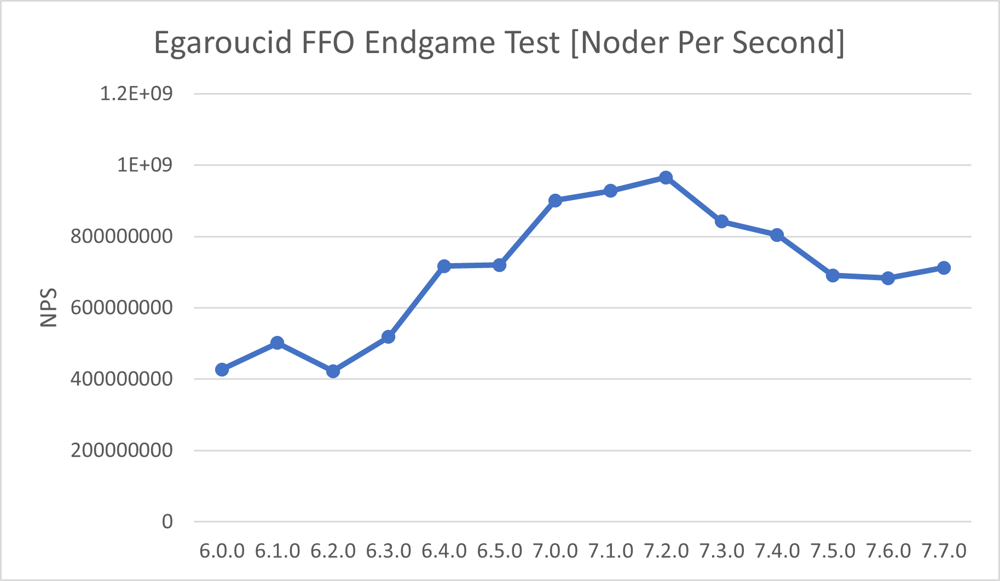

# Egaroucid 技術資料

## ベンチマーク

各バージョンのベンチマークを公開します。

Egaroucidの性能の確認として2種類のベンチマークを使用しています。1つ目は[The FFO endgame test suite](http://www.radagast.se/othello/ffotest.html)です。これは、終盤の完全読みにかかる時間に関するベンチマークです。2つ目は他の強豪オセロAIとの対戦として、[Edax 4.4](https://github.com/abulmo/edax-reversi/releases/tag/v4.4)との対戦です。単純に評価関数の強さを計測するため、bookを使わず、複数のレベル(読み深さ)で、[XOT](https://berg.earthlingz.de/xot/aboutxot.php?lang=en)という初期局面集を用いて対戦させました。

各バージョンで少し条件が違うものもありますので、詳細はそれぞれのページをご覧ください。

<table>
	<tr>
		<th>バージョン</th>
		<th>リリース時期</th>
	</tr>
    <tr>
		<td><a href="./benchmarks/6_4_0/">6.4.0</a></td>
		<td>2023/09/01</td>
	</tr>
    <tr>
		<td><a href="./benchmarks/6_3_0/">6.3.0</a></td>
		<td>2023/07/09</td>
	</tr>
    <tr>
		<td><a href="./benchmarks/6_2_0/">6.2.0</a></td>
		<td>2023/03/15</td>
	</tr>
    <tr>
		<td><a href="./benchmarks/6_1_0/">6.1.0</a></td>
		<td>2022/12/23</td>
	</tr>
	<tr>
		<td><a href="./benchmarks/6_0_0/">6.0.0</a></td>
		<td>2022/10/10</td>
	</tr>
    	<tr>
		<td><a href="./benchmarks/5_10_0/">5.10.0</a></td>
		<td>2022/06/08</td>
	</tr>
    	<tr>
		<td><a href="./benchmarks/5_9_0/">5.9.0</a></td>
		<td>2022/06/07</td>
	</tr>
    	<tr>
		<td><a href="./benchmarks/5_8_0/">5.8.0</a></td>
		<td>2022/05/13</td>
	</tr>
    	<tr>
		<td><a href="./benchmarks/5_7_0/">5.7.0</a></td>
		<td>2022/03/26</td>
	</tr>
    	<tr>
		<td><a href="./benchmarks/5_5_0/">5.5.0/5.6.0</a></td>
		<td>2022/03/16</td>
	</tr>
    <tr>
		<td><a href="./benchmarks/5_4_1/">5.4.1</a></td>
		<td>2022/03/02</td>
	</tr>
</table>

以下はThe FFO endgame test suiteをCore i9 13900Kで実行した結果をバージョンを横軸に取ってグラフにしたものです。

	
    
    

## 技術解説

日本語のみでEgaroucidの[技術解説](./explanation)を書きました。のんびりと追記します。

## 棋譜公開

Egaroucidによる自己対戦で生成した棋譜を大量に公開しています。詳しくは[棋譜公開](./transcript)をご覧ください。

