# Egaroucid 使い方

<b>This page is only in Japanese. Please see [translation by Google here](https://www-egaroucid-nyanyan-dev.translate.goog/ja/usage/?_x_tr_sl=ja&_x_tr_tl=en&_x_tr_hl=ja&_x_tr_pto=wapp) in English.</b>

オセロAI Egaroucidの公式ドキュメントです。各機能の使い方を簡単に紹介します。このページの内容は最新バージョンに合わせてありますが、更新が追いつかない場合もあります。

最終更新: 2025/04/02 Egaroucid 7.6.0

INSERT_TABLE_OF_CONTENTS_HERE

## 参考リンク

このページでは各機能の使い方の説明にとどめますが、実際にそれらの機能をどう活用すれば良いのかという内容については別のページに書きました。随時追加予定です。

<ul>
    <li><a href="./book">Book詳説</a>: Bookの構造から学習のやり方までを解説しました</li>
</ul>

## 画面の見方

画面の見方を5つの項目に分けて解説します。

<div class="centering_box">
    
</div>

### 盤面

オセロの盤面です。合法手(打てるところ)の表示や評価値などの表示もできます。マスを直接クリックすることで着手できます。

<div class="centering_box">
    
</div>

<ul>
    <li><a href="#表示_合法手への表示 > 石差評価">評価値を表示できます</a></li>
    <li><a href="#表示_合法手への表示 > うみがめ数">うみがめ数を表示できます</a></li>
    <li><a href="#入出力">棋譜、盤面などによる入出力ができます</a></li>
    <li><a href="#入出力_出力 > スクリーンショット">盤面だけを切り取ったスクリーンショットを撮る機能があります</a></li>
</ul>


### 対局情報

盤面やAIに関係する情報をまとめて表示しています。

何手目、手番、現在の石数、<a href="#表示_情報エリアへの表示 > 定石">定石名</a>、<a href="#設定_レベル">AIのレベル</a>、<a href="#表示_情報エリアへの表示 > 最善筋">AIが想定している読み筋</a>、を表示しています。

<div class="centering_box">
    
</div>

### グラフ

対局の形勢などを表すグラフを表示します。

横軸が手数(0手目から60手目まで)で、縦軸が形勢(石差)です。

グラフは真ん中の0で互角、上に行くと黒有利、下に行くと白有利です。

縦軸の値は最終石差の予測値を表していて、具体的には「この局面から双方最善手を打ち続けるとどちらが何石多く勝つか」という値です。

<div class="centering_box">
    
</div>
グラフは通常だと形勢を表すように設定されていますが、設定によって双方の累積石損を表示することも可能です。


<ul>
    <li><a href="#表示_グラフ">対局中など、グラフを見たくないときには非表示にできます</a></li>
    <li><a href="#対局_分析">対局の解析を行うと全ての局面の値をまとめて計算できます</a></li>
    <li><a href="#表示_合法手への表示 > 石差評価">ヒントを表示した上で盤面を進めていくと自動で更新されます</a></li>
    <li><a href="#操作_進む/戻る">白い縦線をドラッグして動かすと局面を戻したり進めたりできます</a></li>
</ul>


### メニュー

各種操作を行います。

様々な機能がついているので、このサイトではメニューの構成に沿って機能を紹介します。

### ログ

AIの計算過程などを表示します。ユーザはあまり気にしなくて良いですが、計算過程が詳細に表示されるので見ていると何の計算をしているのかわかりやすいかもしれません。また、なにか不具合があった場合の解決策のヒントになる場合があります。

<ul>
    <li><a href="#表示_ログ">ログ表示をオフにできます</a></li>
</ul>


## 対局

メニューのここから辿れる機能です。

<div class="centering_box">
    
</div>

### 新規対局 (人間同士)

盤面を初期状態に戻します。AIが着手しない設定なので、そのまま人間が打ち進めます。石を並べる際や人間同士の対局で使うことを想定しています。

この機能はショートカットキーとしてNを割り当てています。

<ul>
    <li><a href="#設定_AIの着手設定">途中からAIに打たせることもできます</a></li>
</ul>


### 新規対局 (人間黒番)

盤面を初期状態に戻し、人間が黒番、AIが白番で対戦します。対局用途にも使えますが、ただ石を並べる用途を考えています。

<ul>
    <li><a href="#設定_AIの着手設定">途中からAIが着手する手番を変更できます</a></li>
    <li><a href="#設定_AIの着手設定">途中から人間同士/AI同士に設定できます</a></li>
</ul>


### 新規対局 (人間白番)

盤面を初期状態に戻し、AIが黒番、人間が白番で対戦します。

AIが初手なので、画面右上に対局開始ボタンが出現します。それを押すと対局が始まります。

<div class="centering_box">
    
</div>
<ul>
    <li><a href="#設定_AIの着手設定">途中からAIが着手する手番を変更できます</a></li>
    <li><a href="#設定_AIの着手設定">途中から人間同士/AI同士に設定できます</a></li>
</ul>


### 新規自己対戦

盤面を初期状態に戻し、AI同士で対戦します。

画面右上に対局開始ボタンが出現します。それを押すと対局が始まります。

<div class="centering_box">
    
</div>
<ul>
    <li><a href="#設定_AIの着手設定">途中からAIが着手する手番を変更できます</a></li>
    <li><a href="#設定_AIの着手設定">途中から人間同士/AI同士に設定できます</a></li>
</ul>


### 分析

対局を分析します。

1手ずつ評価値を再計算して、グラフに描画します。どこで悪手を打ったのかがわかりやすいです。


### 対局情報

対局に関する情報(プレイヤ名、メモ)を閲覧できます。この画面では編集できないので、編集したい場合は編集ボタンを押してください。<a href="#入出力_出力 > 対局保存">対局保存</a>機能に飛びます。

<a href="#入出力_入力 > 対局読み込み">対局読み込み</a>機能で読み込んだ対局は、その対局に保存されていたプレイヤ名やメモが閲覧できます。

プレイヤ名やメモが長い場合は、スクロールバーやマウスホイールでスクロールできます。

<div class="centering_box">
    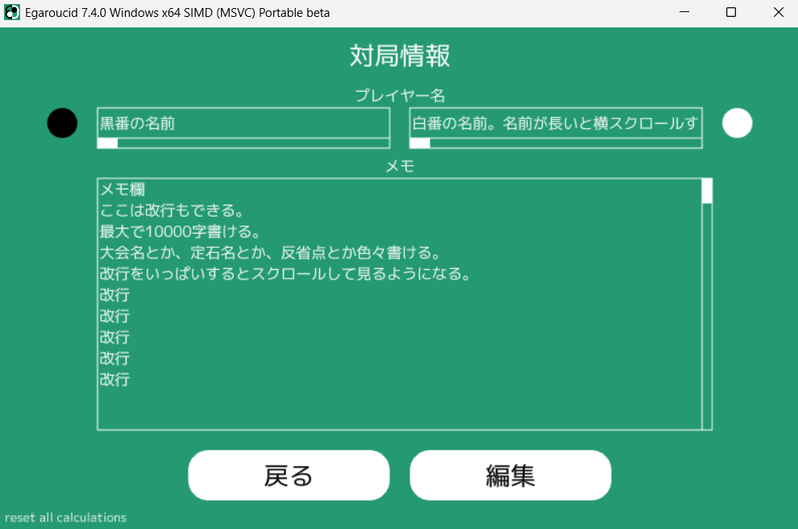
</div>


## 設定

メニューのここから辿れる機能です。

<div class="centering_box">
    
</div>


### book使用

AIの着手やヒント計算にbookを使うか否かを選択できます。

bookとは、予め局面に対して評価値を計算しておいたものです。

<ul>
    <li><a href="#Book_Book操作 > Book拡張">bookを自動で拡張できます</a></li>
    <li><a href="#Book_Book操作 > 右クリックで編集">bookを手動で修正できます</a></li>
    <li><a href="#Book_ファイル操作 > bookの参照">bookのファイル指定ができます</a></li>
    <li><a href="#Book_ファイル操作 > 統合">bookの統合ができます</a></li>
</ul>


### AIに石損させる

AIが確率的に悪い手を打つようにする設定です。チェックボックスをオン・オフすることで、最善手のみを打つ設定と石損させる設定を素早く切り替えられます。

設定は「1手の最大石損」と「石損率」の2つのパラメータで変更可能です。AIによる着手のうち、石損率%の手で石損を許容します。そのとき、最善手から何石損までを許容するかを表すのが「1手の最大石損」です。最善手から設定された最大石損までの中から、ランダムに1手を選択します。

<div class="centering_box">
    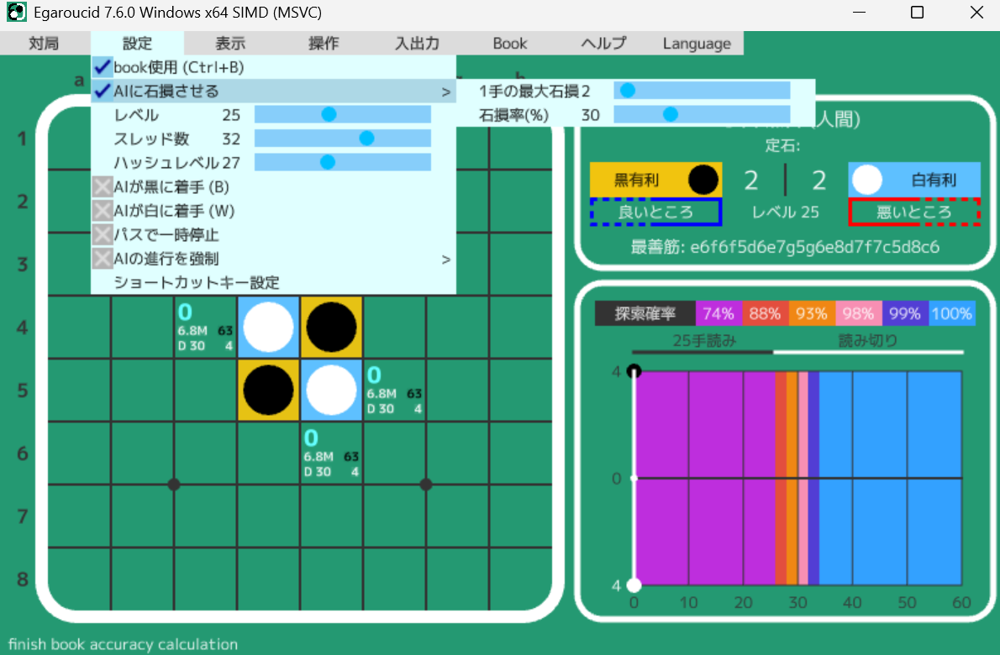
</div>


### レベル

AIのレベルを設定できます。

AIのレベルは、

<ul>
    <li>中盤の読みの深さ</li>
    <li>終盤の読み切りタイミング</li>
    <li>探索の精度の確率</li>
</ul>

という3つの観点で定義されます。レベルを上げると、中盤は深くまで読み、終盤の読み切りタイミングは早く、探索の精度の確率は上がります。

ここで設定するレベルは、<a href="#設定_AIの着手設定">AIの着手</a>、<a href="#表示_合法手への表示 > 石差評価">ヒント表示</a>、<a href="#対局_分析">対局分析</a>、Book学習の全てで統一して使われます。

「探索の精度の確率」と書いたのは、Multi-ProbCutという技術で用いられる確率のことです。Multi-ProbCutは、明らかな悪手の探索を省略するものです。確率が低ければ大胆に、確率が高ければ少しだけ省略します。なお、100%の場合は探索を省略しません。

各レベルのパラメータは<a href="#画面の見方_グラフ">グラフエリア</a>に表示されています。下図はレベル27のグラフです。これを見ると、

<ul>
    <li>23手目までは中盤探索を行い、27手読みを75%の精度で行う</li>
    <li>24手目からは終局まで読み切る</li>
    <li>読み切りは88%の精度から始まって、終局に近づき32手目で100%の完全読みを行う</li>
</ul>

ということがわかります。グラフに重ねて描画されるので、グラフの点がどのような探索の結果なのかがわかりやすいです。

<div class="centering_box">
    
</div>


### スレッド数

ここでは、並列計算についての設定をします。

お使いのCPUが$X$コア$Y$スレッドであれば、$Y$に近い値に設定すると高速になると思います。

デフォルトで$Y$に自動的に設定されるようになっています。


### ハッシュレベル

Egaroucidでは探索時に、一部の探索結果を保存しておきます。その保存領域の大きさを決められます。大きくするとメモリ消費量が増え、深い探索をする場合に探索が高速になる可能性が高まります。

この保存領域において以下の表で示されるメモリを消費します。使用しているコンピュータの物理メモリの空き容量がメモリ消費量を下回る場合、設定できるレベルの最大値が30よりも小さくなります。

<div class="table_wrapper">
<table>
<tr>
<th>ハッシュレベル</th>
<th>メモリ消費量(GiB)</th>
</tr>
<tr>
<td>25</td>
<td>0.75</td>
</tr>
<tr>
<td>26</td>
<td>1.5</td>
</tr>
<tr>
<td>27</td>
<td>3.0</td>
</tr>
<tr>
<td>28</td>
<td>6.0</td>
</tr>
<tr>
<td>29</td>
<td>12</td>
</tr>
<tr>
<td>30</td>
<td>24</td>
</tr>
</table>
</div>

終盤探索では25手程度まではハッシュレベル25で十分かと思います。作者の環境では30手を超えるとハッシュレベル27以上にすると若干速くなります。ハッシュレベル28以上はほとんど恩恵を感じませんが、一応設定できるようにしてあります。

内部的には、ハッシュレベルを$X$とすると$2^X$個の局面を保存できるようにするハッシュテーブルを作っています。


### AIの着手設定

「AIが黒に着手」「AIが白に着手」によって、対局中でもAIの着手設定を変更できます。

両方のチェックを外せば途中から人間同士の対局(ただ石を並べるだけ)になります。

ショートカットキーをB(AIが黒に着手)とW(AIが白に着手)に割り当てています。

<ul>
    <li><a href="#対局">対局開始時に1クリックで設定できます</a></li>
</ul>


### パスで一時停止

人間とAIの対局で、人間のパスの時に人間が明示的にパスであるというボタンを押すかどうかの設定です。下図はこのモードをオンにしたときで、黒番が人間ですが置く場所がないのでパスボタンが出現しています。

<div class="centering_box">
    
</div>


### AIの進行を強制

AIに対して、打つ進行を強制できます。AIと人間とで対戦する際など、特に練習したい進行があれば、それを登録するとその進行を重点的に練習できます。チェックボックスをオン・オフすることで、進行を強制するかしないかを素早く切り替えられます。

<div class="centering_box">
    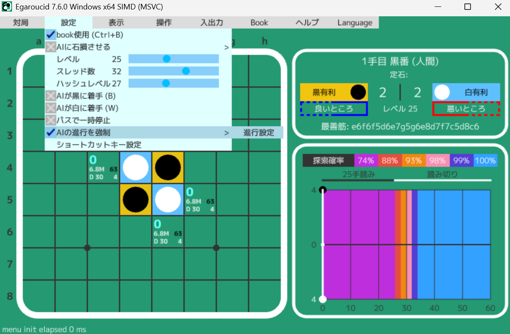
</div>

強制する進行は「AIの進行を強制 > 進行設定」から自由に設定できます。「追加」ボタンを押し、好きな進行を入力し、「登録」ボタンを押すことで登録できます。なお、棋譜が間違っている場合、登録ボタンがグレーアウトして押せなくなります。登録してある進行の左上のバツボタンを押すと、その進行の登録を削除できます。

<div class="centering_box">
    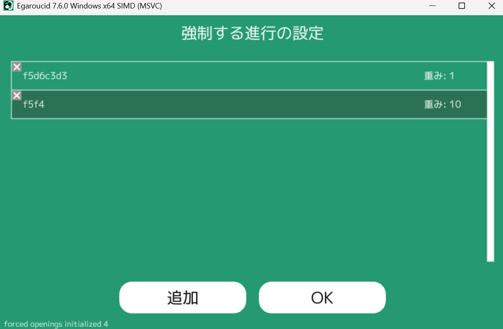
    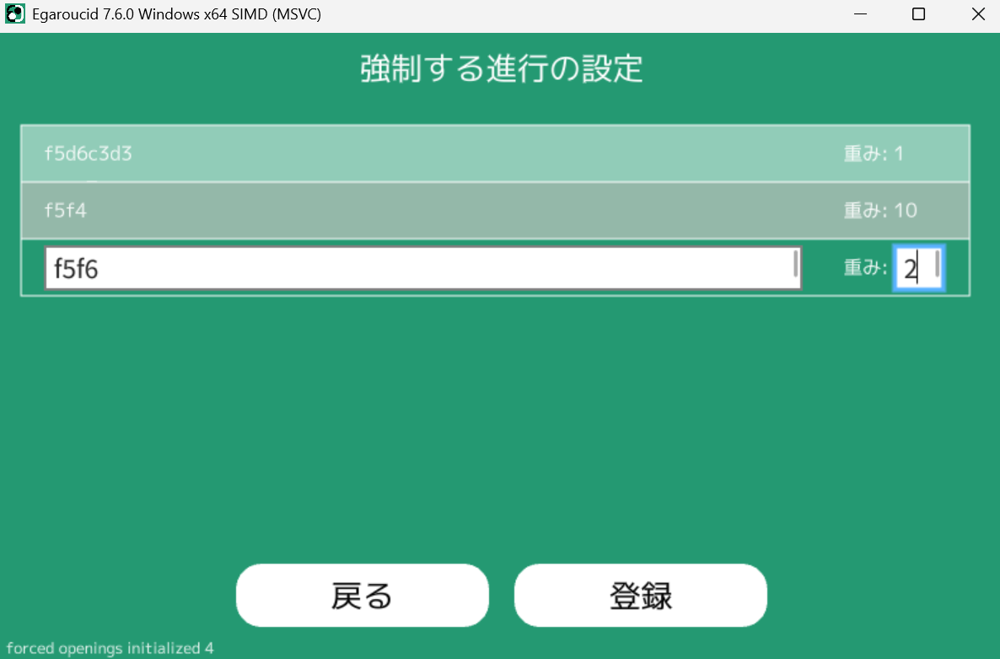
</div>

また、それぞれの進行には「重み」を設定できます。複数の進行を登録した場合、どの進行を選ぶかは確率的に決まりますが、重みが大きければ大きいほど、その進行が選ばれる確率が高くなります。具体的には、ある盤面が登録した進行に現れ、かつ登録されている手が複数あるとき、それらの手の重みの集合を$\{W\}$、$m$という手の重みを$w$とすると、

$mが選ばれる確率 = \frac{w}{\sum{\{W\}}}$

となります。


### ショートカットキー設定

Egaroucidでは、よく使う機能にショートカットキーを割り当ててありますが、これを自由に追加・変更できる設定です。Egaroucidのほぼすべての機能に対してショートカットキーを自由に割り当て可能です。表示されていない機能はスクロールすると見えるようになります。スクロールはマウスホイールのほか、上下ボタンやPage Up、Page Downボタンでも可能です。

<div class="centering_box">
    
</div>

すでに登録されているショートカットキーを削除(解除)したい場合は、削除ボタンを押します。

ショートカットキーを変更/登録したい場合は、該当の機能を探して変更ボタンを押し、登録したいショートカットキーをその場で押します。登録内容が問題ない場合は割り当て完了ボタンを押すかEnterキーを押すと登録が完了します。下の画像では対局>新規自己対戦機能にCtrl+Shift+Nを割り当てようとしています。

<div class="centering_box">
    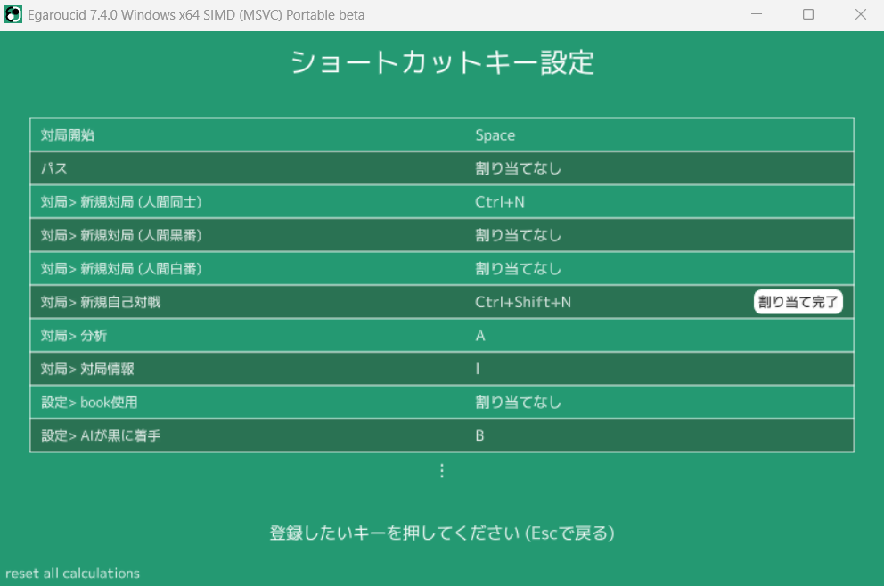
</div>

すでに他の機能で登録されているショートカットキーは別の機能には登録できません。その場合、割り当て完了ボタンが押せなくなり、どの機能で登録されているかを表示します。下の画像では、Aというショートカットキーはすでに対局>分析機能に割り当ててあると表示されています。

<div class="centering_box">
    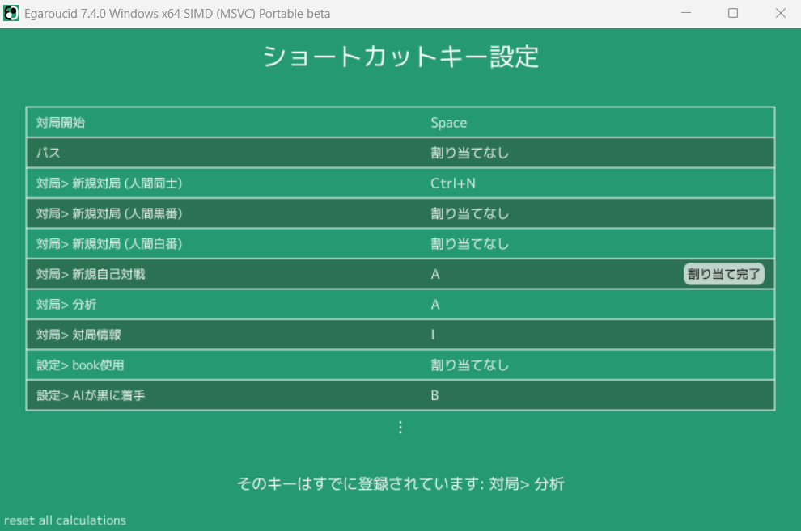
</div>

Ctrl、Shift、Altキーは同時押しに対応しています。つまり、Ctrl+AやCtrl+Shift+Aなどのショートカットキーを割り当てられます。なお、Ctrl、Shift、Altキーは単体でのショートカットキー登録ができません。また、EnterキーとEscキーはショートカットキーとして登録できません。

ショートカットキーを設定した機能には、メニューバーにカッコつきでショートカットキーが表示されます。例えば、下の画像ではショートカットキー設定の機能にイコールキーをショートカットとして割り当てたので、メニューに(=)と表示されています。

<div class="centering_box">
    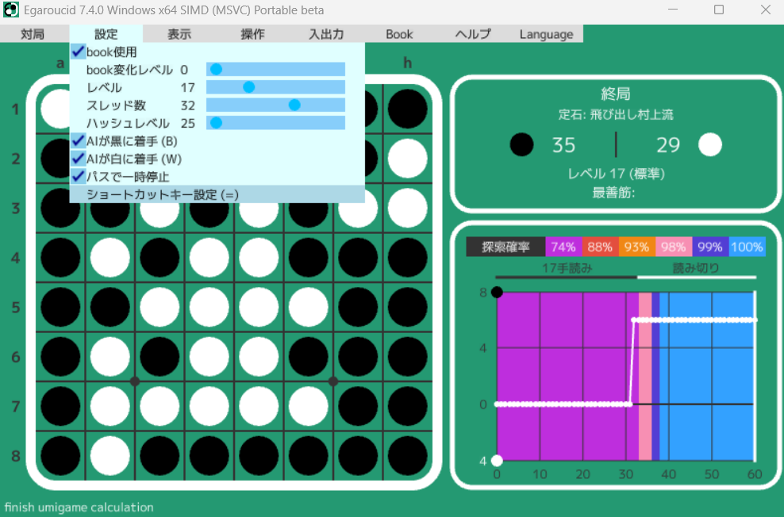
</div>

初期設定ボタンを押すとデフォルトのショートカットキー設定に一括変更できます。初期設定は以下の通りです。

<ul>
    <li>対局開始ボタン Space</li>
    <li>対局
        <ul>
            <li><a href="#対局_新規対局 (人間同士)">新規対局 (人間同士)</a> Ctrl+N (New game)</li>
            <li><a href="#対局_分析">分析</a> A (Analyze)</li>
        </ul>
    </li>
    <li>設定
        <ul>
            <li><a href="#設定_AIの着手設定">AIが黒に着手</a> B (Black)</li>
            <li><a href="#設定_AIの着手設定">AIが白に着手</a> W (White)</li>
        </ul>
    </li>
    <li>表示
        <ul>
            <li><a href="#表示_合法手への表示 > 石差評価">合法手への表示 > 石差評価</a> V (evaluation Value)</li>
            <li><a href="#表示_合法手への表示 > うみがめ数">合法手への表示 > うみがめ数</a> U (Umigame's number)</li>
            <li><a href="#表示_グラフ">評価値グラフ</a> D (estimated Disc difference)</li>
            <li><a href="#表示_グラフ">累積石損グラフ</a> S (Sum of loss)</li>
            <li><a href="#表示_レーザーポインタ">レーザーポインタ</a> P (laser Pointer)</li>
        </ul>
    </li>
    <li>操作
        <ul>
            <li><a href="#操作_AIに1手打たせる">AIに1手打たせる</a> G (Go)</li>
            <li><a href="#操作_進む/戻る">進む</a> →</li>
            <li><a href="#操作_進む/戻る">戻る</a> ←</li>
            <li><a href="#操作_待った">待った</a> BackSpace</li>
            <li><a href="#操作_この分岐を保存">この分岐を保存</a> Ctrl+L (Line)</li>
            <li><a href="#操作_ランダム局面を生成">ランダム局面を生成</a> R (Random)</li>
        </ul>
    </li>
    <li>入出力
        <ul>
            <li><a href="#入力 > クリップボードから形式を指定せず入力">入力 > クリップボードから形式を指定せず入力</a> Ctrl+V</li>
            <li><a href="#入出力_入力 > 棋譜入力">入力 > 棋譜入力</a> Ctrl+T (Transcript)</li>
            <li><a href="#入出力_入力 > 盤面編集">入力 > 盤面編集</a> Ctrl+E (Edit board)</li>
            <li><a href="#入出力_出力 > 現局面までの棋譜をコピー">出力 > 棋譜をコピー</a> Ctrl+C (Copy)</li>
            <li><a href="#入出力_出力 > スクリーンショット">出力 > スクリーンショット</a> Ctrl+S (Save / Screenshot)</li>
        </ul>
    </li>
</ul>


なお、基本操作として、すべての機能で統一して、「取り込む」や「出力する」「スタート」「OK」のようなニュアンスのボタンはEnterキーで操作できます。「戻る」や「この画面から抜ける」のようなニュアンスのボタンはEscキーで操作できます。


## 表示

メニューのここから辿れる機能です。

<div class="centering_box">
    
</div>


### 合法手への表示 > 合法手

盤面に合法手を表示するかどうか設定できます。合法手は水色の小さな点で表されます。

<div class="centering_box">
    
</div>


### 合法手への表示 > 石差評価

合法手のマスに評価値(最終石差)を表示するかどうか選択できます。ヒント表示と表記する場合もあります。

評価値表示はショートカットキーVでオンオフできます。

<div class="centering_box">
    
</div>

#### 表示個数

また、全ての合法手に対して評価値を計算すると計算が遅い場合、表示個数を選択できます。下の画像では4つを選択しており、これは上位4手の評価値を表示するという意味です。

合法手に評価値を表示するようにすると、その値を流用して自動で<a href="#画面の見方_グラフ">グラフ</a>が更新されます。

#### レベル

ヒントを計算しているAIのレベルの表示をオン・オフできます。

#### AIの手番でも表示

AIの手番でも思考中に評価値を見ることができます。この項目をオンにすると、計算時間が増える可能性があります。

####  Book精度

Book精度をABCDEFの6段階で表し、表示します。また、Bookの内部情報にある、Book値を登録したAIのレベル、およびBookライン数を表示します。Book精度はAが一番信頼性が高く、Fが一番不完全です。Book値の登録レベルは値が大きい方が信頼性が高いです。Bookライン数は大きいほどBook値の信頼性が高くなる傾向があります。

ある局面におけるライン数は、ある局面から着手を進めてたどり着くことができる局面のうち、bookに登録されている局面の数を表します。数字が大きくなる場合にはK(1000倍)やM(1000000倍)などをつけて表示しています。

Book学習の際、信頼性の低い手を優先的に学習させると良いと思います。

なお、この表示をオンにすると、スペースの都合上、マスに「book」という文字は表示されなくなります。

<div class="centering_box">
    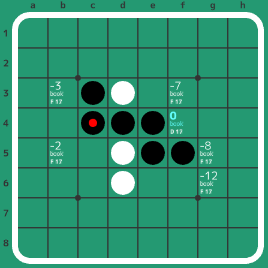
</div>


Book精度は、その局面から各プレイヤが2石損未満の手を打ち続けたときのBook末端の状況で決まります。詳しくは以下の表を参照してください。

<div class="table_wrapper">
<table>
<tr>
<th>精度</th>
<th>状態</th>
<th>判定基準</th>
</tr>
<tr>
<td>A</td>
<td>値に狂いはほぼない</td>
<td>末端が全て完全読み</td>
</tr>
<tr>
<td>B</td>
<td>高信頼</td>
<td>1つ以上の末端が完全読みで、その他の末端は終局まで読み切り</td>
</tr>
<tr>
<td>C</td>
<td>正確</td>
<td>末端が全て終局まで読み切り</td>
</tr>
<tr>
<td>D</td>
<td>それなりに正確</td>
<td>末端の1つ以上が完全読みで、他に読み切っていない末端がある</td>
</tr>
<tr>
<td>E</td>
<td>まあ正確</td>
<td>末端の1つ以上が終局まで読み切り</td>
</tr>
<tr>
<td>F</td>
<td>値が怪しい</td>
<td>末端に終局まで読み切った局面がない</td>
</tr>
</table>
</div>

Egaroucid 7.3.0以降では、精度Aについてさらに細かくAAからAFまでで精度を評価します。AAからAFは、2石損以下の手を打ち続けたときのBook末端の状況で判定を行います。


### 合法手への表示 > うみがめ数

bookに登録されている局面について、うみがめ数を計算して表示します。

マスの右下に、黒と白のうみがめ数が表示されます。

うみがめ数表示はショートカットキーUでオンオフできます。

うみがめ数計算においてbookを参照する深さも設定できます。デフォルトは60(bookのある限り参照する)です。

<div class="centering_box">
    
</div>


### 合法手への表示 > 定石

マスにマウスをホバーしたときに定石名を出してくれます。

<a href="#画面の見方_対局情報">対局情報</a>に定石名は書かれていますが、それは「ここまでどんな定石で来たか」です。一方、この機能で表示されるのは、「この手に打ったらどんな定石になるか」です。

<div class="centering_box">
    
</div>


### 合法手への表示 > 直後の手

対局を振り返るなどして盤面を戻したとき、直後に打った手を薄く表示します。

<div class="centering_box">
    
</div>
なお、ここで「合法手への表示 > 直後の手 > 表示変更」を選択すると、紫の四角による表示に変更できます。

<div class="centering_box">
    
</div>


### 石への表示 > 直前の手

直前に打った手を小さい赤丸で表示できます。

<div class="centering_box">
    
</div>


### 石への表示 > 確定石

盤面に存在する確定石を黄丸で表示します。なお、これは全ての確定石を計算できるものではありません。

<div class="centering_box">
    
</div>

この機能の実装には、AI内部で探索のために確定石を計算するところを流用しています。


### 石への表示 > 着手順

着手の順番を1手目から1、2、3と表示します。盤面と棋譜をあわせて表示したい場合に有用です。

例としてF.A.T.ドローは以下のようになります。

<div class="centering_box">
    
</div>


### 情報エリアへの表示 > 定石

<div class="centering_box">
    
</div>

情報エリアに、現在の局面に至った定石の名前を表示できます。


### 情報エリアへの表示 > 最善筋

情報エリアに、AIが計算した最善進行を表示できます。表示する長さは2手から40手まで自由に決められます。この設定をオンにすると、AIの計算時間が長くなる可能性があります。

<div class="centering_box">
    
</div>

### レーザーポインタ

マウスカーソルをレーザーポインタのような見た目にします。配信など、マウスカーソルを目立たせたい場合に便利です。

<div class="centering_box">
    
</div>


### グラフ

AIによる形勢判断などの情報をグラフとして表示できます。

グラフは、AIの着手時、<a href="#表示_合法手への表示 > 石差評価">ヒント表示をしているとき</a>、<a href="#対局_分析">対局の分析をしたとき</a>に自動で更新されます。

表示できるグラフは2種類あります。

#### 評価値グラフ

評価値グラフは、AIが計算した評価値を表示するグラフです。グラフが上に行くと黒有利、下に行くと白有利です。

途中から打ち直した場合、分岐として黒色の線で表示されます。

<div class="centering_box">
    
</div>

#### 累積石損グラフ

累積石損グラフは、黒番と白番のそれぞれで、石損(打った手が最善手からどれくらい離れているか)を初手から累積した値を表示します。黒線が黒番、白線が白番の累積石損を表します。途中から打ち直した場合、分岐として濃/薄灰色の線で表示されます。

グラフは0(一番上)から始まり、徐々に下に向かいます。グラフが大きく下がっているところは悪手を打ったところです。グラフがガクンと下がっているところの局面は、ガクンと下がっている方の手番にとって難しい局面だったという捉え方ができます。また、グラフが上の方でずっとキープできていれば、対局全体を通して良い手が打てたという意味になります。

<div class="centering_box">
    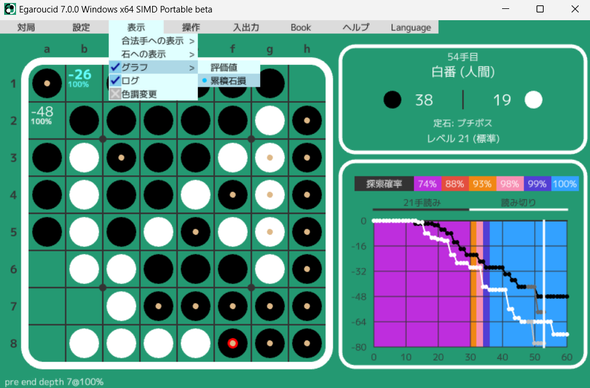
</div>

#### 表示・非表示

グラフの表示/非表示を選択できます。非表示にすると画像のように、薄灰色の点だけでグラフが描画されます。この点は0のところだけにあり、特に上下しません。

<div class="centering_box">
    
</div>


### AIの注目する場所

どの石がどちらのプレイヤにとってどれくらい有利かを可視化する機能です。この機能をオンにすると、一部のマスに色がつきます。橙色は黒有利、青色は白有利の石を表します。色は濃いほど有利な度合いが大きいことを表します。さらに、合法手にマウスホバーすると、その手によってひっくり返る石・返らない石の中でその手番にとって良いところを青の四角で囲い、悪いところを赤の四角で囲っています。その際、実線四角は実際に返る石、点線四角は、実際には返らない石を表しています。

例として以下の画像では、左上の方は黒が有利となっています。これは白がb2のマスに着手しており、黒が左上の隅を狙えるため、また、白から上辺に着手できないためです。対して、左辺の形は白有利となっています。また、画像ではh3にマウスホバーしたところ、斜めのラインが赤四角で表示されています。これは、黒がh3に着手すると斜めのラインがひっくり返り、それが良くないことを表しています。実際、h3によって返るd7の石によって、下辺は黒から手を付けられなくなります。また、g4とf5の石が返ることによって、白にg5の良手が発生してしまいます。

<div class="centering_box">
    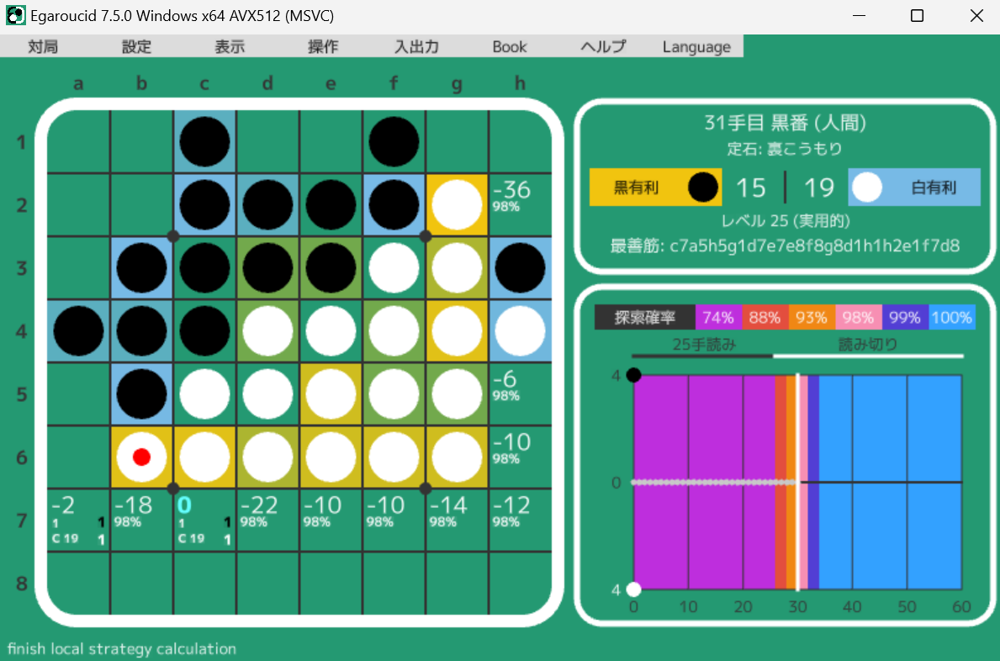
</div>


### ログ

ログの表示/非表示を切り替えられます。

AIの計算中、ログには評価値が現れるので、本気で対戦したいときにはグラフと一緒にログも非表示にすることをおすすめします。


### 色調変更

グラフの色調を変更できます。色覚特性によってグラフが見にくい場合にお使いください。

制作者の意図としては、2型2色覚、および3型2色覚の方に見やすいよう配慮しました。もし色彩についてアイデアがありましたらぜひご連絡ください。

<div class="centering_box">
    
</div>


## 操作

メニューのここから辿れる機能です。

<div class="centering_box">
    
</div>


### AIに1手打たせる

今の局面からAIに1手打たせることができます。ショートカットキーとしてGを割り当ててあります。


### 進む/戻る

局面を戻したり進めたりできます。これ以上戻れない/進めない場合、何も起こりません。

なお、ショートカットキーとして、単に右矢印キーを押すかDキーを押すだけでも局面を進められます。また、左矢印キーかAキーを押すと局面を戻せます。

さらに、<a href="#画面の見方_グラフ">グラフ</a>に表示されている白い縦線を左右にドラッグすることでも局面を進めたり戻したりできます。


### 待った

局面を戻すと同時に、直後の手を打たなかったことにできます。対局中に「待った」をしたいときや、石を並べているときに打つ手を変更したいときに使えます。

なお、ショートカットキーとしてBackSpaceを割り当てています。


### この分岐を保存

人間同士の対戦設定にして石を並べている際、一度局面を戻し、前回と違う手を打つとグラフに黒線で評価値が表示されます(下図)。このとき、黒線を分岐側、白線を本筋とします。

この機能はショートカットキーとしてLを割り当てています。

<div class="centering_box">
    
</div>

分岐側の手筋は、分岐開始局面以前に局面を戻すと自動で消えてしまいます。しかし、「この分岐を保存」ボタンを押すと、分岐側の手筋を本筋にして、本筋だった手筋を消せます。上の図の状態で分岐を保存した後のグラフは下図です。

<div class="centering_box">
    
</div>


### ランダム局面を生成

中盤局面をランダムに自動生成します。ヒントを非表示にして局面を生成しその局面の形勢を判断する、というオセロの勉強のために実装しました。

生成ボタンを押すと自動で中盤局面が生成されます。また、生成手数を変更することで、何手目の局面を生成するかを選択できます。

ランダム局面生成はショートカットキーとしてRを割り当てています。

この機能では、各着手に対して68%の確率で4石損以下、95%の確率で8石損以下の手を選びます。

<div class="centering_box">
    
</div>

この機能は、指定された手数までの各着手に対して以下の計算によって手を選んでいます。

平均0、標準偏差4の正規分布に従ってランダムに数値を出力する関数を$\mathrm{randdst_{0,4}()}$とします。

$E=\mathrm{round\left(\mathrm{randdst_{0,4}()}\right)}$

として、許容誤差$E$を整数で決定します。

与えられた局面に対して、評価値の集合を$A=\{(v,m)\}$とします。ここで、$v$は(手番目線の)評価値、$m$は手です。

$B=\left\{(v,m)\in A\middle|v\geq v_{\mathrm{max}}-E\right\}$

で定義される$B$を作り、$E$石損以下の手を厳選します。なお、$v_{\mathrm{max}}$は最善手の評価値です。

この$B$の中から手をランダムに選択します。

なお、この機能では強い手を選ぶ必要がないため、手の評価値はbook登録値または2手読みの評価値を使用しています。


### 変換

局面を以下7種類の方法で対称に変換できます。

<ul>
    <li>180度回転</li>
    <li>90度時計回り</li>
    <li>90度反時計回り</li>
    <li>ブラックラインで線対称</li>
    <li>ホワイトラインで線対称</li>
    <li>左右反転</li>
    <li>上下反転</li>
</ul>


ブラックラインはh1からa8のライン(初期局面で黒石が並ぶライン)、ホワイトラインはa1からh8のライン(初期局面で白石が並ぶライン)です。

<ul>
    <li>棋譜を入力して、変換機能を使って初手をf5に変換し、<a href="#入出力_出力 > 現局面までの棋譜をコピー">棋譜をコピー</a>するという使い方もできます。</li>
</ul>


### AI操作 > 計算停止

AIの計算が終わらない場合など、このボタンを押すと強制的に停止できます。


### AI操作 > キャッシュクリア

AIは探索時に一部の局面の評価値を自動で保存し、以降の探索を高速にする工夫をしています。この保存された局面を全て消去します。

<ul>
    <li>この機能は<a href="#設定_ハッシュレベル">ハッシュレベル</a>の設定と関係します。</li>
</ul>


## 入出力

メニューのここから辿れる機能です。

<div class="centering_box">
    
</div>


### 入力 > クリップボードから形式を指定せず入力

この機能では、テキスト形式で対局情報を読み込みます。クリップボードに文字列をコピーしてからこのボタンを押すと、画面遷移なしに即座にその対局が画面に反映されます。デフォルトではCtrl+Vをこのショートカットキーとして割り当ててあります。この機能は、「テキストで形式を指定せず入力」と同じ機能ですが、こちらのほうがスピーディーに入力を行えます。

Egaroucidでは、テキスト形式の入力として、棋譜、ボード形式、GGF (Generic Game Format)、オセロクエスト形式、汎用的なボード+棋譜形式の5種類をサポートしています。これらのフォーマットをEgaroucidが自動で判別します。対応しているそれぞれのフォーマットについては以下を参照してください。


### 入力 > テキストで形式を指定せず入力

この機能は、テキストボックスに対局情報を書き込み、それをEgaroucidに読み込ませる機能です。入力形式はEgaroucidが自動で判別します。各ボタンはショートカットキーとして、Enterで「取り込む」、Escで「戻る」の操作ができます。

<div class="centering_box">
    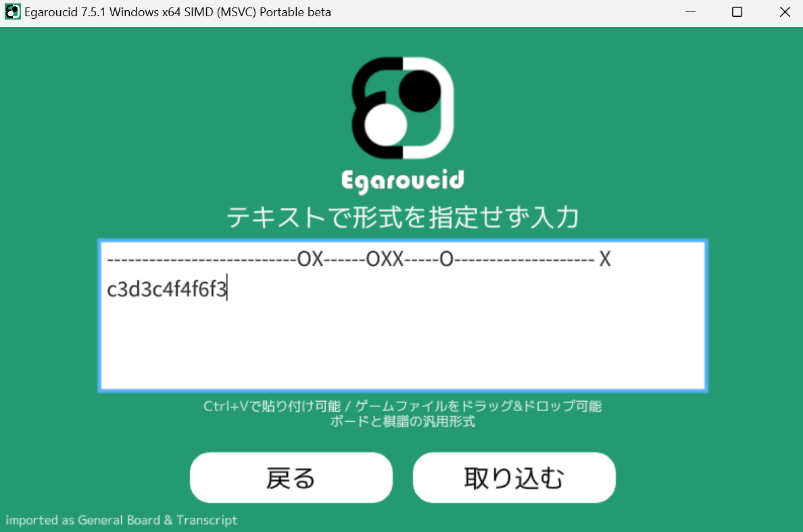
</div>

Egaroucidでは、テキスト形式の入力として、棋譜、ボード形式、GGF (Generic Game Format)、オセロクエスト形式、汎用的なボード+棋譜形式の5種類をサポートしています。これらのフォーマットをEgaroucidが自動で判別します。各形式の詳細は以下の通りです。

<b>棋譜形式</b>: f5D6形式の棋譜を入力して局面を設定できます。大文字小文字、スペースは無視されます。パスがある場合は、パスを省略して記述するか、"PA"や"PS"、"pa"、"ps"をパスを表す文字列として使用できます。ただし、パスできない局面でパスすることはできません。さらに、メイン画面で設定してある局面をスタートとして、そこからの棋譜を入力することもできます。初期局面と設定されている局面とでどちらをスタートとするかはEgaroucidが判定します。

棋譜形式の例: <code>f5d6c3d3c4</code>

<b>ボード形式</b>: 盤面をa1、b1、c1…、h8と一行に並べた状態を入力します。空きマスは"."または"-"、黒石は"X"、"x"、"B"、"b"、0"、"*"として、白石は"O"、"o"、"W"、"w"、"1"として表現します。混在しても構いませんし、スペースや改行を含んでも構いません。最後に手番として黒を表す文字か白を表す文字を入れます。下図では例として虎定石(f5d6c3d3c4)を入力しています。入力した文字列は

ボード形式の例: <code>------------------XO------XXX------OXX-----O-------------------- O</code>

<b>GGF (Generic Game Format)</b>: オセロに限らず様々なゲームを記述できる形式です。Egaroucidではプレイヤのデータも自動で読み込みます。

GGFの例: <code>(;GM[Othello]PC[]PB[b_player]PW[w_player]RE[-32]TI[0]TY[8]BO[8  ---------------------------O*------*O---------------------------  *]B[E6]W[F6]B[F5]W[D6]B[C3]W[G4]B[C6]W[F4]B[H4]W[F3]B[G5]W[E3]B[D3]W[C4]B[C5]W[G6]B[H6]W[H3]B[G3]W[E2]B[E1]W[D7]B[D8]W[B3]B[B5]W[F7]B[F8]W[D2]B[D1]W[C7]B[A3]W[H5]B[H2]W[C8]B[F2]W[E8]B[B8]W[E7]B[B4]W[A4]B[A6]W[A5]B[B6]W[H7]B[H8]W[G8]B[G7]W[A8]B[PA]W[A7]B[PA]W[B7]B[PA]W[A2]B[B2]W[G2]B[F1]W[H1]B[PA]W[A1]B[C2]W[G1]B[B1]W[C1];)</code>

<b>オセロクエスト形式</b>: オセロクエストで内部データとして使用されている保存形式です。Egaroucidではプレイヤのデータも自動で読み込みます。

オセロクエスト形式の例: <code>{"name":"player","args":[{"attrs":["opp:human","opp:strong","opening:vs-DiagonalOpening"],"id":"id","gtype":"reversi1","players":[{"id":"b_player_id","name":"b_player","oldR":1500.0,"newR":1500.0,"oldD":0,"newD":0},{"id":"w_player_id","name":"w_player","oldR":1500.0,"newR":1500.0,"oldD":1,"newD":1}],"position":{"moves":[{"t":1,"m":"e6"},{"t":218,"m":"f6"},{"t":639,"m":"f5"},{"t":467,"m":"d6"},{"t":685,"m":"c3"},{"t":884,"m":"g4"},{"t":687,"m":"c6"},{"t":705,"m":"f4"},{"t":1265,"m":"h4"},{"t":1013,"m":"f3"},{"t":2397,"m":"g5"}]},"tcb":60000,"created":"2024-12-24T00:00:00.000Z","finished":false}]}</code>

<b>汎用的なボード+棋譜形式</b>: ボード情報(省略可能)と棋譜情報で構成された形式です。様々なソフトウェアの形式に対応しています。棋譜部分は余計な文字列を自動で無視するので、「1.」などの文字列が混在していても読み込めます。

ボード+棋譜の例: <code>---------------------------OX------OXX-----O-------------------- X c3d3c4f4f6f3</code>

例えば、PlayOKでコピーできる棋譜も入力できます: <code>F5 f4 2. F3 g4 3. H3 f6 4. G5 g6 5. E6 h6 6. H5 e7 7. E3 d2 8. F7 f8 9. E2 c5 10. B5 d6 11. C4 c3 12. D7 b3 13. C6 b6 14. D3 c7 15. D8 c8 16. E8 b4 17. C1 c2 18. G3 b7</code>


### 入力 > 盤面編集

盤面の石の状態を手動で設定できます。画面中央右の「色」のチェックボックスを選択し、左の盤面をクリックすることで好きに石を配置できます。最後に手番を黒番か白番か選んで「取り込む」を押すと反映されます。手番はデフォルトで編集前の手番になっています。

ショートカットキーとして、置く色を変えるのに黒ならBキー、白ならWキー、空きマスならEキーを割り当てています。また、Enterで取り込み、Escで戻ることができます。

<div class="centering_box">
    
</div>


### 入力 > 対局読み込み

Egaroucidは<a href="#入出力_出力 > 対局保存">対局を独自形式で保存する</a>ことができます。その対局を読み込む機能です。

保存日時、対局者、結果、メモがまとまって表示されるので、取り込むボタンで取り込めます。また、左上のバツ印を押すと対局を削除できます。

対局数が多い場合にはスクロールできます。マウスホイールのほか、上下ボタンやPage Up、Page Downでもスクロールできます。

プレイヤ名やメモが長い場合、適宜省略されます。また、勝ったプレイヤの名前は赤、負けたプレイヤの名前は青で表示されます。引き分けは橙です。終局まで保存されていない対局はスコアが??-??と表示され、名前の背景色は特にありません。

<div class="centering_box">
    
</div>


### 入力 > ビットボード入力

オセロAI開発者向け機能です。

Egaroucidでは内部でボードの表現にビットボード(64bit符号なし整数2つ)を使っています。この情報をそのまま手動で入力できます。

手番側と相手側のそれぞれを16進数として入力し、黒番か白番かを選択してください。下図では虎定石を入力しています。

"0x"はつけなくても問題ありません。また、先頭に0が続く場合は省略しても構いません。アルファベットの大文字小文字は両方対応しています。

Tabキーで入力エリアを切り替えられます。

<a href="#入出力_出力 > ビットボード出力">ビットボード出力</a>と対応した機能です。

Egaroucidでは最下位ビットがh8、最上位ビットがa1です。もし逆にしたい場合は取り込み後に盤面を<a href="#操作_変換">180度回転</a>させてください。

<div class="centering_box">
    
</div>


### 出力 > 現局面までの棋譜をコピー

<a href="#画面の見方_盤面">盤面エリア</a>に表示されている局面までの棋譜を簡単にコピーできます。

<a href="#入出力_入力 > 棋譜入力">棋譜入力</a>と対応した機能です。

Ctrl+Cをショートカットとして割り当ててあります。


### 出力 > 盤面を文字列でコピー

<a href="#画面の見方_盤面">盤面エリア</a>に表示されている局面を文字列としてコピーできます。

<a href="#入出力_入力 > 盤面入力">盤面入力</a>と対応した機能です。


### 出力 > スクリーンショット

盤面のスクリーンショットを撮れます。クリップボードに画像をコピーする他、日時+棋譜をファイル名として画像が保存されます。デフォルトの保存場所はドキュメントフォルダ内のEgaroucid/screenshotsフォルダです。保存場所は「出力 > スクリーンショット > 保存場所変更」にて自由に変更できます。

画像の解像度は、Egaroucidの画面の大きさに依存します。高解像度画像が欲しい場合には最大化してからスクリーンショットを撮ってください。

<div class="centering_box">
    
</div>
<ul>
    <li>この機能は<a href="#入出力_出力 > ボードの画像を編集">ボードの画像を編集</a>の簡易版+評価値表示をつけたものという位置づけです。</li>
</ul>


### 出力 > ボードの画像を編集

オセロの盤面に自由にマークをつけ、画像を保存できます。オセロの解説冊子などへの利用を想定しています。

マークを選択し、自由に石やマスをクリックしてください。

この画面では石の配置の変更はできないので、石の配置は<a href="#入出力_入力 > 棋譜入力">棋譜を入力</a>するか、<a href="#入出力_入力 > 盤面編集">盤面編集</a>をして作ってからこの機能を使ってください。

白黒印刷で綺麗に見えるよう、モノクロ画像への変換もできます。

「画像を保存」で、クリップボードに画像をコピーしつつ、画像を保存します。デフォルトの保存先はドキュメントフォルダ内のEgaroucid/screenshotsフォルダで、日時+棋譜をファイル名とします。保存場所を変更したい場合は、「出力 > スクリーンショット > 保存場所変更」から変更してください。

ショートカットキーとしてEscを「戻る」に割り当てました。

画像の解像度は、Egaroucidの画面の大きさに依存します。高解像度画像が欲しい場合には最大化してから画像を保存してください。

<div class="centering_box">
    
    
    
    
</div>


### 出力 > 対局保存

対局をEgaroucid独自形式で保存します。最終結果やグラフの情報も自動で保存されます。

黒番と白番の名前とメモを書き、「本筋を保存」ボタンで保存できます。なお、「設定局面までを保存」では、<a href="#画面の見方_盤面">盤面エリア</a>に表示されている局面までの情報を保存できます。ですから、局面を戻してからこのボタンで対局を保存すると、戻したところまでが保存されます。

Ctrl+Vによってコピペが可能です。ショートカットキーとして、Tabキーで入力エリア切り替え、Escで「戻る」操作ができます。バージョン6.5.2からカーソル移動に対応しました。メモの入力は10000文字までの制限があります。

対局を読み込みたい場合は<a href="#入出力_入力 > 対局読み込み">対局読み込み</a>から一覧を確認し、読み込んでください。

<div class="centering_box">
    
</div>

ドキュメントフォルダ内のEgaroucid/gamesフォルダにデータが保存されます。


### 出力 > ビットボード出力

オセロAI開発者向け機能です。

Egaroucidでは内部でボードの表現にビットボード(64bit符号なし整数2つ)を使っています。この情報をそのまま出力できます。

2つの64bit符号なし整数が16進数としてタブ区切りでコピーされます。2種類の方法でコピーできます。

<ul>
    <li>手番/相手: 手番側の石の配置と相手側の石の配置</li>
    <li>黒/白: 黒石の配置と白石の配置</li>
</ul>

例として虎定石(<code>f5d6c3d3c4</code>、白番)では、以下の文字列がコピーされます。

手番/相手: <code>0x0000100010100000	0x000020380c000000</code>

黒/白: <code>0x000020380c000000	0x0000100010100000</code>

Egaroucidでは最下位ビットがh8、最上位ビットがa1です。

<a href="#入出力_入力 > ビットボード入力">ビットボード入力</a>と対応した機能です。


## Book

玄人向け機能です。Book関連機能は<a href="./book">こちら</a>に使い方の例やフォーマットの詳細などを書きましたので、併せてお読みください。メニューのここから辿れます。

<div class="centering_box">
    
</div>


### Book操作設定

Egaroucidでは自動でbookを操作する機能(自動学習、自動削減など)があります。Egaroucidでは深さ、1手あたりの誤差、積算誤差、リーフ誤差という4つの項目で操作の設定を行います。

深さ$D$は、単にbookの深さを表します。初手から数えて最大で$D$手目までの局面を操作します。

1手あたりの誤差$E_1$は、その局面の最善手から$E_1$石損した手までを探索するという意味です。

積算誤差$E_{\mathrm{sum}}$は、bookの学習を開始した局面から石損を足していって、石損が$E_{sum}$以下となる手のみを探索するという意味です。

リーフ誤差$E_{\mathrm{leaf}}$は、bookにすでに登録されている局面の値に対して$E_{\mathrm{leaf}}$以下の石損をしているリーフのみを探索するという意味です。

なお、この設定にはチェックボックスがついています。チェックを外すとその項目が無制限として計算されます(Infと表示されます)。

<div class="centering_box">
    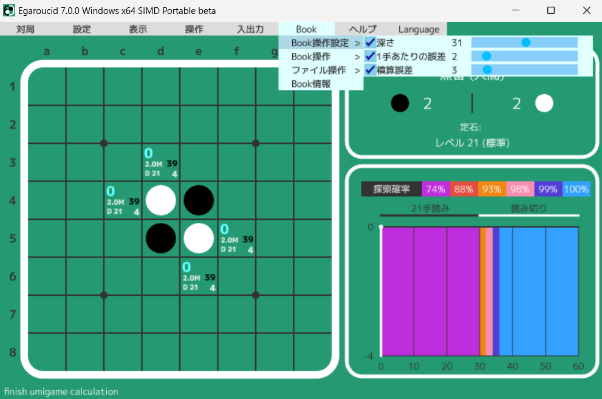
</div>


### Book操作 > 右クリックで編集

合法手を右クリックし、数字を打ち込み(テンキーも対応しています)、Enterを押すことで手動でbook値を修正したり、局面をbookに追加したりできます。

合法手を右クリックするとbook手動編集モードに入ります。同じマスをもう一度右クリックかEscキーを押すとこのモードを抜けられます。手動で値を入力した場合、book値を計算したレベルはAIの全ての設定よりも高い"S"として記録されます。

編集したbookはEgaroucidの終了時に自動で保存されます。デフォルトの保存場所はドキュメントフォルダ内のEgaroucid/book.egbk3です。

<div class="centering_box">
    
</div>


### Book操作 > Book学習

これがbookの自動学習ボタンです。

学習を開始したい開始局面を作り、使用するAIのレベルとbookの学習設定を確認し、そこでこのボタンを押すと確認画面に移行します。開始局面がbookに登録されていない局面の場合、開始局面に至る棋譜の中で最後にbookに登録された値を使って開始局面まで自動でbookに登録します。

ここで「開始」を押すと学習が始まります。しばらく待つと「完了」と出るので、戻れます。

なお、学習中に強制終了したい場合は「学習停止」ボタンが出現しているので、押してください。学習中は不慮の事故防止のため、ウィンドウ右上のバツボタンを無効化しています。

編集したbookはEgaroucidの終了時に自動で保存されます。デフォルトの保存場所はドキュメントフォルダ内のEgaroucid/book.egbk3です。

<div class="centering_box">
    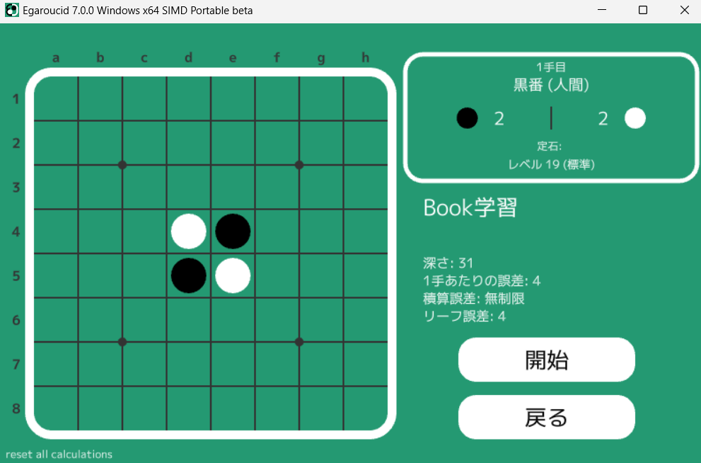
</div>

この機能はバージョン7.3.0でEdaxのBook deviateとほぼ全く同じ実装になりました。これ以前はEdaxよりも登録局面数が多くなるような実装をしていました。

bookにはリーフという概念があり、「これはbookに登録されていない手のうち一番良さそうな手」という意味を持ちます。Egaroucidのbook学習機能は、このリーフをbookに登録するという作業を、条件が満たされる限り繰り返すことで実装されています。ですから、リーフの評価値と手があまりにもデタラメだと学習はなかなかうまくいきません。そんなときはリーフ再計算機能を使ってみてください。


### Book操作 > 棋譜を指定してBook学習

この機能はバージョン7.1.0で搭載した機能です。上記のBook学習では学習を開始する局面を自分で設定する必要がありましたが、この機能では学習を開始する局面を棋譜として複数設定し、それらを順番に学習していく機能です。学習開始局面がbookに登録されていない局面の場合、開始局面に至る棋譜の中で最後にbookに登録された値を使って開始局面まで自動でbookに登録します。

下図のように棋譜を改行区切りで入力してください。このとき、全体の文字数は10000文字までの制限があります。改行区切りで棋譜が羅列されているテキストファイルを別途作って、それをドラッグ&ドロップすることもできます。この場合は文字数制限がありません。大量の棋譜を入力する場合は、文字数制限やエラーが起きたときの対処しやすさの観点から、外部にテキストファイルを準備することをおすすめします。

開始ボタンを押すと学習が開始されます。このとき、真ん中の「開始」ボタンを押すと通常のbook学習が始まりますが、右の「指定ループ数で開始」を押すと、指定したループ数だけ学習を行います。このループ数とは、book学習処理を何回行うかの指標です。何も指定しなければ(通常の学習では)無限大となりますが、指定することで学習時間を短縮できます。ただ、そのかわりにbookのミスが増える可能性があります。通常は15程度で良いと感じているため、このオプションをつけました。

開始ボタンを押すとまず棋譜に間違いがないかチェックし、棋譜に間違いがあるとエラーが出ます。エラーとなった行が表示されるので、戻るボタンを押して棋譜を修正してください。

<div class="centering_box">
    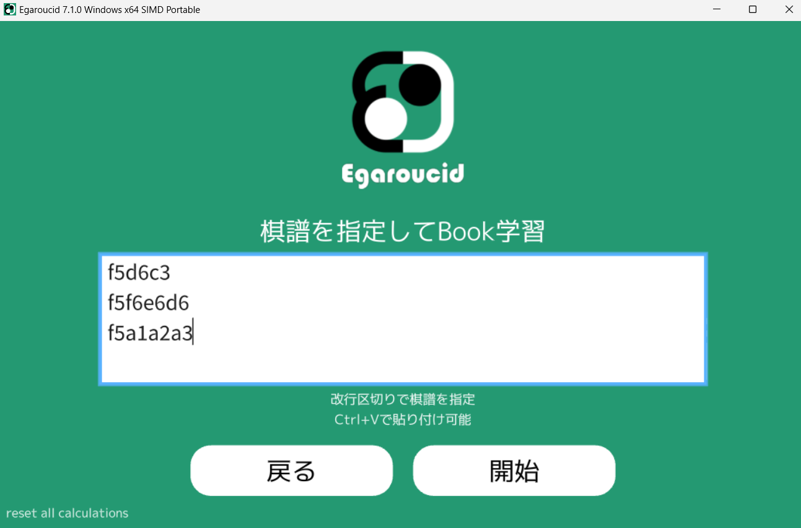
    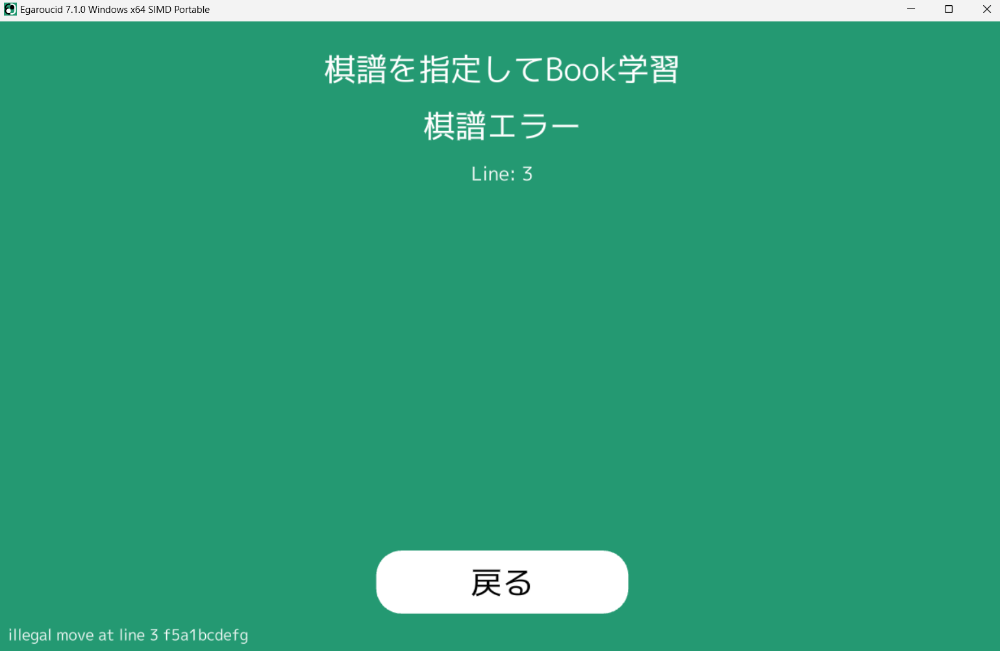
    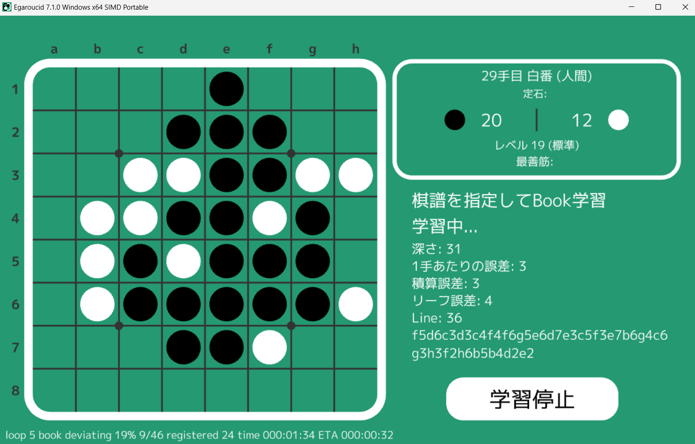
</div>


### Book操作 > Book修正

bookに登録された局面の繋がりを再計算し、末端からbook値をnegamax的に計算し、初期局面から孤立している局面を削除する機能です。また、この機能ではbookの<a href="#表示_合法手への表示 > Bookライン数">ライン数情報</a>も同時に更新します。

修正したbookはEgaroucidの終了時に自動で保存されます。

デフォルトの保存場所はドキュメントフォルダ内のEgaroucid/book.egbk3です。


### Book操作 > Book修正 (Edax準拠)

Egaroucidの通常のBook修正はEdaxのBook Fixコマンドとは互換性がありません。そのため、Edax準拠のBook修正機能を別途搭載しています。EdaxのBookを読み込んだときなどに使用できます。

なお、完全な互換性は担保しません。


### Book操作 > Book削減

<a href="#Book_Book操作設定">bookの設定</a>で設定した項目に従って、指定局面から先の局面に対して、あまりにも悪い手や、設定した深さよりも先の局面がbookに登録されていたら登録を解除します。

修正したbookはEgaroucidの終了時に自動で保存されます。

デフォルトの保存場所はドキュメントフォルダ内のEgaroucid/book.egbk3です。


### Book操作 > リーフ再計算

<a href="#Book_Book操作 > Book学習">book学習</a>に少し書いた通り、book学習機能ではbookの内部情報として保持されているリーフという概念が非常に大事になっています。bookによっては(特に過去のegbk2やegbk形式をインポートした場合には)リーフの計算がうまくいっていない場合があります。そのような場合、この機能を使うことでリーフの評価値と手を精度良く計算できます。

この機能では、<a href="#設定_レベル">設定>レベル</a>で設定できるAIのレベルと、<a href="#Book_Book操作設定">bookの設定</a>の項目で設定できる各項目が使用されます。

bookの自動学習と同様に、1手あたりの誤差、および手筋の合計誤差の条件を満たしているbookに登録されている局面を生成して、その局面のリーフを設定したAIのレベルで計算します。

レベルを上げたり、許容誤差を大きくすると計算時間が非常に長くなります。

<div class="centering_box">
    
</div>


### Book操作 > ライン数再計算

Bookのライン数(その局面から先にいくつの局面が登録されているか)を再計算します。[Book精度](#表示_合法手への表示 > Book精度)の表示をしている場合には値が更新されたことがわかります。


### ファイル操作 > Book読み込み

様々なフォーマットのBookを読み込めます。対応フォーマットはEgaroucid形式()```.egbk3```、```.egbk2```、```.egbk```)とEdax形式(```.dat```)です。拡張子がこれらのどれでもない場合は読み込みボタンが押せません。

読み込んだBookは内部で```.egbk3```形式に変換されます。```.egbk```形式は互換性の問題で読み込み時にAIのレベルを手動で設定する必要があります。

<div class="centering_box">
    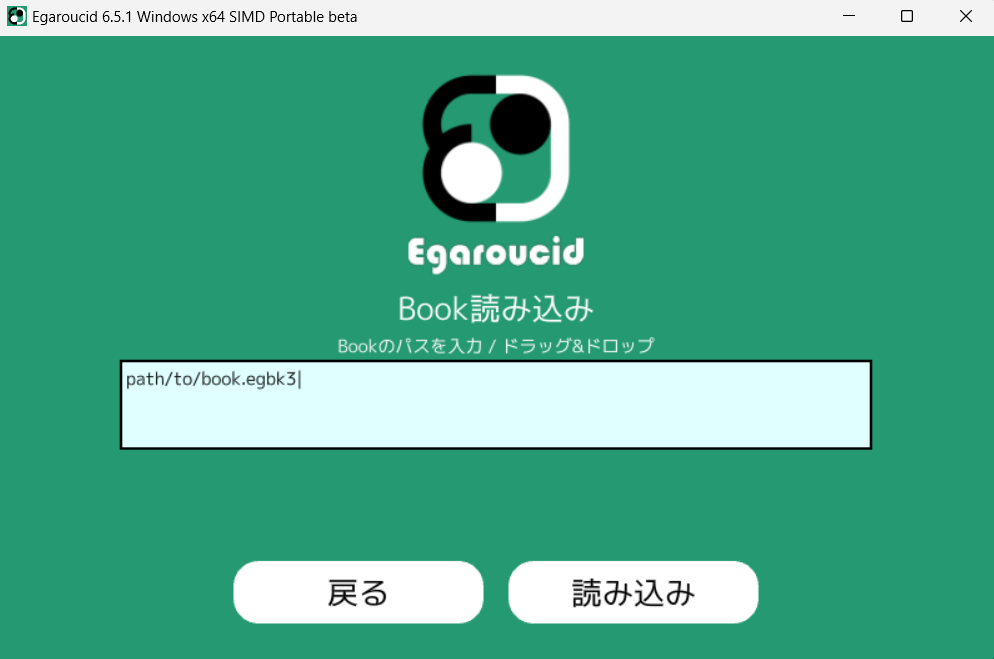
    
</div>


### ファイル操作 > Book書き出し

現在使用しているBookをEgaroucid形式またはEdax形式でファイルに書き出すことができます。なお、EgaroucidはBookの変更があった場合には終了時に自動でBookを保存しますが、これはその機能とは別に、任意の場所にBookを書き出す機能です。

Bookの内部情報として、局面ごとに、その局面をレベルいくつのAIで探索したかという情報が含まれています。「書き出し」ボタンを押すと現在アプリ内で保持しているレベルで書き出されますが、「指定レベルで書き出し」を押すと、下部のバーで設定したレベルで書き出されます。Enterキーを押すと「書き出し」ボタンが押されたことと同じ挙動をします。

Egaroucid形式は```.egbk3```、Edax形式は```.dat```という拡張子でパスを入力してください。それ以外の拡張子だと書き出せないようになっています。

Edax形式への変換は完璧な互換性を保証するものではありません。また、Edax形式への変換によって生じたいかなる問題にも責任は負いません。

<div class="centering_box">
    
    
    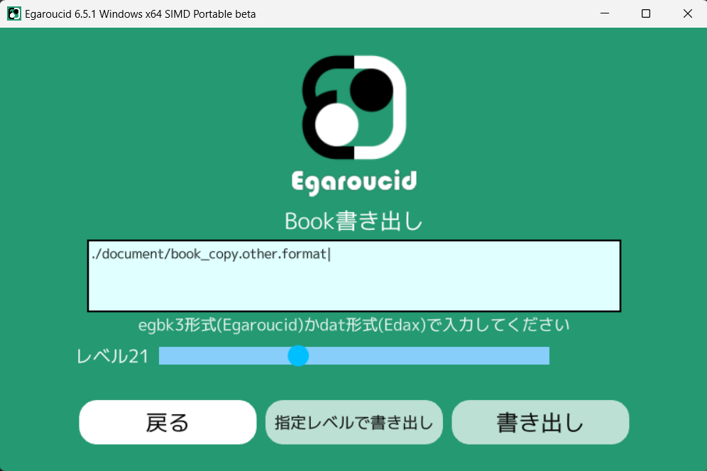
</div>


### ファイル操作 > Book統合

2つのbookを統合できます。統合したいbookについて、パスを入力するかドラッグ&ドロップしてください。

Egaroucid起動時に読み込んだbookに新たなbookを統合し、競合する場合はBook値を計算したAIのレベルが高い方で上書きします。レベルが同じ場合は新しい方で上書きします。

Egaroucid形式のbook(```.egbk3```)とEdax形式のbook(```.dat```)も使えます。Egaroucid形式の古いbookはBookの読み込み機能を使って```.egbk3```形式に変換してからこの機能をお使いください。

Edax形式からの変換は完璧な互換性を保証するものではありません。また、Edax形式からの変換によって生じたいかなる問題にも責任は負いません。


### ファイル操作 > Bookの参照

起動時に読み込むbookを変更できます。パスを入力するか、ドラッグ&ドロップしてください。

デフォルトはドキュメントフォルダ内のEgaroucid/book.egbk3です。


### Book情報

Bookに登録されている局面の情報を表示します。左半分にはAIのレベルごとに登録局面数を、右半分には打った手数ごとに登録局面数を表示します。この機能は簡易的な実装のため、少し見にくいです。

<div class="centering_box">
    
</div>


## ヘルプ

### 使い方

このページへ飛べるボタンです。


### Webサイト

Egaroucid公式サイトのトップページに飛べるボタンです。


### バグレポート

バグ報告や機能追加依頼などができるGoogleフォームに飛べるボタンです。


### 更新確認

新しいバージョンが公開されているかを確認します。新しいバージョンがあった場合、ダウンロードボタンを押すことでダウンロードページを開けます。


### 自動更新確認

Egaroucidの起動時に更新を自動で確認するかを選択できます。

Egaroucidは過去バージョンとの互換性を極力高めて開発しており、最新バージョンでは様々なバグを解消していますので、常に最新バージョンへのアップデートを推奨します。


### ライセンス

Egaroucidのライセンス、およびEgaroucidで使用しているライブラリ等のライセンスをまとめて表示できます。


## Language

言語を変更できます。日本語、英語、中国語(簡体字・繁体字(台湾))に対応しています。中国語(簡体字と繁体字両方)はユーザによる翻訳です。

jsonファイルで言語パックを作ることで他の言語にも対応可能(なはず)(フォントが対応している限り…)です。

言語パックはEgaroucidインストールフォルダの中のresources/languagesの中にある言語名.jsonです。ここに言語パックを追加して、languages.jsonに言語の英名と言語の表示名を書き、表示する言語名の画像を作れば、Egaroucidに反映できます。

もしご自身で翻訳された場合、ご連絡いただければその翻訳を公式採用します。ぜひご連絡ください。

<div class="centering_box">
    
</div>
