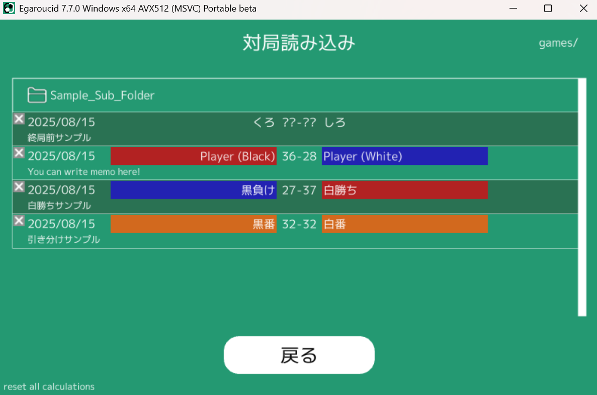

# Egaroucid 使い方

オセロAI Egaroucidの公式ドキュメントです。このページの内容は最新バージョンに合わせてありますが、更新が追いつかない場合もあります。

このページは日本語のみです。

INSERT_TABLE_OF_CONTENTS_HERE

## 画面の見方

画面の見方を5つの項目に分けて解説します。

    

### 盤面

オセロの盤面です。合法手(打てるところ)の表示や評価値などの表示もできます。マスを直接クリックすることで着手できます。

    

<ul>
    <li><a href="#表示_合法手への表示 > 石差評価">評価値を表示できます</a></li>
    <li><a href="#表示_合法手への表示 > うみがめ数">うみがめ数を表示できます</a></li>
    <li><a href="#入出力">棋譜、盤面などによる入出力ができます</a></li>
    <li><a href="#入出力_出力 > スクリーンショット">盤面だけを切り取ったスクリーンショットを撮る機能があります</a></li>
</ul>

### 対局情報

盤面やAIに関係する情報をまとめて表示しています。

現在が何手目で、誰の手番なのか、現在の石数はいくつ対いくつなのか、定石名は何か、<a href="#設定_レベル">AIのレベル</a>はいくつか、を表示しています。

    

### グラフ

対局の形勢を表すグラフを表示します。

横軸が手数(0手目から60手目まで)で、縦軸が形勢(石差)です。

グラフは真ん中の0で互角、上に行くと黒有利、下に行くと白有利です。

縦軸の値は最終石差の予測値を表していて、具体的には「この局面から双方最善手を打ち続けるとどちらが何石多く勝つか」という値です。

    

<ul>
    <li><a href="#表示_グラフ">対局中など、グラフを見たくないときには非表示にできます</a></li>
    <li><a href="#対局_分析">対局の解析を行うと全ての局面の値をまとめて計算できます</a></li>
    <li><a href="#表示_合法手への表示 > 石差評価">ヒントを表示した上で盤面を進めていくと自動で更新されます</a></li>
    <li><a href="#操作_進む/戻る">白い縦線をドラッグして動かすと局面を戻したり進めたりできます</a></li>
</ul>

### メニュー

各種操作を行います。

様々な機能がついているので、このサイトではメニューの構成に沿って機能を紹介します。

### ログ

AIの計算過程などを表示します。ユーザはあまり気にしなくて良いですが、なにか不具合があった場合の解決策のヒントになる場合があります。

<ul>
    <li><a href="#表示_ログ">ログ表示をオフにできます</a></li>
</ul>

## 対局

メニューのここから辿れる機能です。

    

### 新規対局 (人間同士)

盤面を初期状態に戻します。AIが着手しない設定なので、そのまま人間が打ち進めます。石を並べる際や人間同士の対局で使うことを想定しています。

<ul>
    <li><a href="#設定_AIの着手設定">途中からAIに打たせることもできます</a></li>
</ul>

### 新規対局 (人間黒番)

盤面を初期状態に戻し、人間が黒番、AIが白番で対戦します。対局用途にも使えますが、ただ石を並べる用途を考えています。

<ul>
    <li><a href="#設定_AIの着手設定">途中からAIが着手する手番を変更できます</a></li>
    <li><a href="#設定_AIの着手設定">途中から人間同士/AI同士に設定できます</a></li>
</ul>

### 新規対局 (人間白番)

盤面を初期状態に戻し、AIが黒番、人間が白番で対戦します。

AIが初手なので、画面右上に対局開始ボタンが出現します。それを押すと対局が始まります。

    

<ul>
    <li><a href="#設定_AIの着手設定">途中からAIが着手する手番を変更できます</a></li>
    <li><a href="#設定_AIの着手設定">途中から人間同士/AI同士に設定できます</a></li>
</ul>

### 新規自己対戦

盤面を初期状態に戻し、AI同士で対戦します。

画面右上に対局開始ボタンが出現します。それを押すと対局が始まります。

    

<ul>
    <li><a href="#設定_AIの着手設定">途中からAIが着手する手番を変更できます</a></li>
    <li><a href="#設定_AIの着手設定">途中から人間同士/AI同士に設定できます</a></li>
</ul>

### 分析

対局を分析します。

1手ずつ評価値を再計算して、グラフに描画します。どこで悪手を打ったのかがわかりやすいです。

## 設定

メニューのここから辿れる機能です。

    

### book使用

AIの着手やヒント計算にbookを使うか否かを選択できます。

bookとは、予め局面に対して評価値を計算しておいたものです。

<ul>
    <li><a href="#Book_Book操作 > Book拡張">bookを自動で拡張できます</a></li>
    <li><a href="#Book_Book操作 > 右クリックで編集">bookを手動で修正できます</a></li>
    <li><a href="#Book_ファイル操作 > bookの参照">bookのファイル指定ができます</a></li>
    <li><a href="#Book_ファイル操作 > 統合">bookの統合ができます</a></li>
</ul>

### book変化レベル

bookには最善手以外の手も収録されています。AIの着手時にそのような悪手をどれくらいの確率で打つかを決められます。

book変化レベルが0だと最善手しか打ちません。値が大きくなると悪手を積極的に打つようになります。

最大でbook変化レベルの2倍の石損を許すという意図の設定です。ただ、石損が大きい手は選ぶ確率が低いです。

具体的な計算手法は以下です。

book変化レベルが$X$で、ある局面から手を選択するとき、bookに登録されている着手の評価値の集合を$A=\{(v,m)\}$とします。ここで、$v$は(手番目線の)評価値、$m$は手です。

$B=\left\{(v,m)\in A\middle|v\geq v_{\mathrm{max}}-2X\right\}$

で定義される$B$を作り、$2X$石損以下の手を厳選します。なお、$v_{\mathrm{max}}$は最善手の評価値です。そして

$C=\left\{(s,m)\middle| s=\left(\exp\left(\frac{v-v_{\mathrm{max}}+1.5}{3}\right)\right)^{(10-X)}\right\}$

$D=\left\{(s,m)\middle| s=\frac{s}{c_{\mathrm{sum}}}\right\}$

softmax的に変換します。$c_{\mathrm{sum}}$は$C$の$s$の合計値です。

そしてここで$r$を0以上1未満のランダムな値として、

$r\leq\sum_{j=0}^{i}{s'_j}$

かつ

$r>\sum_{j=0}^{i-1}{s'_j}$

を満たす$i$を見つけ、$M_i$を着手する手として採用します。

### レベル

AIのレベルを設定できます。

AIのレベルは、

<ul>
    <li>中盤の読みの深さ</li>
    <li>終盤の読み切りタイミング</li>
    <li>探索の精度の確率</li>
</ul>

という3つの観点で定義されます。レベルを上げると、中盤は深くまで読み、終盤の読み切りタイミングは早く、探索の精度の確率は上がります。

ここで設定するレベルは、<a href="#設定_AIの着手設定">AIの着手</a>、<a href="#表示_合法手への表示 > 石差評価">ヒント表示</a>、<a href="#対局_分析">対局分析</a>、Book学習の全てで統一して使われます。

「探索の精度の確率」と書いたのは、Multi-ProbCutという技術で用いられる確率のことです。Multi-ProbCutは、明らかな悪手の探索を省略するものです。確率が低ければ大胆に、確率が高ければ少しだけ省略します。なお、100%の場合は探索を省略しません。

各レベルのパラメータは<a href="#画面の見方_グラフ">グラフエリア</a>に表示されています。下図はレベル27のグラフです。これを見ると、

<ul>
    <li>23手目までは中盤探索を行い、27手読みを75%の精度で行う</li>
    <li>24手目からは終局まで読み切る</li>
    <li>読み切りは88%の精度から始まって、終局に近づき32手目で100%の完全読みを行う</li>
</ul>

ということがわかります。グラフに重ねて描画されるので、グラフの点がどのような探索の結果なのかがわかりやすいです。

    

### スレッド数

ここでは、並列計算についての設定をします。

お使いのCPUが$X$コア$Y$スレッドであれば、$Y$に近い値に設定すると高速になると思います。

デフォルトで$Y$に自動的に設定されるようになっています。

### ハッシュレベル

Egaroucidでは探索時に、一部の探索結果を保存しておきます。その保存領域の大きさを決められます。大きくするとメモリ消費量が増え、探索が高速になる可能性が高まります。

この保存領域において以下の表で示されるメモリを消費します。

<table>
<tr>
<th>ハッシュレベル</th>
<th>メモリ消費量(GB)</th>
</tr>
<tr>
<td>23</td>
<td>0.75</td>
</tr>
<tr>
<td>24</td>
<td>0.75</td>
</tr>
<tr>
<td>25</td>
<td>0.75</td>
</tr>
<tr>
<td>26</td>
<td>1.5</td>
</tr>
<tr>
<td>27</td>
<td>3.0</td>
</tr>
</table>

内部的には、ハッシュレベルを$X$とすると$2^X$個の局面を保存できるようにする大きさのハッシュテーブルを作っています。ハッシュレベル25までは静的にメモリを確保してあります。

### AIの着手設定

「AIが黒に着手」「AIが白に着手」によって、対局中でもAIの着手設定を変更できます。

両方のチェックを外せば途中から人間同士の対局(ただ石を並べるだけ)になります。

<ul>
    <li><a href="#対局">対局開始時に1クリックで設定できます</a></li>
</ul>

### パスで一時停止

人間とAIの対局で、人間のパスの時に人間が明示的にパスであるというボタンを押すかどうかの設定です。下図はこのモードをオンにしたときで、黒番が人間ですが置く場所がないのでパスボタンが出現しています。

    

## 表示

メニューのここから辿れる機能です。

    

### 合法手への表示 > 合法手

盤面に合法手を表示するかどうか設定できます。合法手は水色の小さな点で表されます。

    

### 合法手への表示 > 石差評価

合法手のマスに評価値(最終石差)を表示するかどうか選択できます。ヒント表示と表記する場合もあります。

また、全ての合法手に対して評価値を計算すると計算が遅い場合、表示個数を選択できます。下の画像では4つを選択しており、これは上位4手の評価値を表示するという意味です。

    

合法手に評価値を表示するようにすると、その値を流用して自動で<a href="#画面の見方_グラフ">グラフ</a>aが更新されます。

### 合法手への表示 > うみがめ数

bookに登録されている局面について、うみがめ数を計算して表示します。

マスの右下に、黒と白のうみがめ数が表示されます。

    

### 合法手への表示 > 定石

マスにマウスをホバーしたときに定石名を出してくれます。

<a href="#画面の見方_対局情報">対局情報</a>に定石名は書かれていますが、それは「ここまでどんな定石で来たか」です。一方、この機能で表示されるのは、「この手に打ったらどんな定石になるか」です。

    

### 合法手への表示 > 直後の手

対局を振り返るなどして盤面を戻したとき、直後に打った手を薄く表示します。

    

なお、ここで「合法手への表示 > 直後の手 > 表示変更」を選択すると、紫の四角による表示に変更できます。

    

### 石への表示 > 直前の手

直前に打った手を小さい赤丸で表示できます。

    

### 石への表示 > 確定石

盤面に存在する確定石を黄丸で表示します。なお、これは全ての確定石を計算できるものではありません。

    

この機能の実装には、AI内部で探索のために確定石を計算するところを流用しています。

### グラフ

グラフの表示/非表示を選択できます。非表示にすると画像のように、薄灰色の点だけでグラフが描画されます。この点は0のところだけにあり、特に上下しません。

内部的にグラフの情報はずっと保持しているので、表示に切り替えるとすぐに値が反映されます。

グラフは、AIの着手時、<a href="#表示_合法手への表示 > 石差評価">ヒント表示をしているとき</a>、<a href="#対局_分析">対局の分析をしたとき</a>に自動で更新されます。

下図はグラフ表示をオフにした様子です。形勢が傾いている(黒優勢)のに、グラフには反映されていません。

    

### ログ

ログの表示/非表示を切り替えられます。

AIの計算中、ログには評価値が現れるので、本気で対戦したいときにはグラフと一緒にログも非表示にすることをおすすめします。

### 色調変更

グラフの色調を変更できます。色覚特性によってグラフが見にくい場合にお使いください。

制作者の意図としては、2型2色覚、および3型2色覚の方に見やすいよう配慮しました。もし色彩についてアイデアがありましたらぜひご連絡ください。

    

## 操作

メニューのここから辿れる機能です。

    

### 進む/戻る

局面を戻したり進めたりできます。これ以上戻れない/進めない場合、何も起こりません。

なお、ショートカットキーとして、単に右矢印キーを押すかDキーを押すだけでも局面を進められます。また、左矢印キーかAキーを押すと局面を戻せます。

さらに、<a href="#画面の見方_グラフ">グラフ</a>に表示されている白い縦線を左右にドラッグすることでも局面を進めたり戻したりできます。

### 待った

局面を戻すと同時に、直後の手を打たなかったことにできます。対局中に「待った」をしたいときや、石を並べているときに打つ手を変更したいときに使えます。

なお、ショートカットキーとしてBackSpaceを割り当てています。

### この分岐を保存

人間同士の対戦設定にして石を並べている際、一度局面を戻し、前回と違う手を打つとグラフに黒線で評価値が表示されます(下図)。このとき、黒線を分岐側、白線を本筋とします。

    

分岐側の手筋は、分岐開始局面以前に局面を戻すと自動で消えてしまいます。しかし、「この分岐を保存」ボタンを押すと、分岐側の手筋を本筋にして、本筋だった手筋を消せます。上の図の状態で分岐を保存した後のグラフは下図です。

    

### ランダム局面を生成

中盤局面をランダムに自動生成します。ヒントを非表示にして局面を生成しその局面の形勢を判断する、というオセロの勉強のために実装しました。

生成ボタンを押すと自動で中盤局面が生成されます。また、生成手数を変更することで、何手目の局面を生成するかを選択できます。

この機能では、各着手に対して68%の確率で4石損以下、95%の確率で8石損以下の手を選びます。

    

この機能は、指定された手数までの各着手に対して以下の計算によって手を選んでいます。

平均0、標準偏差4の正規分布に従ってランダムに数値を出力する関数を$\mathrm{randdst_{0,4}()}$とします。

$E=\mathrm{round\left(\mathrm{randdst_{0,4}()}\right)}$

として、許容誤差$E$を整数で決定します。

与えられた局面に対して、評価値の集合を$A=\{(v,m)\}$とします。ここで、$v$は(手番目線の)評価値、$m$は手です。

$B=\left\{(v,m)\in A\middle|v\geq v_{\mathrm{max}}-E\right\}$

で定義される$B$を作り、$E$石損以下の手を厳選します。なお、$v_{\mathrm{max}}$は最善手の評価値です。

この$B$の中から手をランダムに選択します。

なお、この機能では強い手を選ぶ必要がないため、手の評価値はbook登録値または2手読みの評価値を使用しています。

### 変換

局面を以下3種類の方法で対称に変換できます。

<ul>
    <li>180度回転</li>
    <li>ブラックラインで線対称</li>
    <li>ホワイトラインで線対称</li>
</ul>

ブラックラインはh1からa8のライン(初期局面で黒石が並ぶライン)、ホワイトラインはa1からh8のライン(初期局面で白石が並ぶライン)です。

<ul>
    <li>棋譜を入力して初手をf5に強制して、<a href="#入出力_出力 > 現局面までの棋譜をコピー">棋譜をコピー</a>するという使い方もできます。</li>
</ul>

### AI操作 > 計算停止

AIの計算が終わらない場合など、このボタンを押すと強制的に停止できます。

### AI操作 > キャッシュクリア

AIは探索時に一部の局面の評価値を自動で保存し、以降の探索を高速にする工夫をしています。この保存された局面を全て消去します。

<ul>
    <li>この機能は<a href="#設定_ハッシュレベル">ハッシュレベル</a>の設定と関係します。</li>
</ul>

## 入出力

メニューのここから辿れる機能です。

    

### 入力 > 棋譜入力

f5D6形式の棋譜を入力して局面を設定できます。大文字小文字、スペース、改行は無視されます。

その場で棋譜を打つこともできますし、ペーストもできます。ただ、カーソル操作が行えません。

「取り込む」ボタンで初手からこの進行をたどります。

「設定局面から取り込む」ボタンで、<a href="#画面の見方_盤面">盤面エリア</a>に設定された局面からこの進行を打ちます。

ショートカットキーは、Enterで「取り込む」、Escで「戻る」の操作ができるようになっています。

    

### 入力 > 盤面入力

盤面を文字列として入力できます。

盤面をa1、b1、c1…、h8と一行に並べた状態を入力します。空きマスは"."または"-"、黒石は"X"、"x"、"B"、"b"、0"、"*"として、白石は"O"、"o"、"W"、"w"、"1"として表現します。混在しても構いませんし、スペースや改行を含んでも構いません。最後に手番として黒を表す文字か白を表す文字を入れます。下図では例として虎定石(f5d6c3d3c4)を入力しています。入力した文字列は

<code>------------------XO------XXX------OXX-----O-------------------- O</code>

です。

ショートカットキーとしてEnterを「取り込む」に、Escを「戻る」に割り当てています。

    

### 入力 > 盤面編集

盤面の石の状態を手動で設定できます。画面中央右の「色」のチェックボックスを選択し、左の盤面をクリックすることで好きに石を配置できます。最後に手番を黒番か白番か選んで「取り込む」を押すと反映されます。

ショートカットキーとして、置く色を変えるのに黒ならBキー、白ならWキー、空きマスならEキーを割り当てています。

また、Enterで取り込み、Escで戻ることができます。

    

### 入力 > 対局読み込み

Egaroucidは<a href="#入出力_出力 > 対局保存">対局を独自形式で保存する</a>ことができます。その対局を読み込む機能です。

保存日時、対局者、結果、メモがまとまって表示されるので、取り込むボタンで取り込めます。

対局数が多い場合にはスクロールできます。

ショートカットキーにはEscで「戻る」を割り当てました。

    

### 出力 > 現局面までの棋譜をコピー

<a href="#画面の見方_盤面">盤面エリア</a>に表示されている局面までの棋譜を簡単にコピーできます。

### 出力 > 対局保存

対局をEgaroucid独自形式で保存します。最終結果やグラフの情報も自動で保存されます。

黒番と白番の名前とメモを書き、「本筋を保存」ボタンで保存できます。なお、「設定局面までを保存」では、<a href="#画面の見方_盤面">盤面エリア</a>に表示されている局面までの情報を保存できます。ですから、局面を戻してこのボタンを押すと、戻したところまでが保存されます。

ショートカットキーとして、Tabキーで入力エリア切り替え、Escで「戻る」操作ができます。

カーソル移動ができないので、特にメモはコピペを推奨します。

対局を読み込みたい場合は<a href="#入出力_入力 > 対局読み込み">対局読み込み</a>から一覧を確認し、読み込んでください。

    

ドキュメントフォルダ内のEgaroucid/gamesフォルダにデータが保存されます。

### 出力 > スクリーンショット

盤面のスクリーンショットを撮れます。クリップボードに画像をコピーする他、ドキュメントフォルダ内のEgaroucid/screenshotsフォルダに日時をファイル名として画像が保存されます。

画像の解像度は、Egaroucidの画面の大きさに依存します。高解像度画像が欲しい場合には最大化してからスクリーンショットを撮ってください。

    

<ul>
    <li>この機能は<a href="#入出力_出力 > ボードの画像を編集">ボードの画像を編集</a>の簡易版+評価値表示をつけたものという位置づけです。</li>
</ul>

### 出力 > ボードの画像を編集

オセロの盤面に自由にマークをつけ、画像を保存できます。オセロの解説冊子などへの利用を想定しています。

マークを選択し、自由に石やマスをクリックしてください。

この画面では石の配置の変更はできないので、石の配置は<a href="#入出力_入力 > 棋譜入力">棋譜を入力</a>するか、<a href="#入出力_入力 > 盤面編集">盤面編集</a>をして作ってからこの機能を使ってください。

白黒印刷で綺麗に見えるよう、モノクロ画像への変換もできます。

「画像を保存」で、クリップボードに画像をコピーしつつ、画像を保存します。保存先はドキュメントフォルダ内のEgaroucid/screenshotsフォルダで、日時をファイル名とします。

ショートカットキーとしてEscを「戻る」に割り当てました。

画像の解像度は、Egaroucidの画面の大きさに依存します。高解像度画像が欲しい場合には最大化してから画像を保存してください。

    
    
    
    

## Book

玄人向け機能です。メニューのここから辿れます。

    

### 学習の設定 (深さ、1手あたりの誤差、手筋の誤差)

Egaroucidでは自動でbookを拡張(学習)する機能があります。これは簡単に言うと、指定した局面からの最善進行、および最善に近い進行を見つけて自動で登録する機能です。

Egaroucidでは深さ、1手あたりの誤差、手筋の誤差という3つの項目で学習の設定を行います。

深さは、単にbookの深さを表します。深さを$D$とすれば、初手から数えて最大で$D$手目までの局面を登録します。

1手あたりの誤差は、その局面の最善手から$E_1$石損した手までを探索するという意味の$E_1$です。

手筋の誤差は、bookの学習を開始した局面からbookの末端までで合計$E_{\mathrm{sum}}$石損までの手筋を探索するという意味の$E_{\mathrm{sum}}$です。

つまり、$D$手目以上の局面は登録されませんし、$E_1$石以上の石損をする手は登録されません($E_1$石損以下だと思ったが、計算してみたら$E_1$石損以上であった、という場合には登録されます)し、石損を繰り返して$E_\mathrm{sum}$石損を超えた局面は登録されません。

### Book操作 > 右クリックで編集

合法手を右クリックし、数字を打ち込み(テンキーも対応しています)、Enterを押すことで手動でbook値を修正したり、局面をbookに追加したりできます。

合法手を右クリックするとbook手動編集モードに入ります。同じマスをもう一度右クリックかEscキーを押すとこのモードを抜けられます。

編集したbookはEgaroucidの終了時に自動で保存されます。

デフォルトの保存場所はドキュメントフォルダ内のEgaroucid/book.egbk3です。

### Book操作 > Book拡張

これがbookの自動学習ボタンです。

学習を開始したい開始局面を作り、使用するAIのレベルを確認し、そこでこのボタンを押すと確認画面に移行します。

ここで「開始」を押すと学習が始まります。しばらく待つと「完了」と出るので、戻れます。

なお、学習中に強制終了したい場合は「学習停止」ボタンが出現しているので、押してください。学習中は不慮の自己防止のため、ウィンドウ右上のバツボタンを無効化しています。

編集したbookはEgaroucidの終了時に自動で保存されます。

デフォルトの保存場所はドキュメントフォルダ内のEgaroucid/book.egbk3です。

    

### Book操作 > Book修正

bookに登録された局面の繋がりを再計算し、末端からbook値をnegamax的に計算し、初期局面から孤立している局面を削除する機能です。

修正したbookはEgaroucidの終了時に自動で保存されます。

デフォルトの保存場所はドキュメントフォルダ内のEgaroucid/book.egbk3です。

### Book操作 > 深さ上限設定

bookの深さの上限$D$を変更できます。深さ30のbookを切り出して深さ20のbookにしたい場合などに使えます。

修正したbookはEgaroucidの終了時に自動で保存されます。

デフォルトの保存場所はドキュメントフォルダ内のEgaroucid/book.egbk3です。

### Book操作 > レベル上書き

bookには、計算したAIのレベルを保存してあります。この値を一括で変更できます。

### ファイル操作 > 統合

2つのbookを統合できます。

Egaroucid起動時に読み込んだbookに新たなbookを統合し、競合する場合は新たなbookで上書きします。

Egaroucid形式のbookの他、Edax形式のbookも使えます。そのため、空のbook(ドキュメントフォルダ内のEgaroucid/empty_book.egbk3)を読み込ませて起動してから、Edaxのbookを統合すればEdaxのbookをEgaroucid形式に変換できます。

### ファイル操作 > bookの参照

起動時に読み込むbookを変更できます。パスを入力するか、ドラッグ&ドロップしてください。

デフォルトはドキュメントフォルダ内のEgaroucid/book.egbk3です。

### ファイル操作 > Edax形式で保存

Egaroucid形式のbookをEdax形式で保存できます。完璧な互換性を保証するものではありません。

### Bookファイルの構造

Egaroucidのbookは独自フォーマットのバイナリファイル(リトルエンディアン)で保存されています。過去のフォーマットも含めて構造を説明します。一般ユーザにとって有益な情報ではないと思います。

#### egbk3フォーマット

拡張子は<code>.egbk3</code>です。

最新のフォーマットです。

<table>
    <tr>
    	<th>項目</th>
       	<th>データ量(バイト)</th>
       	<th>内容</th>
    </tr>
    <tr>
    	<td>"EGAROUCID"</td>
        <td>9</td>
        <td>固定の文字列"EGAROUCID"</td>
    </tr>
    <tr>
    	<td>Bookのバージョン</td>
        <td>1</td>
        <td>egbk3フォーマットの場合は3で固定</td>
    </tr>
    <tr>
    	<td>登録局面数</td>
        <td>4</td>
        <td>bookに登録された局面の数</td>
    </tr>
    <tr>
    	<td>局面情報</td>
        <td>23*登録局面数</td>
        <td>登録されている局面のデータ(下記参照)</td>
    </tr>
</table>

登録局面ごとに、以下のデータが保存されています。

<table>
    <tr>
    	<th>項目</th>
       	<th>データ量(バイト)</th>
       	<th>内容</th>
    </tr>
    <tr>
    	<td>手番の石の配置</td>
        <td>8</td>
        <td>64bitを使って64マスのそれぞれに手番の石があるかを格納します(MSBがa1)</td>
    </tr>
    <tr>
    	<td>相手の石の配置</td>
        <td>8</td>
        <td>64bitを使って64マスのそれぞれに手番の石があるかを格納します(MSBがa1)</td>
    </tr>
    <tr>
    	<td>評価値</td>
        <td>1</td>
        <td>その局面の評価値</td>
    </tr>
    <tr>
    	<td>ライン数</td>
        <td>4</td>
        <td>その局面の先にいくつの局面がbookに登録されているかを示す値</td>
    </tr>
    <tr>
    	<td>リーフの評価値</td>
        <td>1</td>
        <td>bookに未登録の手のうち、一番良さそうな手の評価値</td>
    </tr>
    <tr>
    	<td>リーフの手</td>
        <td>1</td>
        <td>bookに未登録の手のうち、一番良さそうな手</td>
    </tr>
</table>

#### egbk2フォーマット

拡張子は<code>.egbk2</code>です。

TBD

#### egbkフォーマット

拡張子は<code>.egbk</code>です。

TBD

## ヘルプ

### 使い方

このページへ飛べるボタンです。

### Webサイト

Egaroucid公式サイトのトップページに飛べるボタンです。

### バグレポート

バグ報告や機能追加依頼などができるGoogleフォームに飛べるボタンです。

### 自動更新確認

Egaroucidの起動時に更新を自動で確認するかを選択できます。

Egaroucidは過去バージョンとの互換性を極力高めて開発しており、最新バージョンでは様々なバグを解消していますので、常に最新バージョンへのアップデートを推奨します。

### Egaroucid/Siv3Dのライセンス

Egaroucidのライセンス、およびEgaroucidで使用しているライブラリであるSiv3Dのライセンスを表示できます。

